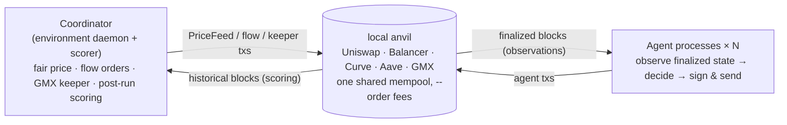

<p align="center">
  
</p>

<h1 align="center">Eris: Agent Simulator</h1>

<p align="center">
  <strong>The Agentic Financial Simulation Layer</strong><br>
  <em>Let your contracts face the swarm.</em>
</p>

<p align="center">
  <a href="https://erisnet.xyz/">erisnet.xyz</a> &nbsp;·&nbsp;
  <a href="#quick-start">Quick Start</a> &nbsp;·&nbsp;
  <a href="#documentation">Documentation</a>
</p>

<p align="center">
  
  
  
  
</p>

<!-- GitHub README does not render iframes, so link the YouTube thumbnail image (click to play). -->

<p align="center">
  <a href="https://youtu.be/7ulkvodT-bA">
    
  </a>
</p>

> **Markets ship behavior.** The real weaknesses of a protocol cannot be fully found just by scanning the checklist of an audit report. Only when many autonomous agents (trading bots) actually compete in a live market do weaknesses such as AMM price distortion, liquidation cascades, and oracle update lag surface as "real-world behavior." **Eris Agent Simulator** is an MVP (proof of concept) that reproduces this competition locally. It is the local edition of the *Agentic Financial Simulation Layer* championed by [erisnet.xyz](https://erisnet.xyz/) — an environment where autonomous agents continuously stress-test financial protocols.

A strategy simulator that runs on a multi-protocol DeFi environment with every protocol deployed on a local anvil. Multiple autonomous agents compete against each other in the same mempool, a coordinator drives the market, and after the run the value series is reconstructed and scored. Agents are never given RPC, private keys, pending transactions, or the txpool — only **observations of finalized state**.



---

## What is this

- **Multi-protocol DeFi environment** — Uniswap V3 / Balancer v2 / Curve / Aave v3 / GMX v2 are all provisioned on a single Anvil, and enabled pluggably through the protocol adapter registry (`sdk/src/protocols/`).
- **Multi-agent competition** — agents run as fully independent processes, subscribe to blocks at their own pace, and sign and send directly themselves. In-block ordering is determined by anvil `--order fees` (descending priority fee).
- **Controllable fair price** — the coordinator generates a SEED-derived deterministic fair price every block and writes it to the on-chain `PriceFeed` and mock oracles. Aave health factors and GMX mark prices follow it.
- **Market stress & liquidation** — price spikes/crashes can be injected to trigger the Aave liquidation path.
- **LLM-driven autonomous agents** — a single `prompt.md` is the strategy itself. The LLM emits an action on every decision and can even self-revise the prompt (no hand-written trading logic).
- **Fork-free local deploy mode** — avoids cold-state RPC round trips to the fork backend (fork RPC latency), and multi-asset (WETH/WBTC) works too.
- **Backtesting** — with a distributed state dump plus official regimes (market scenarios), a strategy can be verified over and over under the same environment and the same scoring (`--repeat` to read the distribution).

For details on the architecture (separation of the environment and agent execution), see [Architecture](docs/guide/architecture.md).

---

## Quick Start

Instead of forking Arbitrum, connect to a local anvil where the bundled [`deployer/`](deployer/) has deployed every protocol. This avoids fork RPC latency, and multi-asset (WETH/WBTC) works too. For details, see [Local Realtime Simulation](docs/guide/local-deploy.md).

### Setup

```bash
# poc (repository root)
npm install
cp config/example.yaml config/local.yaml   # run config + agent roster
cp .env.example .env.local                  # secrets (Anvil dev keys work locally; LLM backend choice next)
npm run build:contracts                     # forge build PriceFeed + mock oracles (once, if out/ is missing)

# bundled deployer/ (first time only; takes a few minutes to fetch the GMX clone + install Aave deps)
cd deployer
npm install
forge build                  # compile shared mock tokens
cp .env.example .env
./scripts/setup-vendors.sh   # clone+patch external repos (GMX), install Aave deps
cd ..
```

### Choose an LLM backend

**The default roster is LLM-driven**: the trading agents run in prompt mode (`prompt.md`, one LLM call per decision), so they need an LLM backend to trade. Pick one — without it the run still completes, but the trading agents fail closed to `noop` and trade nothing:

| backend | setup |
|---|---|
| **Ollama Cloud** (default; model `gpt-oss:120b`) | put `OLLAMA_API_KEY=...` in `.env.local` |
| **Local ollama** (no key) | `ERIS_OLLAMA_BASE_URL=http://127.0.0.1:11434/api` in `.env.local`, and set a locally-pulled model via the roster env `ERIS_LLM_MODEL` |
| **Claude Code / Codex subscription** (no API key; spawns the logged-in CLI) | in `config/local.yaml`, swap each prompt agent's `env:` for the commented variant with `ERIS_LLM_MODEL: "claude-cli:haiku"` (or `"codex"`) |

To skip LLMs entirely and run the same strategies rule-based (`agent.ts`), remove the `env:` line from each agent in the roster. Details: [LLM Agents](docs/guide/llm-agents.md).

### Run

```bash
# Separate terminal: start anvil + deploy all venues via deployer (do not pass --exit)
cd deployer && npm run deploy -- --keep-fresh

# poc side (repository root): import the deploy addresses and run in local deploy mode
npm run gen:local-constants
npm run sim:realtime -- --local-deploy \
  --seed 1 --blocks 100 --seconds 300 --protocols uniswap,balancer,curve
# The roster is the inline agents in config/local.yaml (edit the YAML to swap it out.
# backtest supports swapping via --agents <roster.yaml>)
```

> The `--local-deploy` flag (or config `run.localDeploy: true`) switches to local deploy mode. The CLI entry point detects this at startup, sets `ERIS_LOCAL_DEPLOY=1` internally, and `sdk/src/constants.ts` overlays the locally-deployed addresses (WETH/USDC/WBTC, etc.) — no need to pass the env by hand.

> LLM decisions take ~10s each, hence the 100-block / 300s run above (rule-based runs are fine with 24 blocks / 70s). If the trading agents only emit `noop`, you probably skipped [Choose an LLM backend](#choose-an-llm-backend) — check `runs/<run_id>/agents/<id>.jsonl` for `llm cycle skipped`.

Output is written under `runs/<run_id>/` (`summary.json` / `events.jsonl` / `blocks.csv` / `agents/<id>.jsonl`). What to check:

- Setup completes for all agents and the flow wallet.
- Flow transactions and valid agent transactions are submitted in each block.
- `valueSeries.failedReads` in `summary.json` is `0`.

### Backtesting (iterative strategy verification)

Once you bake a state dump from a deployed anvil, you can **replay official regimes (market scenarios) as many times as you like** without launching the deployer. Market conditions are identical every time by seed determinism, and scoring is identical to realtime:

```bash
npm run gen:state-dump                                # bake once from the running deployer anvil
npm run backtest -- --regime calm-01 --repeat 5       # calm market, 5 times (prints mean alphaUsdc)
npm run backtest -- --regime crash-01                 # crash + Aave liquidation scenario
```

For details, see [Backtesting](docs/guide/backtest.md).

---

## Documentation

**Writing strategies (for participants)** — reading order:

| Document | Contents |
|---|---|
| [Local Realtime Simulation](docs/guide/local-deploy.md) | Setup: prerequisites, steps, and troubleshooting for non-fork local deploy mode |
| [Writing Agents](docs/guide/writing-agents.md) | Agent authoring tutorial: minimal agent → reading observations → actions → logging → verification → submission |
| [Backtesting](docs/guide/backtest.md) | Replaying state dump + official regimes, iterating with `--repeat`, sparring, what is and isn't measurable |
| [Run Output and Analysis](docs/guide/run-output.md) | The output files under `runs/<id>/` and how to analyze a run afterwards |
| [Protocols and Actions](docs/guide/protocols-and-actions.md) | Reference: actions per venue, stablecoin accounting, oracle control |
| [LLM-driven Autonomous Agents](docs/guide/llm-agents.md) | prompt.md-type agents (per-decision LLM, self-revision, conversation log) |

**How the environment works / operations**:

| Document | Contents |
|---|---|
| [Architecture](docs/guide/architecture.md) | Separation of the environment (market mechanism + scorer) from agent execution, fair price distribution, scoring reconstruction |
| [Configuration (config/local.yaml)](docs/guide/configuration.md) | The single-source YAML config, its sections, and how to write the roster |
| [Market Stress Events](docs/guide/stress-events.md) | Injecting price spikes/crashes and triggering Aave liquidation |
| [Repository Layout](docs/guide/repository-layout.md) | Quick reference for the directory layout |

---

## Disclaimer

This is an **MVP / Proof of Concept** for research and experimentation, not intended for production use. The Aave / GMX oracles are mocks controlled by the coordinator, and the fair price is a synthetic path generated deterministically. Simulation results (PnL, ranking, discrimination) depend on the environment configuration, SEED, and sample count, and do not guarantee real-market performance.

<p align="center">
  <sub>Built by <a href="https://erisnet.xyz/">Nyx Foundation</a> · <em>Let your contracts face the swarm.</em></sub>
</p>
