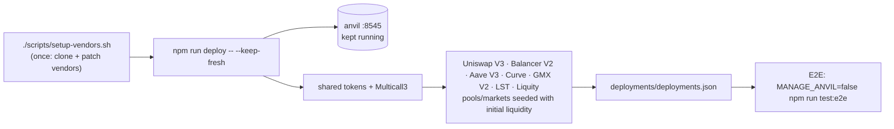

# eris-app-deployer

A TypeScript/viem orchestrator that deploys the major DeFi protocols from scratch onto an empty (non-fork) **anvil** chain, and provisions pools/markets down to initial liquidity.

| Protocol | Status | Deployment method |
|---|---|---|
| Uniswap V3 | ✅ | Deploy the official `@uniswap/v3-core` / `v3-periphery` artifacts directly with viem |
| Balancer V2 | ✅ | Deploy the `@balancer-labs/v2-deployments` bytecode sequentially with viem |
| Aave V3 | ✅ | Run `@aave/deploy-v3` (hardhat-deploy) via `vendor/aave` |
| Curve | ✅ | Deploy prebuilt bytecode of `stableswap-ng` built with Vyper 0.3.10, using viem |
| GMX V2 | ✅ | Run `vendor/gmx-src` (gmx-synthetics, hardhat-deploy), patched for localhost support |
| LST | ✅ | `contracts/MockLSTVault.sol` (a wstETH-style non-rebasing vault) plus its LST/WETH plain pool on the stableswap-ng factory, with the pool's rate oracle wired to `stEthPerToken()` |
| Liquity (eUSD) | ✅ | An unmodified Liquity V1 core fork, plus two of ours: a price-feed adapter (Liquity renounces ownership, so the oracle address is fixed forever) and a redemption helper (partial-redemption hints depend on the execution-time price) |

The order in `--only` does not matter, but the deploy order does: `lst` and `liquity` both reuse the
stableswap-ng factory for their secondary markets, so they run after `curve`, and `liquity` warps the
chain 14 days forward to clear its bootstrap period. The last two have no Arbitrum counterpart, which
is why the simulator treats them as local-deploy only.

## Prerequisites

- Node.js 18+ (verified on 23.x)
- Foundry (`anvil`, `forge`) installed

## Setup

```bash
npm install
forge build                 # compile shared mock tokens (WETH9 / MockERC20)
cp .env.example .env
./scripts/setup-vendors.sh  # clone+patch external repos (GMX), install Aave deps
```

> **Vendor layout**
> - Clones of external repositories (`vendor/gmx-src`, `vendor/curve-src`) are **not tracked by git**.
>   `scripts/setup-vendors.sh` clones them at pinned commits and applies
>   `vendor/gmx-localhost.patch` to GMX. The patch = changes needed to get
>   hardhat-deploy through on `localhost` (anvil): `hardhat`/`localhost` detection, `chainId`,
>   `localhost` keys in each config, making `setBalance` anvil-compatible, etc. (see `docs/adr` for details).
>   When `vendor/gmx-localhost.patch` is updated (e.g. after `git pull`), reset the vendor tree with
>   `npm run clean:vendors`, then re-run `./scripts/setup-vendors.sh` to apply the new patch.
> - `vendor/curve` **commits** the `{abi, bytecode/blueprintBytecode}` JSON built from
>   `curvefi/stableswap-ng` with Vyper 0.3.10 (Docker). Vyper is not needed at runtime.
>   Only to rebuild, clone `vendor/curve-src` and use
>   `docker run --rm -v $PWD:/code vyperlang/vyper:0.3.10 -f <fmt> <file>`.
> - `vendor/aave` is a minimal hardhat project (config only, committed) that loads `@aave/deploy-v3`.

## Usage

The deployer starts and maintains anvil itself (`MANAGE_ANVIL=true`).

```bash
# Deploy all protocols onto an empty anvil (anvil is kept running)
npm run deploy -- --keep-fresh
```



Main flags:

- `--only uniswap,balancer` — limit to the target protocols (e.g. `--only gmx`)
- `--no-seed` — skip pool creation / liquidity provisioning (core contracts only)
- `--keep-fresh` — reset `deployments/deployments.json` before starting
- `--exit` — stop anvil and exit after completion (for CI)

### E2E verification (vitest)

Against a running anvil + a deployed `deployments.json`, verify each protocol with vitest for
quantitative checks, round-trip/lifecycle, negative tests, and deployment health.
For GMX V2, it registers `MockOracleProvider` (`contracts/`) with the DataStore, and verifies the full E2E
where a trader creates a deposit/order → a keeper executes it with an oracle price (GM liquidity provisioning → openPosition).
Since this is a separate process from deployment, run it against an external anvil connection (`MANAGE_ANVIL=false`):

```bash
npm run anvil &                            # start anvil (--balance etc. are set in the npm script)
MANAGE_ANVIL=false npm run deploy -- --keep-fresh
MANAGE_ANVIL=false npm run test:e2e        # run test/*.test.ts
```

CI (the `deploy` job in `.github/workflows/ci.yml`) also verifies all protocols in this order.

> GMX V2 deploys 150+ contracts via hardhat-deploy, so the first run takes a few minutes
> (Solidity compilation is cached). Individual runs are also possible with `--only gmx`.

If anvil is already running in another terminal, set `MANAGE_ANVIL=false` in `.env`.
Start anvil with `--code-size-limit 50000` to support large contracts
(`npm run anvil` starts with this setting).

## Deploying with a secret mnemonic (issue #74)

Everything here is deployed by account index 0 of `MNEMONIC`, which defaults to anvil's **public**
test mnemonic (`test test … junk`). That account is not just the payer:

- Aave's `POOL_ADMIN` / `ACL_ADMIN`, GMX's `CONFIG_KEEPER` and `MARKET_KEEPER`, the LST vault's
  owner, the admin key of the Liquity price-feed adapter;
- the owner of every seeded LP position and the holder of the genesis Trove's surplus eUSD;
- and, because each address is `CREATE(deployer, nonce)`, the account that decides where all of the
  contracts land.

On a chain that accepts transactions from participants, that key has to be one they do not have —
anvil prints the default mnemonic in its banner, so with it "the deployer" is a role anyone can
assume. Keep the default for local work and CI; use a secret one for anything reachable.

```bash
# .env is gitignored, so a secret in it never reaches the repository
echo 'MNEMONIC="<twelve secret words>"' >> .env

# or keep it out of the filesystem of this repo entirely
export MNEMONIC="$(cat ~/.ascon-secret-mnemonic)"
```

Then redeploy. Both entry points read the same value, so anvil and the deploy agree:

```bash
npm run anvil                      # separate terminal; MANAGE_ANVIL=false in .env
npm run deploy -- --keep-fresh
```

Two things follow from a changed mnemonic, and neither is optional:

1. **Every address moves.** `deployments/deployments.json` is rewritten by the deploy, and the poc
   has to be regenerated from it (`npm run gen:local-constants`, then `npm run gen:state-dump` if a
   state dump is in use). A consumer left on the old addresses reads empty accounts — `getMarkets`
   answering `0x` is what that looks like from GMX, and the deploy now says so by name rather than
   letting viem report it as a decoding failure.
2. **The deployer's key is now a secret the simulator needs.** The stress events that trade as the
   environment (`liquidityPull`, `depeg`, `eusdDepeg`) send from the deployer account, so the poc's
   `.env.local` has to carry `DEPLOYER_PRIVATE_KEY=0x…` for it. Without it those events fail fast
   rather than finding nothing to pull.

Guards, so that a half-rotated setup fails at the start instead of in the middle:

- an invalid mnemonic (one word wrong fails the BIP-39 checksum) is rejected before anvil starts;
- reusing an already-running anvil is refused when its first account is not the one `MNEMONIC`
  derives, in either direction — deploying a default-mnemonic chain over a secret one is the same
  bug with the ownership reversed.

### Verifying a rotation

The deploy is the test — a mnemonic that does not reach GMX shows up as a missing market rather
than as an error about keys. After redeploying, three reads say whether it took:

```bash
# 1. the registry names the account that actually deployed
node -e 'console.log(require("./deployments/deployments.json").accounts)'

# 2. GMX has markets (the failure mode: `getMarkets returned no data ("0x")`, which used to mean
#    a stale deployments/localhost rather than anything about GMX)
node -e '
  const r = require("./deployments/deployments.json").protocols.gmxV2;
  console.log(`markets: ${r.marketCount}`, r.markets.map((m) => m.marketToken));
'

# 3. the Aave admin role sits on that same account, not on Hardhat account 0
cast call "$(node -e 'console.log(require("./deployments/deployments.json").protocols.aaveV3.aclManager)')" \
  "isPoolAdmin(address)(bool)" \
  "$(node -e 'console.log(require("./deployments/deployments.json").accounts.deployer)')" \
  --rpc-url http://127.0.0.1:8545
```

> Changing `MNEMONIC` also changes what the two hardhat subprojects sign with: both
> `vendor/aave/hardhat.config.js` and the `localhost` network in `vendor/gmx-localhost.patch`
> derive their accounts from it. After pulling a new patch, reset the vendor tree
> (`npm run clean:vendors && ./scripts/setup-vendors.sh`) — an old tree keeps hardhat's
> `accounts: "remote"` default and signs as whatever the node has unlocked.

## Output

All addresses are aggregated into `deployments/deployments.json`:

```jsonc
{
  "chainId": 31337,
  "tokens": { "WETH": "0x..", "USDC": "0x..", ... },  // shared mock tokens
  "protocols": {
    "uniswapV3": { "factory": "0x..", "swapRouter": "0x..", "wethUsdcPool": "0x.." },
    "balancerV2": { "vault": "0x..", "wethUsdcPoolId": "0x.." },
    "aaveV3": { "pool": "0x..", "aaveOracle": "0x..", "tokens": {..}, "aTokens": {..} }
  }
}
```

> Aave uses a separate system from the shared mock tokens, because `@aave/deploy-v3` generates
> its own test tokens (USDC/WETH/WBTC/DAI...). For Aave addresses, refer to
> `protocols.aaveV3.tokens`.

## Architecture

```
src/
├── index.ts           orchestrator (CLI)
├── anvil.ts           anvil process start/wait + the flag list (including --mnemonic)
├── anvil-cli.ts       `npm run anvil` (same flags, foreground)
├── clients.ts         viem clients + accounts
├── config.ts          chain / token definitions
├── tokens.ts          deployment of shared mock tokens
├── registry.ts        deployments.json aggregation
├── erc20.ts           generic ERC20 helpers
├── verify.ts          E2E smoke check
└── protocols/
    ├── uniswap-v3.ts
    ├── balancer-v2.ts
    ├── aave-v3.ts
    ├── curve.ts
    ├── gmx-v2.ts
    ├── gmx-deposit.ts  GM liquidity provisioning (deposit → keeper execution)
    ├── lst.ts          MockLSTVault + LST/WETH market + rate-oracle wiring
    └── liquity.ts      Liquity V1 core fork + eUSD/USDC market + our adapter/helper
contracts/             shared mock tokens (WETH9.sol, MockERC20.sol, Multicall3.sol) +
                       MockLSTVault.sol + MockOracleProvider.sol +
                       LiquityPriceFeedAdapter.sol / LiquityRedemptionHelper.sol
vendor/aave/           minimal hardhat project that runs @aave/deploy-v3
vendor/curve/          Curve bytecode prebuilt with Vyper (JSON)
vendor/gmx-src/        gmx-synthetics clone (patched for localhost support)
```
