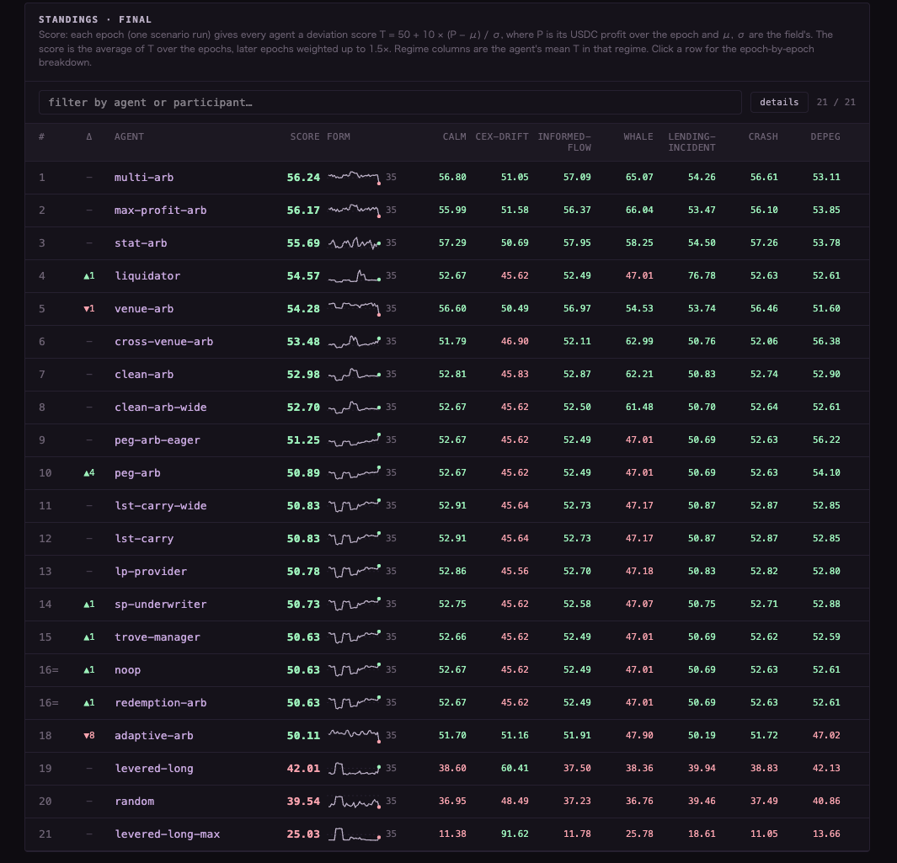
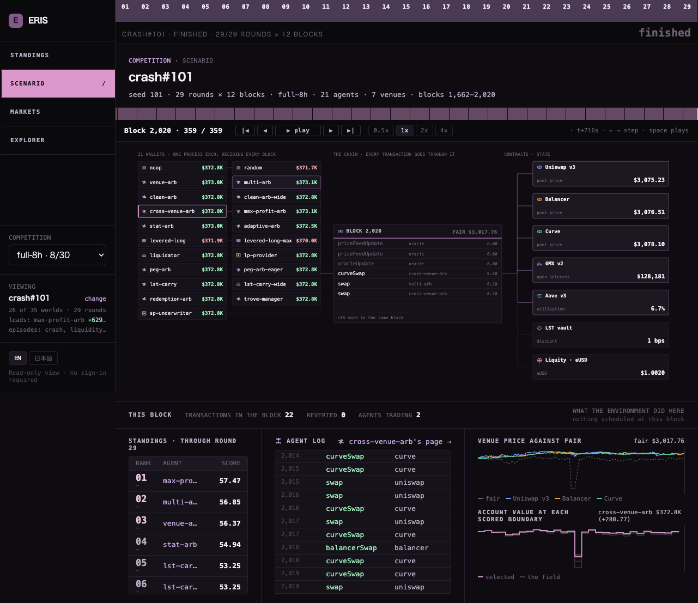
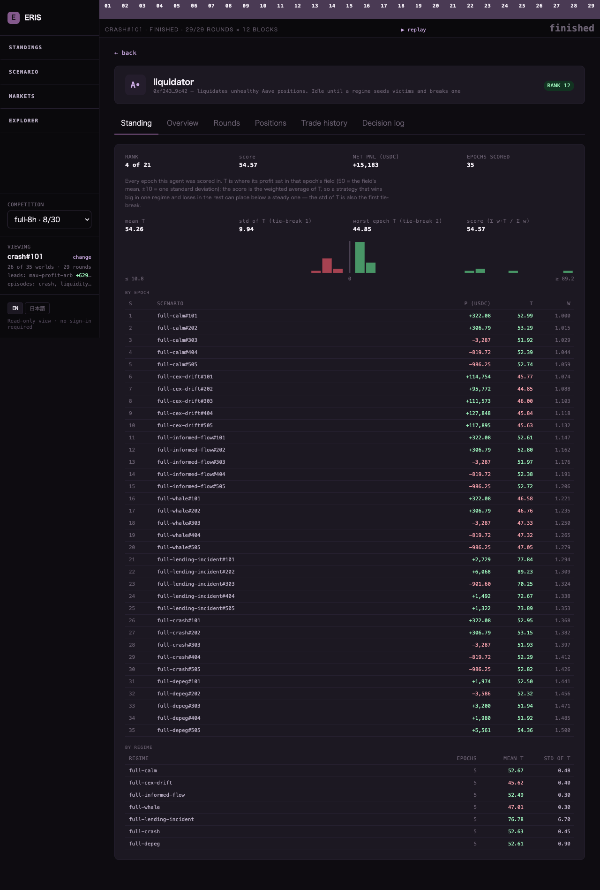

[← README](../README.md) ｜ 日本語: [`competition-start.md`](competition-start.md)

# Getting Started (competition entrants)

**A straight line from nothing to a submittable agent.** §2–§3 get something running in about 30 minutes; §6 onwards is where you keep coming back while you build.

The rules themselves live at [ascon.dev/rules](https://ascon.dev/rules) and are the only source for
them; the Japanese text governs. Where this guide and the rules disagree, the rules win. This guide
only covers how to build. The [Japanese version](competition-start.md) governs this guide too; this
one is a reference translation.

**You need**: Node.js 20 or newer, [Foundry](https://book.getfoundry.sh/getting-started/installation)
(`forge` and `anvil`), `git`, and `zip` (used to build the submission archive).

---

**Contents**: [1. The shape of the competition](#1-the-shape-of-the-competition) ([the 11 regimes](#the-11-regimes) / [timeline](#the-competition-timeline) / [what does not happen](#what-does-not-happen-here) / [what you can do](#what-you-can-do-here-examples)) · [2. Setup](#2-setup) · [3. The smallest agent](#3-the-smallest-submittable-agent) · [4. Observations and actions](#4-observations-and-actions) · [5. LLM strategy revision](#5-llm-strategy-revision) · [6. The development loop](#6-the-development-loop-run-read-fix) · [7. The dashboard](#7-reading-your-results-on-the-dashboard) · [8. Reference agents](#8-the-reference-agents) · [9. Practice devnet](#9-the-practice-devnet-optional) · [10. Submitting](#10-submitting) · [11. Ways people break this](#11-ways-people-actually-break-this) · [12. What to read next](#12-what-to-read-next)

## 1. The shape of the competition

```
the competition
 └ epoch  ×k          One world. Every participant unit starts from identical initial
    │                 conditions at the same moment and runs 360 blocks (2s each = 12 min).
    │                 The world resets between epochs: no inventory, no PnL carries over.
    │
    ├ scenario        The market that epoch replays = (regime, random seed).
    │                 A regime is a type of market condition. Which epoch is which
    │                 regime is not announced in advance.
    │
    └ evaluation interval ×29   A 12-block slice. Used for the leaderboard's running
                                progress. NOT used for scoring.
```

> **360 / 12 / 29 are the code's current values.** Appendix A of the rules lists the blocks per
> epoch, the blocks per evaluation interval, `k` and the gas ETH as **published by the start of the
> submission period (2026-09-23)**. The numbers here come from the official regimes (`blocks: 360`
> in `config/regimes/*.yaml`) and the sdk default (12-block intervals); where the published values
> differ, the rules win.

**Scoring takes exactly one number per epoch.**

```
PnL P    = asset value at the epoch's end − asset value at its start (in USDC)
score T  = 50 + 10 × (P − mean over all units) / standard deviation
final    = weighted mean, later epochs heavier (1.0 at the first, 1.5 at the last)
```

So the competition is **"how did you do against everyone else that round", stacked k times**. An
unrealised gain in the middle of an epoch is worth nothing; only the value at the end counts. A
market-wide move is absorbed into everyone's mean, so **you neither gain from a rally nor lose from
a selloff.**

Every unit is handed the same initial capital: **8 WETH + 0.4 WBTC + 25,000 USDC**, plus ETH for
gas. One benchmark agent that never moves its capital runs alongside. Every unit runs on the same single chain at the same time.

> **A local `npm run backtest -- --scenarios` ranks with the same rule as the competition** (one scenario = one epoch, P → deviation score T → the later-weighted average; `standings.json`). What differs is the field: locally the population is your roster, in the competition it is every participant. **Local numbers are for comparing your own versions against each other, not for predicting where you will place.**

### Vocabulary (read this)

**The rules and the code use the same words for different things.** This is the one table to
remember.

| The rules say | The code calls it | What it actually is |
|---|---|---|
| epoch | run | one `runs/<id>/` — one `summary.json` |
| scenario | scenario | `<regime>#<seed>`; regimes are defined in `config/regimes/*.yaml` |
| evaluation interval | **epoch** / "round" in the dashboard | `valueSeries.epochSeries` in `summary.json`, `run.epochBlocks` (default 12). Not used for scoring |

**The code's `epoch` is not the rules' epoch.** The code's `epoch` is the rules' *evaluation
interval*.

### The 11 regimes

These are the eight kinds rules §3.2 publishes plus `spike` (issue #105), `depeg-persist` (issue #106) and `cdp-incident` (issue #107); the rules' list needs all three additions. Which epoch is which regime is never announced, but
**the kinds themselves and their generators are public**: `config/regimes/<name>.yaml`. The public set
`config/scenarios/public.yaml` is 11 regimes × 5 seeds = 55 scenarios; the non-public set is drawn from

the same family, of which only the perturbation ranges are published (rules §3.3). The numbers in the
table are the current YAML ranges; where the published values differ, the rules win.

| # | Regime | What the environment does | Reference agents written for it (§8) |
|---|---|---|---|
| 0 | Calm `calm` | No events. The reference price is a mean-reverting walk, the order flow neutral | `venue-arb` / `multi-arb` / `stat-arb`. The baseline for arbitrage: a strategy that loses here loses everywhere |
| 1 | CEX drift `cex-drift` | While a window is open the reference price carries a drift (0.1–0.2% per block) and mean reversion weakens. Three windows; one of them does not give the level back when it closes. Pool prices keep diverging from the reference | The cross-venue arbitrageurs get work. A directional `levered-long` swings hard on β |
| 2 | Informed flow `informed-flow` | The environment's order flow leans one way while a window is open (2–3× size, correlation 1.0, 12-block persistence; two windows). Hard to tell from calm | `stat-arb` / `multi-arb` |
| 3 | Whale `whale` | A single 25–60 WETH order knocks a pool's mid. Four of them, two pinned to Balancer / Curve. The reference price does not move | `venue-arb` / `multi-arb` / `max-profit-arb`. Whoever takes the dislocation first wins it, so bidding priority fee matters |
| 4 | Lending incident `lending-incident` | The reference price falls 12–16%, in the same window every AMM loses 40–60% of its depth, and two victim accounts opened at HF 1.10 become liquidatable on Aave | `liquidator` (the one liquidating) / `levered-long` (managing not to be the one liquidated) |
| 5 | Stablecoin depeg `depeg` | The environment sells DAI into the USDC/DAI pool (35–60% of its depth; ramp 12 / hold 36 / decay 45 blocks) and opens a discount. **The only regime without GMX** | `peg-arb`. DAI has no redemption floor, so the question is whether you believe it comes back |
| 6 | Crash `crash` | The reference price gaps 15–22% and liquidity is pulled 40–60% in the same window. No victims are opened | Everyone. Arbitrage shrinks in a thin book and leverage crosses its HF. `trove-manager` / `sp-underwriter` handle the same moment on the Liquity side |
| 7 | New pools `vuln` | Mid-epoch, 4–6 pools appear, twice; 50–70% of them skim assets from any trade above a size (4–8% of the USDC endowment). The bait is a 3–6% discount | `discovery-arb-verify` (dry-runs before taking) / `discovery-arb` (the unverified control) |
| 8 | Spike `spike` | The reference price gaps 15–22% **up** and liquidity is pulled 40–60% in the same window. Crash's mirror; no victims are opened | Everyone. The one regime where merely holding the basket is rewarded and a hedge or a short pays; the arbitrage runs the other way round from crash, so it needs USDC inventory |
| 9 | Persistent depeg `depeg-persist` | The environment sells DAI as in `depeg` (35–60% of depth; ramp 12 / hold 36) and then **does not buy it back**: the discount stands through the last scored block, the buy-back comes after scoring | `peg-arb`. In `depeg` waiting for par was right by construction; here whatever was bought on the belief that par returns is marked at the discount. The one regime that separates judging the return from assuming it |
| 10 | CDP incident `cdp-incident` | The environment opens two Troves at ICR 1.20, the reference price falls 12–16% (depth pulled 40–60% in the same window), and in the same window it sells eUSD into its pool. The Troves cross MCR 1.10 and eUSD trades below par | `sp-underwriter` (absorbs through the Stability Pool and liquidates), `redemption-arb` (buys cheap eUSD and redeems against the victims), `trove-manager` (keeps its own Trove out of the redemption path and above MCR) |

Three notes.

- **The seed decides where an event lands.** `windowFrac` is a range for where in the epoch it falls, so
  the same regime lands in different places under different seeds. The observation does not carry the
  window positions (§4)
- **Fitting one regime is paid for in the others.** The deviation score absorbs the difference in
  roughness between regimes, so all eight weigh about equally on the score. A strategy that wins big in
  `lending-incident` and loses in the other seven places below a steady one. The regime columns of the
  standings and the per-regime table on an agent's page show exactly that (§7)
- **In regime 7, neither "never look" nor "take everything" is optimal** (the note under rules §3.2). Some
  of the pools that appear are honest and the discount is real

### The competition timeline

The schedule of rules §1 (Japan Standard Time), with what you do at each stage.

| When | What happens | What you do |
|---|---|---|
| 9/1 – 10/24 | Registration period | Join the ASCON channel on the Discord and submit the registration form |
| 9/23 | The submission period opens. Appendix A's values (epoch length, evaluation interval, k, gas ETH), the inference proxy's model list and the list of permitted exploit targets are published **by this day** (rules §7.1) | Work through §2–§6 of this guide |
| 9/23 – 10/31 | **Submission period.** Evaluate yourself on the 40 public scenarios and replace your submission **up to 5 times a day**. In the same period the operator's **trial environment** (rules §2.7) is open: the same configuration as the competition, take any transaction you like, but **no standings are posted** and nothing counts | Build → run → fix (§6). Submit the `bundle:agent` zip (§10) |
| 10/31 | **Submission deadline = the agent is frozen.** Nominate up to 2 submissions for final evaluation. The hash of the lottery seed is published | No more code changes |
| 11/1 – 11/7 | **Live competition.** One epoch is one unit; k of them, the world reinitialised each time, every unit starting at once. Score and cumulative standings update after every epoch | **You operate nothing.** Your agent runs in the operator's container and the only thing that moves is the in-epoch LLM revision. Watch the standings on the dashboard (§7) |
| 11/8 | Reserve day, for the same-seed re-run of an epoch that failed on the operator's side (rules §4.4.2) | — |
| 11/9 – 11/30 | Review period: audit of violations, review of the report track (entries due 11/21), the standings are finalised. No new epochs run | Enter the report track by 11/21 if you want to |
| 12/7 | Results. After a 7-day objection period the run directories, decision logs and the lottery seed's original are published in full (rules §7.2) | — |

**What you see during the live week** is whatever part of the standings, the scenario page and the agent
pages can be shown without breaking a competition in progress. Which epoch is which regime is withheld
(it says only `epoch s`), decision logs and raw LLM exchanges are 404, the event schedule and the seed
are dropped. The table at the end of §7 lists it.

### What does not happen here

The more mainnet experience you have, the more you design around things that this environment does
not have. None of the following exists here.

- **Reorgs and unconfirmed blocks.** The chain is a single Anvil node on interval mining. A block is
  final the moment it is mined; it does not roll back and a mined transaction does not disappear. The
  world is rebuilt only at the start of an epoch (rules §4.7.1) — that is an initialization, not a reorg
- **Gas price spikes.** The base fee is pinned at 0. What you pay is the priority fee you choose to
  stack (default 0.1 gwei, capped by `obs.limits.maxPriorityFeePerGasWei`); other people's congestion
  never raises your bill. Gas ETH is part of your asset value (rules §4.2), so fees do reach the PnL
- **An edge from arriving first.** Order within a block is by priority fee, highest first (rules §2.6;
  Anvil runs with `--order fees`). A faster line or an earlier call wins nothing — if you want the
  position, bid for it
- **Enumerating pending orders through RPC.** With `RPC_FILTER=1`, the participant gateway refuses
  pending transaction lists/filters and block, transaction and receipt reads with the `pending` tag.
  `eth_getTransactionCount(address, "pending")` remains available for sender nonce management.
  See the [gateway policy and measurements](../infra/rpc-gateway/README.md). This applies at the
  gateway; local runs pointed directly at Anvil do not get this filter.
- **Rewriting the reference price or an oracle.** `PriceFeed`, the Aave aggregators and the GMX oracle
  provider are owner-gated, and at startup every privileged write is simulated by `eth_call` from an
  address with no role to measure that the gate holds (`core/src/realtime/ownerGuards.ts`). Move a
  pool as far as you like: the marks for WETH / WBTC and the liquidation prices at Aave and GMX do not
  follow (they come from the environment's price). Assets marked from a market — stablecoins, the LST,
  eUSD — can be moved, but the mark is the median over the previous 5 blocks (rules §4.1), and trading
  to distort a mark is a prohibited act (rules §8)
- **Direct manipulation of chain state.** The RPC gateway answers 403 to every method outside `eth_` /
  `net_` / `web3_` (`anvil_*` / `evm_*` / `hardhat_*` / `txpool_*` / `debug_*`;
  `infra/rpc-gateway/README.md`). There is no way to write a balance or a storage slot, and no
  `eth_sendTransaction` either — you sign locally
- **Operator intervention mid-epoch.** During an epoch the environment does exactly this: the
  per-block reference price update, the background order flow, execution of GMX orders, and the
  events the regime defines (the 8 kinds in rules §3.2). The only other hand on the wheel is the
  voiding and same-seed re-run of an epoch that failed on the operator's side (rules §4.4.2), and the
  PnL of an epoch that did not finish never reaches the standings
- **Disqualification or penalties for going bust, timing out or crashing.** Each of those is just a
  PnL that becomes a deviation score (rules §4.4.2, §4.5). Blocks do not wait for an agent's answer
  (rules §2.3), so a slow strategy never stalls the chain either
- **Real-world losses.** Every asset exists only inside the competition environment and has no value
  or convertibility outside it (rules §0.2)

### What you can do here (examples)

Conversely, things that capital or permissions make hard to try on mainnet are ordinary here. The
reference agents live in `example/agents/`.

- **Deploy your own contracts.** A `rawTx` with `to` omitted is a deployment
  (`example/agents/lib/deployContract.ts`; the forge artifacts ship inside the submission zip). An
  atomic arbitrage across several venues is written as your own contract this way (rules §0.1: a
  bundle guarantees no atomicity). Aave flash loans are enabled (`flash-arb` calls `flashLoanSimple`
  through `rawTx`). **But whatever is still inside your contract when the epoch ends is valued at 0**
  (what the environment cannot price is 0; rules §4.1). Profit that passed through counts in full, so
  withdraw before the bell
- **Make a market, provide liquidity.** You can create a new Uniswap V3 pool (`createPool`). Adding to
  an existing pool works the same way (`mintLiquidity` / `removeLiquidity` / `collectFees`; see
  `lp-provider`). The environment's order flow never visits a pool you made, so your counterparties are
  other participants only. The official regimes carry no registry (`obs.registry`), so another
  participant finds your pool only by reading the chain themselves. Permissionless lending
  (`createLendingMarket`) exists only in the verification regime
  (`config/regimes/agent-markets.yaml`)
- **Deploy a vulnerable contract on purpose, attack someone else's.** Exploiting weaknesses in other
  participants' agents, contracts and the market structure is part of the competition (rules §8; the
  permitted targets are the operator's protocols and other participating units — rules §3.1). See
  `vault-keeper` (deploys a `LeakyVault` whose `rescue()` was left ungated and puts USDC in it) and
  `exploit-hunter` (recovers selectors from the bytecode of someone else's unknown contract and drains
  it atomically). Measured: hunter +9,999.9 / vault-keeper −10,000.2 — the whole 10,000 USDC deposit
  moved. With no registry in the official regimes, the hunting side scans the chain itself. The
  environment's own contracts, by contrast, are measured at startup for closed owner gates. Moving
  assets between your own two submissions is self-dealing and prohibited (rules §8)
- **Liquidate and redeem other people's positions.** Aave's `liquidationCall` through `rawTx`
  (`liquidator`), Liquity's `liquityLiquidate` and Stability Pool underwriting (`sp-underwriter`),
  eUSD redemption (`liquityRedeem`; `redemption-arb`)
- **Use leverage.** GMX perps (`gmxIncrease` / `gmxDecrease`; orders are executed by the environment's
  keeper from the next block on), Aave borrowing, a Liquity Trove, borrowing ETH against the LST
  (`lst-carry`)
- **Buy your position in the block.** Bid with `maxPriorityFeePerGasWei` on the action. The highest fee
  anyone else paid in the most recent block is `obs.competition.maxCompetitorPriorityFeeWei`
- **Inspect a pool that appears mid-epoch before touching it.** In regime 7 the operator places pools
  during the epoch, some of which skim assets (rules §3.2). `obs.discoveredPools` carries the address,
  the code hash and a quote. `discovery-arb-verify` dry-runs before taking; `discovery-arb` takes
  without checking. Measured: unverified −5,306 / verified +721
- **Rewrite the strategy while it runs.** As in §5, the LLM revises the code outside the trade path

---

## 2. Setup

```bash
git clone <repo> && cd eris-competition-poc
npm install
cp config/example.yaml config/local.yaml   # run config + roster
cp .env.example .env.local                 # keys and RPC (Anvil's dev keys are fine locally)
npm run build:contracts                    # forge build PriceFeed + mock oracles (once)
```

Deploy every venue onto a local anvil (the first run takes a few minutes to fetch the GMX clone).

```bash
# --- terminal A (first time only) ---
cd deployer
npm install && forge build
cp .env.example .env
./scripts/setup-vendors.sh
```

**The deploy runs in a terminal of its own and stays there.** `npm run deploy` **deliberately never
exits**, because it is what keeps anvil alive (`deployer/src/index.ts`). Anything written after it in
the same block never runs.

```bash
# --- terminal A (the deploy; leave this open) ---
cd deployer && npm run deploy -- --keep-fresh
```

Once it logs that the deploy finished, carry on in **a second terminal**.

```bash
# --- terminal B ---
npm run gen:local-constants               # deployments.json → sdk/src/constants.local.ts
npm run sim:realtime
```

A `runs/<id>/` directory appears; if `summary.json` holds a result per agent, you are set up.

> **Redeploying means rebuilding the anvil too.** `--keep-fresh` only removes `deployments.json`;
> running it twice against the same anvil fails at the WETH wrap with `insufficient funds`.

---

## 3. The smallest submittable agent

**One agent is one directory.** Copy the template.

```bash
cp -r example/agents/my-arb example/agents/my-strategy
```

It holds two files. **The runtime starts an agent with only `agent.ts`, but rules §2.5 requires
`prompt.md`, so a submission needs both.** (An agent with no `prompt.md` runs normally in local
testing; what fails at startup is a `prompt.md` that exists **without** `kind: improve`.)

```
example/agents/my-strategy/
  agent.ts     the strategy, which trades on every block
  prompt.md    how an LLM should rewrite the strategy (required by rules §2.5)
```

**Creating the directory does not start anything.** Add the id to the roster in
`config/local.yaml`.

```yaml
agents:
  - id: my-strategy          # points at example/agents/my-strategy/
    wallet: AUTO
```

Now `npm run sim:realtime` spawns your agent. To use an id that differs from the directory name, name
the directory with `dir:` — that is how you run one strategy several times with different parameters.

### `agent.ts` — the strategy

```ts
import type { AgentAction, AgentObservation } from "@eris/sdk";

export function decide(obs: AgentObservation): AgentAction | null {
  return { type: "noop", reason: "not doing anything yet" };
}
```

That is the whole contract.

- If you return an action, the runtime **validates it before** signing and sending. **Neither kind of
  failure reaches the chain** (fail-closed). Something malformed enough to fail the schema is logged
  as `bad_action` in `agents/<id>.jsonl`; something that parses but does not validate is `rejected`
- Returning `null` skips the round. **Doing nothing is a perfectly good answer** — not trading in a
  market with no opportunity is correct
- Throwing does not break the run: that round is skipped and `decide error:` is logged

> **Write a submission as `decide()`.** The runtime also accepts `run(ctx)` in place of `decide`, for
> an agent that owns its own loop (see `liquidator`) — but **`run(ctx)` and `prompt.md` cannot
> coexist**: self-improvement works by swapping out `decide`, so an agent with both exits 1 at
> startup (`example/agents/runtime/bot.ts` says so in its error). Since rules §2.5 makes `prompt.md` mandatory, the
> `run(ctx)` form cannot currently be submitted.

### `prompt.md` — the revision policy

**The frontmatter needs `kind: improve`. Without it the run fails at startup.**

```markdown
---
kind: improve
name: my-strategy
description: one line describing the strategy
reviseEveryBlocks: 60
---

This file is not "what to do with this observation". It is **when, on what evidence, and how the
strategy code should change**.

## What this strategy is built on
(the assumptions the LLM must not break)

## What may change, and what may not
(thresholds and sizing yes; the ordering of a two-leg execution no)
```

> **Why the marker exists.** There used to be a `prompt.md` under the same name that said "what to do
> with this observation", with the same frontmatter keys. `kind: improve` is the only thing that
> tells them apart, so one without it is rejected rather than read — reading it would put trading
> instructions into a system prompt as though they were a revision policy.

`reviseEveryBlocks` is how often a revision is attempted (default 60 blocks). **The first observation
is kept as the baseline and does not trigger one** — otherwise a revision would be spent before the
strategy had any record to reason about. So 360 blocks span 359, and the default gives **5 attempts
per epoch**.

---

## 4. Observations and actions

`obs` is a **snapshot of confirmed state** that the runtime rebuilds every block. You never hit RPC
yourself.

```ts
obs.fairPriceUsdcPerWeth        // the reference price the environment publishes (on-chain PriceFeed)
obs.protocols.uniswap.pool      // per-venue state
obs.balances                    // your balances; stables come itemised
obs.limits                      // default/max priority fee and default slippage. No size caps in here
```

**What the observation does not carry**: unconfirmed orders, the next block, where the event windows
are. Everyone sees the same things with the same delay (writes to `PriceFeed` land in the next block,
so the reference price is always one block behind).

**The highest competitor priority fee in the most recent block is observable**
(`obs.competition.maxCompetitorPriorityFeeWei`); it is mined history. `ctx.publicClient` permits
additional read-only chain queries. There is no `ctx.walletClient`: return an action or use
`ctx.submit({ type: "rawTx", tx })` for transactions. Sending through a separate client on the same
key races the runtime's nonce and bypasses its `submitted` records. Keep all sends in the runtime.
Rules §8 define prohibited conduct.

`decide()` runs in a worker thread with a **5-second parent-owned deadline**. Synchronous infinite
loops and unresolved awaits both produce `decide timeout:`; the result and all queued `ctx.submit`
actions from that call are discarded. The next decision reloads the selected strategy in a new
worker. Worker-local variables reset; the parent observation and revision loops, nonce, logs,
version history and state directory continue. **The no-restart provision in rules §2.3 concerns a
terminated agent process.** Replacing computation inside a live process neither restarts that agent
nor automatically rolls its strategy back. Self-driven `run(ctx)` agents retain their own lifecycle
and do not have a per-decision deadline.

**There is no order-size cap.** No venue has a per-order amount cap, a bundle-length cap or an
open-position cap, and `obs.limits` carries no size budget (the former `maxWethInWei` /
`maxUsdcInUnits` / `maxBundleActions` / `maxOpenPositions` were removed on 2026-09-02 — removed,
not raised). The only bounds on a trade are **your balance** and **the depth of the pool you trade
into**; the bigger you go, the worse the fill. Size yourself. The shared helper is
`sized(obs, token, bps)` in `example/agents/lib/affordable.ts`, a fraction of what you hold.

**There are two kinds of limit and they bite differently.**

| Where it comes from | What it caps | What happens if you exceed it |
|---|---|---|
| the runtime (validates before sending) | the action's shape and content (schema; a leg you hold no inventory for), the priority fee (`obs.limits.maxPriorityFeePerGasWei`), **gas** (30,000,000 per transaction, 30,000,000 per agent per block in total) | **rejected** before signing, with a `rejected` entry and its reason in `agents/<id>.jsonl` (for gas: `tx gas cap` / `per-block gas budget`). Nothing reaches the chain |
| rules §2.3 and §2.6 (the operator imposes it) | **5,000 ms** per decision, **2 vCPU / 4 GB** of memory (§2.3). **No cap on transactions per block** (§2.6: inclusion is decided by the priority-fee auction, and the block gas limit is 30,000,000) | a timeout is no action for that block; a crash is no action for the rest of the epoch (no restart). **None of this is in `obs.limits`** |

The runtime enforces send validation and the decision deadline. Design your agent to operate within
the CPU and memory allocation.

The action catalogue is in [protocols-and-actions.md](guide/protocols-and-actions.md); every field of
`obs` is in [writing-agents.md](guide/writing-agents.md).

---

## 5. LLM strategy revision

The rules require **every agent to be configured for strategy revision**. The LLM sits outside the
trading path: every `reviseEveryBlocks`, it looks at the strategy's own track record and its current
code and decides whether to rewrite it.

Generated code passes a **cheatcode static check → compilation** (evaluating the function expression
is capped at 1 second) before it is installed. **It is not trial-run first.** Once installed, every
call to `decide` is capped at **5 seconds** (`DECIDE_TIMEOUT_MS`, rules §2.3), the same bound a
hand-written strategy gets; exceeding it records that round as no action (`decide timeout:`). A revision that fails static checking or compilation is not installed; the failure is recorded and the
strategy keeps trading unchanged. There is no automatic rollback — reverting is the model's decision, made
with the version history and `revertTo`.

Configure it through the roster's `env`.

```yaml
agents:
  - id: my-strategy
    wallet: AUTO
    env:
      ERIS_LLM_MODEL: "claude-cli"       # a subscription CLI works for local development
      ERIS_IMPROVE_LOG_CALLS: "1"        # log the raw exchange to agents/<id>.llm.jsonl
```

**Backends supported today**:

| Value | What it runs | Auth |
|---|---|---|
| `codex` / `codex:<model>` | spawns `codex exec` | ChatGPT subscription (`codex login`) |
| `claude-cli` / `claude-cli:<model>` | spawns `claude -p` | Claude subscription |
| `claude…` (a model name starting with `claude`) | the Anthropic API | `ANTHROPIC_API_KEY` |
| `openai:<model>`, or a name starting with `gpt-` / `o1` / `o3` / `o4` | OpenAI-compatible chat completions | `OPENAI_API_KEY` (`OPENAI_BASE_URL` for a compatible endpoint) |
| anything else (default) | the ollama family | `ERIS_OLLAMA_BASE_URL` (Ollama Cloud by default) + `OLLAMA_API_KEY` |

> **In the competition no key reaches your agent.** Inference goes through the operator's proxy
> (rules §2.3, §2.5); the models you may use are the proxy's published list (§2.5) and every exchange
> is recorded. Set `ERIS_INFERENCE_BASE_URL` locally to exercise the same path
> (`infra/inference-proxy/README.md`).

A run completes with no backend at all: the revision is recorded as failed and the strategy keeps
trading unchanged. Details in [llm-agents.md](guide/llm-agents.md).

---

## 6. The development loop: run, read, fix

Once §2–§3 have run once, the daily routine is these three moves, repeated. **Keep one lap short**: a
360-block scenario takes 12 minutes.

```bash
# 1. Check the wiring on a short run (40 blocks ≈ 80 s; every submission, rejection and exception shows)
npm run sim:realtime -- --blocks 40 --agents <your roster>

# 2. Replay one scenario (--seed is required: a scenario is (regime, seed), a regime alone names none)
npm run backtest -- --regime crash --seed 101 --agents <your roster>

# 3. Run the whole public set and get a standing (40 scenarios × 12 min; run it overnight)
npm run backtest -- --scenarios config/scenarios/public.yaml --agents <your roster>
```

**Always put opponents in the roster.** A deviation score is a position within a field, so with only
yourself T is undefined (an epoch with σ = 0 is dropped from the score). `config/rosters/full-field.yaml`
is the field of every reference agent, and `noop` in the roster lets you read the difference from doing
nothing.

```yaml
# my-roster.yaml
agents:
  - id: noop                 # the do-nothing baseline
    wallet: AUTO
  - id: my-strategy
    wallet: AUTO
  - id: multi-arb            # a bundled opponent (§8)
    wallet: AUTO
```

The public set is **a handful of draws from a distribution, not the target**. The generator is open, so
**sample your own seeds**. Tuning to the published seeds falls apart the moment the non-public set hands
you a different draw. Judge by the **distribution across seeds**, not by one run (transaction order
varies even within a scenario).

**The reading order is fixed.** First `runs/<id>/agents/<id>.jsonl`, then `summary.json`, then the
dashboard (§7). Read backwards and all you learn is "the rank is bad".

### Reading `agents/<id>.jsonl`

One JSON per line, three kinds of line mixed together.

| How to tell the line | Who writes it | What it means |
|---|---|---|
| `round` + `action` + `reason` (no `kind`) | your `ctx.log(...)`, or the runtime recording what `decide()` returned | The decision for that block. Put anything you like in `signals` / `state`. **A log without `reason` cannot be read afterwards** — write it from the start |
| `reason: "decide error: …"` | the runtime | `decide()` threw. No action that block. Guessing the shape of `obs` (§11) is the usual cause |
| `reason: "decide timeout: …"` | the runtime | Over 5 seconds (rules §2.3). No action. Counted separately from errors |
| `kind: "mempool"`, `event: "runtime_start"` | the runtime | Started, with `address` / `rpcUrl` / `mode`. **If this line is missing, the pre-flight (RPC, chain id, venue bytecode) failed** |
| `kind: "mempool"`, `event: "bad_action"` | the runtime | The returned action failed the schema. Nothing reaches the chain |
| `kind: "mempool"`, `event: "rejected"` | the runtime | It parsed but failed validation; `reason` says why (a leg with no inventory / priority fee over the cap / `tx gas cap` / `per-block gas budget`). Nothing reaches the chain |
| `kind: "mempool"`, `event: "submitted"` | the runtime | Signed and sent: `hash` / `nonce` / `priorityFeeWei` / `actionType` / `protocol` / `blockSeen`. **Whether it was mined is a separate question** — match `hash` against `blocks.csv` |
| `kind: "mempool"`, `event: "submit_failed"` | the runtime | The send itself failed (node refusal, nonce out of step); `error` carries the raw text |
| `reason: "revision installed"` / `"revision rejected"` / `"revision reverted"` / `"revision declined"` | the runtime (§5) | The outcome of an LLM revision; `state` holds the model's notes or the rejection reason. With `ERIS_IMPROVE_LOG_CALLS: "1"` the raw exchange is also in `<id>.llm.jsonl` |

Count first.

```bash
L=runs/<id>/agents/my-strategy.jsonl
grep -c '"event":"submitted"' $L        # how often you sent
grep -c '"event":"rejected"'  $L        # how often you were stopped before sending
grep -c 'decide error'        $L        # how often you threw
grep '"event":"rejected"' $L | jq -r .reason | sort | uniq -c   # why you were stopped
```

Zero `submitted` and a column of `rejected` is a **size or inventory** problem, not a strategy problem
(§11). `submitted` lines but `includedTxCount: 0` in `summary.json` means the priority fee was too low to
get into a block.

**`summary.json`** has one record per agent. Read `initialValueUsdc` / `finalValueUsdc` (the two ends of
P), `netPnlUsdc`, `includedTxCount` (mined transactions), `revertCount` (mined but reverted — gas paid for
nothing), `stderrTail` (the last output of a process that died), and the run-level `violations`.
**`blocks.csv`** is the full record of mined transactions (block, `txIndex`, sender, `priorityFeeWei`,
`status`); where in the block your transaction landed is read here.

When you fix something, change **one thing** and rerun the same seed. Change two at once and the
distribution cannot tell you which one worked.

---

## 7. Reading your results on the dashboard

```bash
npm run dashboard        # http://localhost:5173
```

Pick a competition from **Competition** in the left sidebar (one `--scenarios` run = one competition; a
single `sim:realtime` run appears as a one-scenario competition). EN / 日本語 switches the language. The
pages are three layers that follow the ladder **competition › scenario › round**.

### Standings (`/`)



This is the formula of rules §4.4 and nothing else. The columns:

- **score** — the weighted mean of the deviation score T, at two decimals, the precision rules §4.6 ranks
  on. The tooltip carries the number of scored epochs and the tie-breaks (std of T, worst epoch)
- **Δ** — the rank change since the previous completed epoch
- **form** — T per epoch as a small line (the dotted line is 50, the field's mean), with the count of
  scored epochs beside it. Whether an agent is "steadily above the field" or "one big epoch" is visible in
  the shape
- **regime columns** (CALM … DEPEG) — the agent's mean T within that regime. **An explanation, not a second
  ranking.** A row with one high column and the rest under 50 is a strategy that bet on that regime
- **details** — mined transactions and reverts (activity, not a ranking)
- **score by epoch**, above the table — every agent's cumulative score after each completed epoch. The
  last point of each line is the number in the table

The bar across the top is the **rounds** (the rules' evaluation intervals); **click one and the standings
rewind to that point** ("Standings · through round k"). The rank at round k is not a preview of the final
rank — the arbitrageurs may be leading only because the crash window has not opened yet.

The **scenario list** below the table is one row per world (`regime#seed`): rounds, leader, and the kinds
of environment event. "none scheduled" means no window event in that epoch, not that the regime is calm.
Click a row to open that world.

### The scenario page (`/scenario`)



The board of one world. The bar at the top is that world's rounds; the **block axis** below it walks the
world block by block (play, single-step, speed). The board reads left to right: **wallets** (each agent's
account value), **the chain** (the transactions in that block and their priority fees), **contracts**
(each venue's state: pool price, GMX open interest, Aave utilisation, LST discount, eUSD price). Below:
the **standings within this world** (through round k), the picked wallet's **agent log** (mined
transactions, method and venue), **venue price against fair** (the gap to fair is what arbitrage is made
of), and **account value at each scored boundary** (you against the field).

It never shows the future. No transaction or ranking past the block axis's head appears, so "what was
visible at this point" is reproduced as it was. The **Markets** tab is per-venue state (AMM / Perp /
Lending / Stablecoin / LST); **Explorer** lists blocks and transactions and deep-links into Blockscout
(`npm run explorer`) when it is running.

### An agent's page (`/agent/<id>`)



Click a standings row to open it. The **Standing** tab answers "why this rank": rank, score, net PnL,
epochs scored; mean, std (tie-break 1) and worst epoch (tie-break 2) of T; the distribution of T; **by
epoch** (s / scenario / P / T / w); **by regime** (epochs / mean T / std of T).

`liquidator` in the picture is the textbook case. Only the five `lending-incident` epochs have T between
70 and 89; the other thirty sit between 45 and 53. Cumulatively it is 4th, but in every regime without a
liquidation it is below the field's mean. Why a strategy that wins big in one regime and loses in the rest
places below a steady one is visible in the per-regime rows.

The rank badge at the top right is **the rank within the world (scenario) currently open**; the
competition rank is the "k of n" in the Standing tab. The other tabs: **Overview** (the account value
curve and end-of-run positions), **Rounds** (this agent's Δ value / log return / rank per round),
**Positions** (every venue: GMX perps, Aave accounts with HF, LST queues, Trove ICR), **Trade history**,
**Decision log** (the contents of `agents/<id>.jsonl`).

### What is visible in the competition and the trial environment

The operator-hosted dashboard is public, but whatever would break a competition in progress is dropped on
the server. `ERIS_DASHBOARD_AUDIENCE=1 npm run dashboard` shows you the same view locally.

| | Local (`npm run dashboard`) | Trial environment (9/23 – 10/31) | Live week (11/1 – 11/7) | After the results |
|---|---|---|---|---|
| Standings | shown | **not shown** (rules §4.7) | shown, updated per epoch | shown |
| A scenario's regime and seed | shown | — (a continuous chain, no regimes) | **not shown** (only `epoch s`) | shown |
| Environment event schedule | shown | closed windows only | not shown | shown |
| Decision logs, LLM exchanges | shown | not shown (they are on your machine) | not shown | shown (rules §7.2) |
| Venue state, transactions, explorer | shown | shown | shown | shown |

---

## 8. The reference agents

From `example/agents/`, the ones **worth copying from** (benchmarks and internal measurement agents left
out). Any of them goes straight into a roster as an opponent. A "yes" in the `prompt.md` column means the
directory is in submittable form (`kind: improve`) and is a worked example of a revision policy. "Where
it works" is the regime whose environment gives the strategy something to do (§1), not a measured PnL.

| Group | Agent | What it does | Main venue | Where it works | prompt.md |
|---|---|---|---|---|---|
| Starting point | `my-arb` | The template you copy. A naive arbitrage that swaps toward fair on the venue furthest from it. Sizing, fees and two-leg execution are deliberately left out | Uniswap / Balancer / Curve | all | yes |
| Benchmark | `noop` | Does nothing. In a roster it shows the difference from not moving (the competition's benchmark is this) | — | — | no |
| Arbitrage | `venue-arb` | Cross-venue WETH arbitrage; takes only gaps above fee + safety margin | the 3 AMMs | calm / whale / cex-drift | yes |
| Arbitrage | `multi-arb` | Base-agnostic (WBTC too) cross-venue arbitrage; two-leg and single-leg | the 3 AMMs | same | yes |
| Arbitrage | `stat-arb` | A z-score per base over the gap's own history; bets on mean reversion | AMMs | calm / informed-flow | no |
| Arbitrage | `max-profit-arb` | Derives a priority-fee ceiling from the expected profit and bids for position in the block | AMMs | whale | no |
| Arbitrage | `flash-arb` | An Aave flash loan for arbitrage beyond its own capital, in one transaction (`rawTx`) | Aave + AMMs | whale / crash | no |
| Arbitrage | `basis-arb` | One AMM leg hedged on the GMX perp (spot against futures) | AMMs + GMX | cex-drift | yes |
| LP | `lp-provider` | Holds a Uniswap V3 position for fees, pulls it when the gap gets large | Uniswap | calm | no |
| Leverage | `levered-long` | Collateral → borrow leverage on Aave; keeps HF inside a band and repays below it | Aave | cex-drift (direction) / lending-incident, crash (defence) | no |
| Leverage | `lst-carry` | Stakes the LST for yield or trades the redemption-rate / market-price gap. The Aave collateral loop is opt-in via `ERIS_LST_LEVERAGE_TARGET_HF` | LST + Aave | calm | yes |
| Liquidation | `liquidator` | Aave `liquidationCall`; idle until victims appear. The example of the **`run(ctx)` form** (§3, not submittable) | Aave | lending-incident | no |
| CDP | `redemption-arb` | Buys eUSD at a discount and redeems it against the riskiest Trove | Liquity + the eUSD pool | when eUSD trades below par; the dedicated verification regime is `config/regimes/liquity.yaml` | yes |
| CDP | `trove-manager` | A borrower that opens a Trove and holds it through the price path, defending against liquidation, redemption and Recovery Mode | Liquity | crash / lending-incident | yes |
| CDP | `sp-underwriter` | Deposits eUSD in the Stability Pool to absorb liquidations and calls `liquityLiquidate` itself | Liquity | crash / lending-incident | yes |
| Stablecoin | `peg-arb` | Buys a market-priced stable (DAI) below a dollar and sells when it returns | Curve | depeg | yes |
| Regime 7 | `discovery-arb-verify` | Dry-runs a pool that appeared mid-epoch before taking it | new pools | vuln | no |
| Regime 7 | `discovery-arb` | Takes the same pools without checking (the control; the one that gets skimmed) | new pools | vuln | no |
| Attack / defence | `vault-keeper` | The honest but buggy creator: deploys a `LeakyVault` whose `rescue()` was left ungated and puts USDC in it | own contracts | all | no |
| Attack / defence | `exploit-hunter` | Recovers selectors from the bytecode of someone else's unknown contract and drains it atomically through an `Exploiter` | own contracts | all | no |
| Verification only | `market-launcher` / `market-taker` / `trap-launcher` | Create, use and trap a permissionless lending market. Not in the official regimes; only `config/regimes/agent-markets.yaml` | lending | outside the official set | no |

---

## 9. The practice devnet (optional)

A chain that does not stop, which you can point your own agent at from your own machine. **It is not
official scoring** — nothing from the practice period counts toward the standings.

You need the `manifest.json` the operator publishes (RPC, chain id, every venue address, round
length, action vocabulary, fee defaults, and an explicit statement that **there is no order-size
cap**) and your own wallet. Your decision log stays **on your machine and
nowhere else**. Steps are in [practice-devnet.md](guide/practice-devnet.md).

Practice teaches you execution and how to read observations. **Epoch resets and deviation scoring do not
exist there** — that structure only exists in the real thing.

---

## 10. Submitting

Run all of these before you send anything.

```bash
npm run typecheck
npm run check:strategy          # cheatcode static check (the entry gate)
npm run backtest -- --scenarios config/scenarios/public.yaml --agents <your roster>
npm run bundle:agent my-strategy
```

That writes `bundle-my-strategy.zip` (the runtime, the sdk, the shared lib, and your agent
directory). `bundle:agent` **refuses** a directory without a `prompt.md` (frontmatter `kind: improve` /
`name` / `description`): rules §2.5 require every submitted agent to revise its strategy, so a
rule-only `decide()` runs but is not a submission.

**You can check your resource budget yourself.** In the competition each agent runs in a container
capped at rules §2.3's limits (2 vCPU / 4 GB). The **same image and the same caps** are available
locally.

```bash
npm run agent:build -- team my-strategy     # build the submission image
npm run agent:selftest -- my-strategy       # short run under the same caps; reports whether you fit
```

The competition, and `npm run backtest` on the official regimes, launch agents through this container
(`run.agentSandbox: docker`). Without docker, `--agent-sandbox process` runs them as plain processes — with
no caps.

An agent over the cap is **OOM-killed** (`--memory-swap` is pinned to `--memory`, so there is no
swapping out of it) and reaches the coordinator as an early exit with code 137. **That is
indistinguishable from a record of choosing not to trade**, so check before you submit. Details in
[infra/docker-agent/README.md](../infra/docker-agent/README.md).

During the submission period you may **replace your submission up to 5 times a day** and **nominate
up to 2 submissions** for final evaluation. With two, each is evaluated independently against the
non-public set and **the higher score** becomes your final score. When the submission period closes
your agent is frozen, and only the in-epoch LLM revision keeps running.

---

## 11. Ways people actually break this

**Sending the leg you have no inventory for.** Selling while you hold only USDC is rejected by the
runtime's validation and leaves a `rejected` entry. Nothing reaches the chain, so the result is
**identical to an agent that chose not to trade**. Four bundled agents once shipped with this bug.
Use `canFund` / `affordable` from `example/agents/lib/affordable.ts`, and size with `sized` as a
fraction of your own balance (the environment no longer hands out a size cap, so there is nothing
to read out of `obs.limits`).

**`prompt.md` without `kind: improve`.** Startup fails, and the error message says so.

**Guessing the shape of `obs`.** Reading `obs.pool` directly gives `undefined` and a `TypeError`, and
the round is skipped. A log full of `decide error:` is this. It is `obs.protocols.uniswap.pool`.

**Not noticing you never reached the chain.** The runtime checks RPC connectivity, the chain id and
the venues' bytecode at startup and **exits 1** if any of it is wrong. An agent that stays alive
without reaching the chain leaves only `includedTxCount: 0`, which is indistinguishable from a record
of choosing to do nothing.

**Treating a mid-epoch unrealised gain as a result.** Only the **value at the end of the epoch** is
scored. A position you cannot close is valued as a position you cannot close.

---

## 12. What to read next

| Document | Contents |
|---|---|
| [ascon.dev/rules](https://ascon.dev/rules) | **the rules themselves** (the only source) |
| [writing-agents.md](guide/writing-agents.md) | strategy authoring in depth; every field of `obs` |
| [protocols-and-actions.md](guide/protocols-and-actions.md) | the action catalogue per venue |
| [llm-agents.md](guide/llm-agents.md) | how self-improvement works and how to configure a backend |
| [backtest.md](guide/backtest.md) | scenario replay and the scenario matrix |
| [stress-events.md](guide/stress-events.md) | the market stress events and their calibration |
| [dashboard.md](guide/dashboard.md) | the visualisation |
| [docs/spec/](spec/en/README.md) | the normative as-built reference |
