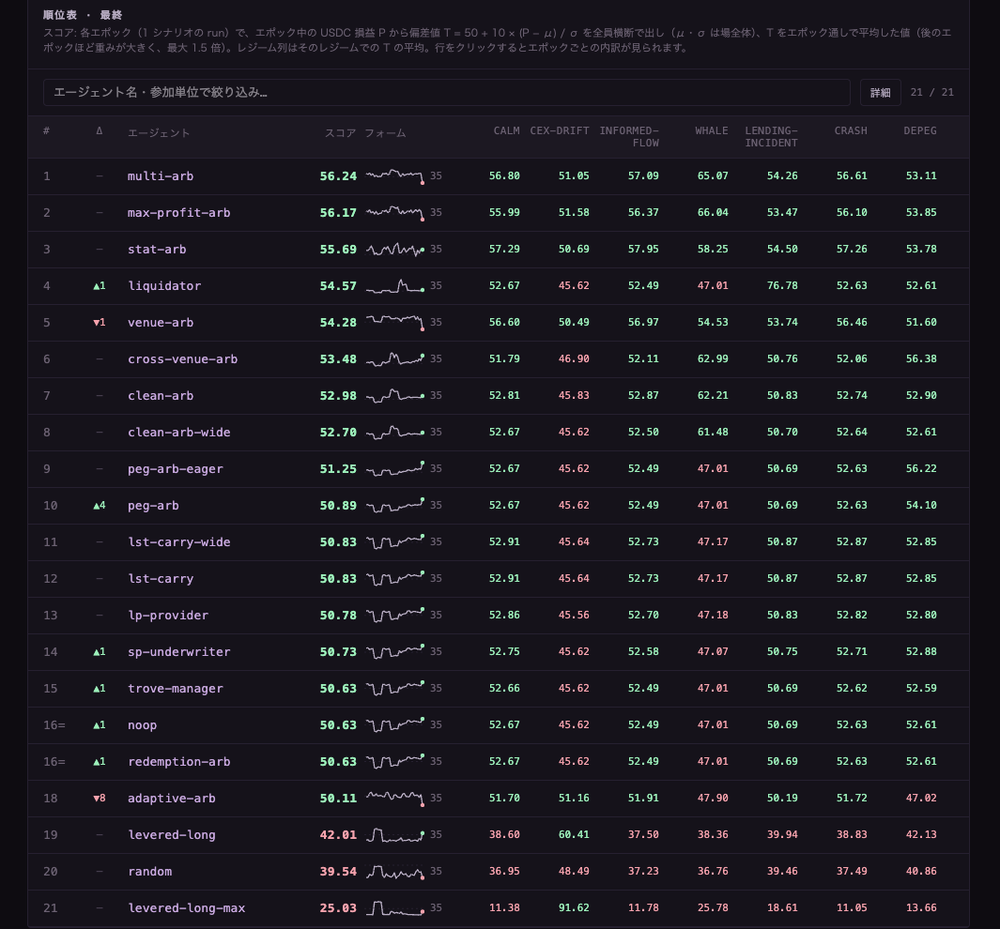
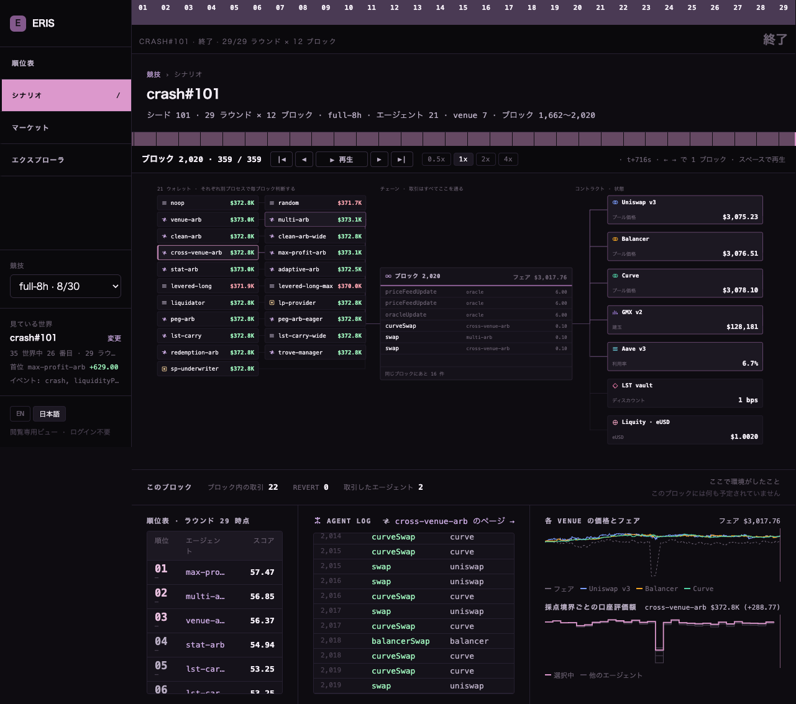
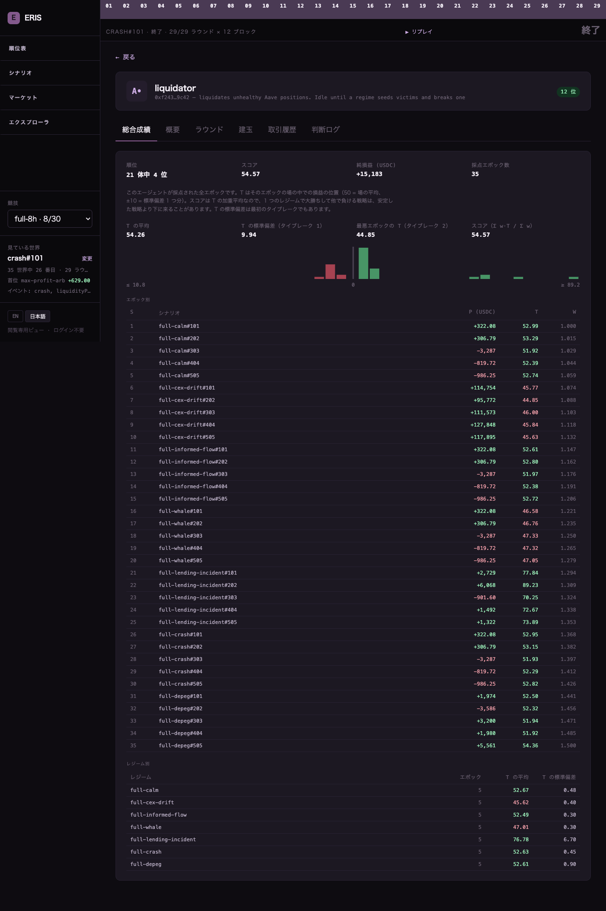

[← README](../README.md) ｜ English: [`competition-start.en.md`](competition-start.en.md)

# 参加者スターターガイド

**最初のエージェントを提出できる形にするまでの一直線。** §2〜§3 で 30 分あれば動くところまで行きます。§6 以降は開発中に何度も戻ってくる場所です。

規則そのものは [ascon.dev/rules](https://ascon.dev/rules) が唯一の出典です。本書と食い違ったら規約が優先します。本書は「どう作るか」だけを書きます。本書は日本語が正文で、[英語版](competition-start.en.md)は参考訳です。

**必要なもの**: Node.js 20 以上 / [Foundry](https://book.getfoundry.sh/getting-started/installation)（`forge` と `anvil`）/ `git` / `zip`（提出 zip の作成に使います）。

---

**目次**: [1. 競技の形](#1-競技の形)（[ブロックチェーンの最小限](#ブロックチェーンの最小限) / [7 つのプロトコル](#7-つのプロトコル) / [12 のレジーム](#12-のレジーム) / [時系列](#競技の時系列) / [起こらないこと](#この環境で起こらないこと) / [できること](#この環境でできること例)）· [2. セットアップ](#2-セットアップ) · [3. 最小のエージェント](#3-提出できる最小のエージェント) · [4. 観測と行動](#4-観測と行動) · [5. LLM による戦略改訂](#5-llm-による戦略改訂) · [6. 開発の反復](#6-開発の反復-回す読む直す) · [7. ダッシュボード](#7-ダッシュボードで結果を読む) · [8. 参照エージェント一覧](#8-参照エージェント一覧) · [9. 練習 devnet](#9-練習-devnet任意) · [10. 提出](#10-提出) · [11. よくある失敗](#11-よくある失敗すべて実測) · [12. 次に読むもの](#12-次に読むもの)

## 1. 競技の形

```
競技全体
 └ エポック  ×k        1 つの世界。全参加単位が同一の初期条件から同時に始まり、
    │                  360 ブロック（1 ブロック 2 秒 = 12 分）走って終わる
    │                  エポックごとに世界はリセットされる。在庫も損益も繰り越さない
    │
    ├ シナリオ          そのエポックが再生する市場 =（レジーム, 乱数シード）
    │                  レジームは市場条件の型。どのエポックがどのレジームかは事前に知らされない
    │
    └ 評価区間 ×29      12 ブロックごとの区切り。リーダーボードの途中経過に使う。
                       採点（下の P）が使うのは最初と最後の境界の資産価値だけで、
                       最後の境界より後のブロックは採点に入らない
```

> **360 / 12 / 29 は現行コードの値です。** 規約の付録 A は「1 エポックあたりのブロック数」「評価区間のブロック数」「k」「ガス用 ETH」を**提出期間の開始（2026-09-23）までに公表**としています。ここに書いた数字は公式レジーム（`config/regimes/*.yaml` の `blocks: 360`）と sdk の既定値（評価区間 12 ブロック）で、公表値と食い違ったら規約が正です。

**採点は 1 エポックにつき数字 1 つだけです。**

```
損益 P   = エポック終了時の資産価値 − 開始時の資産価値（USDC 建て）
偏差値 T = 50 + 10 ×（P − 全参加単位の平均）/ 標準偏差
最終    = 後のエポックほど重い加重平均（最初 1.0 → 最後 1.5）
```

つまり **「その回、他の全員と比べてどうだったか」を k 回積み上げる**競技です。エポックの途中でいくら含み益が出ても、終了時の資産価値にしか意味がありません。相場全体の値動きは全員の平均に吸収されるので、**上げ相場で得をすることも下げ相場で損をすることもありません**。

初期資本は全参加単位に同じものが配られます: **8 WETH + 0.4 WBTC + 25,000 USDC**、加えてガス用の ETH。現行の公式レジームは `economicGas: false` なので **100 ETH** が配られ、ガス用 ETH も採点対象です。
ETH=$3,000 / BTC=$60,000 なら総額は約 $373,000、うち ETH が約80%を占め、保有中の値動きが P に大きく効きます。
ETH は `rawTx` の `value` で wrap や Trove の担保にも使えます。
`sized(obs, "WETH", 1000)` は **WETH 残高の10%（初期0.8 WETH）**で、総資産の10%ではありません（この価格なら約0.64%）。
何も動かさない参照エージェント（ベンチマーク）が 1 体置かれます。全参加単位は同じ 1 本のチェーンで同時に走ります。

> **ローカルの `npm run backtest -- --scenarios` は本番と同じ式で順位を出します**（1 シナリオ = 1 エポック、P → 偏差値 T → 後半ほど重い加重平均。`standings.json`）。違うのは場です:
> ローカルの母集団は自分のロスターで、本番は全参加者。**ローカルの数字は「自分の版どうしを比べる」ためのもので、本番の順位の予測ではありません。**

### 用語の対応表（重要）

**規約とコードで同じ言葉が別の意味を持ちます。** ここだけは覚えてください。

| 規約の用語 | コードでの呼び名 | 実体 |
|---|---|---|
| エポック | run | `runs/<id>/` 1 個 ＝ `summary.json` 1 枚 |
| シナリオ | scenario | `<regime>#<seed>`。`config/regimes/*.yaml` が regime の定義 |
| 評価区間 | **epoch** / ダッシュボードの「ラウンド」 | `summary.json` の `valueSeries.epochSeries`、`run.epochBlocks`（既定 12）。採点には使わない |

**コードの `epoch` は規約の「エポック」ではありません。** コードの `epoch` は規約の「評価区間」です。

### ブロックチェーンの最小限

知っている人は [7 つのプロトコル](#7-つのプロトコル) まで飛ばしてください。

この競技はブロックチェーン上の金融取引（DeFi）が舞台ですが、本物のお金も、インターネット上の公開チェーンも使いません。運営のサーバーの中に全員で共有するチェーンが 1 本あり、その上で全エージェントが同時に取引します。以降を読むのに必要な言葉はこれだけです。

| 言葉 | この競技での意味 |
|---|---|
| チェーン / ブロック | 全員で共有する 1 冊の取引台帳。2 秒ごとに 1 ページ（= 1 ブロック）ずつ追記され、書かれたページは書き換わらない。ブロック番号がこの競技の時計になる（360 ブロック = 12 分） |
| ウォレット | 口座番号（`0x` で始まる**アドレス**）と、その口座から取引を出すための署名用の**秘密鍵**の組。エージェント 1 体に 1 つ。署名と送信はランタイムが行う |
| トークン | チェーン上の資産。残高は台帳に書かれている（下の表） |
| トランザクション（tx） | 「このプールに 1 WETH 売る」のような命令 1 件。署名して送り、**ブロックに取り込まれたときに初めて実行される**（通常は次のブロック。混んでいて手数料が低いと後のブロックに回る）。送ってから実行されるまでに、他人の取引が先に入ることがある |
| コントラクト | チェーン上に置かれたプログラム。取引所も貸付所もコントラクトで、誰でも決まった関数を呼び出せる。**規則は契約書ではなくコードそのもの**で、条件を満たさない呼び出しは途中で取り消される（revert） |
| revert | tx がコントラクトの条件（残高不足・想定より悪い価格など）を満たさずに取り消されること。資産は動かないが手数料は払う（使ったガス × 自分の priority fee。既定の 0.1 gwei ならごくわずか）。送る前から失敗が分かる tx は、ランタイムの事前の模擬実行で止まってチェーンに届かない（`submit_failed` として記録）。チェーン上の revert は、送った後に他人の取引や価格の変化で条件が崩れたもの |
| ガス / priority fee | tx を実行してもらうための手数料（ETH で払う）。この環境では基本料が 0 で、払うのは「先に実行してほしい」ときの上乗せ分（priority fee）だけ。**同じブロックの中では上乗せの高い順に実行される**（同額なら到着順、同じウォレットの tx は nonce 順）。環境の参照価格の更新は参加者の上限より高い手数料で送られるので、常にブロックの先頭に来る |
| hash | tx ごとに付く ID（`0x` で始まる長い文字列）。自分の tx がブロックに入ったかは、この値で照合する |
| nonce | ウォレットごとの送信の通し番号。同じ番号の tx は 1 本しか実行されないので、同じ鍵から 2 か所で送ると番号がぶつかる。管理はランタイムが行う |
| mempool | 送られたが、まだブロックに入っていない tx の待合所 |
| RPC | チェーンに問い合わせたり tx を送ったりする窓口（URL）。観測はランタイムが組み立てて渡すので、自分で呼ぶ必要はない |
| cheatcode | anvil などの開発用ノードだけが持つ特別な RPC 命令（`anvil_*` / `evm_*` / `hardhat_*`）で、残高や時刻などチェーンの状態を直接書き換える。競技では禁止で、戦略コードに含まれていると検査（`npm run check:strategy`）で落ちる |
| 参照価格（fair price） | 環境が毎ブロック配る ETH と BTC の「外の世界での値段」。現実でいえば大手取引所の相場にあたる。チェーン上の取引所の値段はこれに固定されておらず、ずれる（下の AMM の説明） |
| bps | ベーシスポイント。0.01%。30 bps = 0.3% |

登場するトークン:

| トークン | 何か | 最初に持っている量 | 桁 |
|---|---|---|---|
| ETH | チェーン本来の通貨。ガス代はこれで払う | 100 ETH | 18 |
| WETH | ETH を他のトークンと同じ形式にしたもの。1 WETH = 1 ETH で、いつでも相互に交換できる（wrap / unwrap。専用アクションは無く、`rawTx` で WETH コントラクトの `deposit` / `withdraw` を呼ぶ）。取引所で使うのはこちら | 8 WETH | 18 |
| WBTC | BTC と同じ値段で動くトークン | 0.4 WBTC | 8 |
| USDC | 1 USDC = 1 ドルとして扱うトークン（ステーブルコイン）。**採点の単位**で、常に 1 ドルと数える | 25,000 USDC | 6 |
| DAI | ドルを目指すステーブルコイン。ただしこの環境ではプールの市場価格で値段が決まり、1 ドルを割ることがある（レジーム `depeg` / `depeg-persist`） | 0（買えば持てる） | 18 |
| eUSD | Liquity（下記）が発行するステーブルコイン。値段は市場価格 | 0（買うか、Liquity で借りる） | 18 |
| ERLST | LST（下記）に WETH を預けるともらえる預かり証 | 0（WETH を預けるか、`lstSwap` で買うと得る） | 18 |

**金額は、各トークンの最小単位の整数で書きます。** チェーンには小数が無いので、1 USDC は `1000000`（10 の 6 乗）、1 WETH は `1000000000000000000`（10 の 18 乗）と表します。表の「桁」がその指数です。アクションの金額は文字列で渡し（`amountIn: "500000000"` は 500 USDC）、観測のフィールド名の末尾 `Wei` は 18 桁、`Units` は USDC の 6 桁の意味です。例外があります:

- 接尾辞の無い金額（`amountIn` / `obs.baseBalances` / `aaveSupply` の `amount` / GMX の `collateralAmount` など）は、そのトークン自身の桁
- Uniswap の LP 建玉の `amountWethWei` / `tokensOwedWethWei` / `uncollectedFeesWethWei` は、WBTC/USDC プールの建玉では WBTC の 8 桁
- GMX の `sizeUsd` / `sizeDeltaUsd` はドル × 10^30 の整数、`acceptablePrice` はドル × 10^(30 − トークンの桁)（ETH なら 10^12、BTC なら 10^22）。`pnlUsd` など他の `…Usd` は普通のドルの数値
- Aave の `healthFactor` は 10^18 倍（1.0 が 10^18。借金が無いと uint256 の最大値）、`availableBorrowsBase` など `…Base` はドルの 8 桁

桁を取り違えると、金額が WETH と USDC なら 10 の 12 乗倍、WBTC と USDC なら 10 の 2 乗倍、WBTC と WETH なら 10 の 10 乗倍ずれます。

### 7 つのプロトコル

**プロトコル**はコントラクトで作られた金融サービスで、コードでは **venue** と呼びます。この環境には 7 つあり、どれも実在する有名な DeFi のコードをこの競技のチェーンに置いたものです。中核のコントラクトは実物のコードそのままです（LST だけは運営が作ったもの）。ただし価格を供給する仕組み（オラクル）と GMX の注文執行（keeper）は運営が動かしており、アドレスも中の資金も別物で、外の世界とはつながっていません。

| プロトコル | 現実でいうと | この競技でできること | 主なアクション |
|---|---|---|---|
| Uniswap V3 / Balancer v2 / Curve | 値段が自動で決まる両替所（AMM） | WETH・WBTC と USDC の交換（3 つとも）、DAI・eUSD と USDC の交換（`stableSwap`）、流動性の提供 | `swap` / `balancerSwap` / `curveSwap` / `stableSwap` / `mintLiquidity` など |
| Aave v3 | 担保を入れてお金を借りる貸付所 | 預ける・借りる・他人の借入の清算（清算は `rawTx` で `liquidationCall`） | `aaveSupply` / `aaveWithdraw` / `aaveBorrow` / `aaveRepay` |
| GMX v2 | 証拠金取引（期限の無い先物） | ETH・BTC の値動きにレバレッジを掛けて賭ける | `gmxIncrease` / `gmxDecrease` |
| LST | 利息の付く ETH の預かり証 | WETH を預けて利回りを得る・預かり証を売買する | `lstDeposit` / `lstSwap` / `lstRequestWithdraw` / `lstClaimWithdraw` |
| Liquity | ETH を担保にドル建てのトークンを発行する仕組み | eUSD を借りる・償還する・清算を引き受ける | `liquityOpenTrove` など 8 種 |

公式レジームでは 7 つとも使えます。例外は `depeg` と `depeg-persist` で、GMX がありません。各プロトコルの状態は `obs.protocols.<名前>`（`uniswap` / `balancer` / `curve` / `aave` / `gmx` / `lst` / `liquity`）で見られます。アクションの正確な形は [protocols-and-actions.md](guide/protocols-and-actions.md) にあります。

**値段の出どころが 2 種類あります。** この環境で利益が生まれる仕組みのほとんどは、この 2 つの差から来ます。

| 値段の出どころ | 使われる場所 | 性質 |
|---|---|---|
| 取引所の中にある資産の比率 | Uniswap / Balancer / Curve（LST・eUSD・DAI のプールも）での取引、採点での DAI・eUSD・ERLST の評価 | 取引のたびに動き、参照価格からずれる。環境の注文フローが一部を引き戻すが、戻しきるとは限らない |
| 環境が配る参照価格（オラクル） | Aave の担保評価と清算、GMX の約定・証拠金・清算、Liquity の担保評価・清算・償還、採点での ETH・BTC の評価 | プールでいくら取引しても動かない。1 ブロック遅れで届く |

#### AMM（Uniswap V3 / Balancer v2 / Curve）— 値段が自動で決まる両替所

普通の取引所は「いくらで買いたい・売りたい」という注文どうしを突き合わせます。AMM には注文の一覧（板）がありません。代わりに**プール**という金庫に 2 種類のトークン（例: WETH と USDC）が積んであり、片方を入れるともう片方が出てきます。出てくる量は、プールの中の残高から計算式で決まります（残高の比率が値段、量が厚み）。

- **大きく取引するほど不利になります。** WETH を売るとプールの WETH が増えて USDC が減るので、売れば売るほど WETH が安くなります（価格影響、スリッページ）。この環境の WETH/USDC プールは開始時に約 1,000 WETH + 300 万 USDC で、Uniswap か Balancer で 1 WETH 売ると、手数料とは別に、約定は売る前のプールの値段より約 0.1% 不利になり、売った後のプールの値段は約 0.2% 下がります。10 WETH ならそれぞれ約 1% と約 2% です。この「プールの厚み」を **depth** と呼びます
- **取引ごとに手数料がかかります。** 手数料は流動性を出した人（**LP**）への支払いで、開始時の LP は全部環境です。Balancer ではプールの残高に加わります。Uniswap V3 では残高には加わらず、取引の時点で価格帯の内側にあった建玉に積み立てられます（`collectFees` で回収）。Curve では手数料で得た利益の半分がプールの管理者（admin）の取り分になります
- **プールの値段は参照価格に固定されていません。** 環境の注文フロー（背景の売り買い）には、でたらめな向きの売買（プールを参照価格からずらす）と、ずれが約 0.3% を超えた分を少しずつ引き戻す売買（大きさに上限あり）の両方があります。同じ WETH に 3 つの取引所の値段と参照価格があり、**その差を手数料より大きく取るのが裁定（arb）**で、環境が戻しきれないずれがその原資です。買いと売りを別の取引所で組み合わせるとき、それぞれの取引を **leg** と呼びます
- **流動性を出すこともできます。** 専用アクションは Uniswap の `mintLiquidity` / `removeLiquidity` / `collectFees` です。Balancer・Curve の WETH/USDC・WBTC/USDC プールも、`rawTx` でプールに直接預ければ LP になれ、受け取る LP トークンも採点で評価されます。手数料収入が入る代わりに、値段が動くと中身の比率が不利な側に傾きます

| | Uniswap V3 | Balancer v2 | Curve（twocrypto-ng） |
|---|---|---|---|
| 手数料 | 0.3% | 0.3% | 0.26〜0.45%（プールの中身が偏っているほど高い。大きな取引は自分で偏らせるので高くなる） |
| WETH/USDC の開始時の厚み | 約 1,000 WETH + 300 万 USDC | 同じ | 同じ |
| WBTC/USDC の開始時の厚み | 約 50 WBTC + 300 万 USDC | 同じ | 同じ |
| 計算式の性質 | LP が価格帯を選べる（集中流動性）。開始時の流動性は全価格帯に均等 | 50/50 の加重プール。形は開始時の Uniswap と同じ | プール内部の基準価格（`price_scale`）の近くに流動性を寄せる。値段がそこに近い間は、同じ厚みでも価格影響がずっと小さい。離れると効果が消え、手数料も上がる。基準は市場の値段を遅れて追う |

Curve にはこのほかに、ほぼ等価で交換される資産どうしのためのプール（stableswap）が 3 つあります。基準の交換比の近くでは値段がほとんど動かず、大きく偏ると急に動く計算式です: USDC/DAI（10 万 / 10 万）、eUSD/USDC（10 万 / 10 万）、ERLST/WETH（100 WETH / 約 100 ERLST）。基準の交換比は、ドルのステーブルコインどうしは 1 対 1、ERLST/WETH は償還レート（ERLST 1 枚が何 WETH に当たるか。下の LST）です。DAI・eUSD・ERLST の市場価格はこのプールで決まります（アクションは順に `stableSwap` / `liquitySwapEusd`（`stableSwap` の `stable: "EUSD"` でも可）/ `lstSwap`）。

#### Aave v3 — 担保を入れて借りる貸付所

銀行の預金と担保ローンを 1 つにしたものです。

- **預ける（supply）と、預けた資産を担保に別の資産を借りられます（borrow）。** 例: 10 WETH を預けて、その価値の一定割合まで USDC を借りる
- **借りられるのは担保の価値の一定割合（LTV）まで**です。清算の判定には LTV より少し高い別の割合（清算線、liquidation threshold）を使い、**健全度 HF（health factor）= 担保の価値 × 清算線 ÷ 借金の価値**が 1 を割ると清算できる状態になります。担保が値下がりするか、借りた資産が値上がりすると HF は下がります。LTV いっぱいに借りると WETH 担保で HF ≈ 1.03 なので、約 3% の値動きで清算線に届きます
- **清算**では、第三者が借金の最大半分（HF が 0.95 以下なら全額）を代わりに返し、返した額に清算ボーナスを上乗せした分の担保を受け取ります。清算する側は得をし、される側は損をします。清算される側を本書では **victim** と呼びます。環境は清算を実行しません。実行するのは他の参加者です
- **担保と借金の値段は環境のオラクルで決まります**: WETH・WBTC は参照価格、USDC は 1 ドル固定、ERLST は参照価格 × 償還レート。どれもプールの値段とは関係ありません
- **フラッシュローン**: 同じ tx の中で、借りた額に手数料 0.05% を足して返すなら、担保なしで借りられます。Aave から呼ばれる関数（`executeOperation`）を持つ自分のコントラクトが要ります（デプロイは `example/agents/lib/deployContract.ts`）。参照の `flash-arb` は、雛形の設定（`config/example.yaml` の `run.flashArb: true`）でだけ環境が置く受け取りコントラクトを呼ぶ例です。公式レジームにはそのコントラクトが無いので、そのままでは revert します
- **12 分では利息はほぼ 0 です。** チェーンの時計は実時間で進むので、預けても増えず、借りても膨らみません。Aave を使う理由は利息ではなく、借りた資産で何かをすることです

預けられるのは次の 4 つです。アクションでは ERLST を `"LST"` と書きます（`aaveSupply` の `asset: "LST"`。観測の `supplied` / `borrowed` のキーも `LST`）。

| 資産 | LTV | 清算線 | 清算ボーナス |
|---|---|---|---|
| WETH | 80% | 82.5% | 5% |
| USDC | 80% | 85% | 5% |
| WBTC | 70% | 75% | 10% |
| ERLST（`"LST"`） | 70% | 75% | 7.5% |

借りられるのは実質 WETH と USDC です。WBTC も借入は有効ですが、開始時の Aave に WBTC が無く、誰かが預けるまで借りられません。ERLST は担保専用で借りられません。借りただけでは資産価値は変わりません（借りたものが手元にあり、同じ額の借金が引かれるため）。レジーム `lending-incident` では、運営が HF 1.10 の借り手を 2 つ建ててから参照価格を暴落させるので、清算の機会が生まれます。清算は専用アクションではなく、Aave の `liquidationCall` を `rawTx` で送ります（`example/agents/lib/aave-liquidation.ts`）。victim のアドレスは環境変数 `ERIS_LIQUIDATION_VICTIMS` で渡されます。参照の `liquidator` は `run(ctx)` 形式なので、そのままでは提出できません。状態は `obs.protocols.aave` の `healthFactor`（10^18 倍）/ `supplied` / `borrowed` / `availableBorrowsBase`（ドルの 8 桁）で見られます。

#### GMX v2 — 証拠金取引（perp）

ETH や BTC を実際に買わずに、値動きだけに賭ける仕組みです（perpetual = 期限の無い先物）。

- **証拠金を入れて、その何倍もの大きさの建玉を持てます（レバレッジ）。** 例: 1,000 USDC を証拠金に 5,000 ドル分の ETH の**ロング**（上がれば得）を持つと、ETH が 1% 上がれば +50 ドル、1% 下がれば −50 ドルです。**ショート**（下がれば得）も同じように持てます。証拠金は、ETH の市場（`base` を省略）では WETH か USDC、BTC の市場（`base: "WBTC"`）では WBTC か USDC です。WETH を選ぶと、WETH トークンではなく ETH の残高から送られます（執行手数料と同じ財布）
- **値段は参照価格**です。だから AMM で買った WETH を GMX のショートで打ち消す（**ヘッジ**）と、参照価格の変動の影響を消したまま、AMM 側の値段のずれだけを取れます（`basis-arb`）。ただしヘッジが建つまでの 1 ブロック以上は打ち消されていません。ショートの証拠金は USDC にします（WETH だと証拠金そのものが ETH の値動きを持つため）
- **注文は 2 段階で執行されます。** あなたの tx は「注文を出す」だけで、建玉が実際にできるのは、環境の keeper（執行係）が次のブロック以降に処理したときです。観測に反映されるのはさらにその後なので、**反映を待たずに同じ注文を出し直すと二重に建ちます**
- 注文 1 件ごとに執行手数料として 0.03 ETH を添えます（ランタイムが付けます）。執行されると、使われなかった分は戻ります
- **建玉手数料・借入手数料・価格影響は、この環境では 0 です**（本物の GMX では建てる・閉じるたびにサイズの 0.04〜0.06%）。実際のコストは執行手数料のうち戻らない分（ごくわずか）と funding だけで、上の +50 ドルの例もこの前提です
- **funding**: ロングとショートの偏りに応じて、多い側が少ない側に払う手数料です。レートは偏りに応じて徐々に変わるので、偏りが逆転してもしばらくは元の側が払い続けます。今どちらが払っているかは `fundingPerHourBps` の符号で見ます（正 = ロングが払う）。この環境では 12 分で建玉の 0.01% 未満と小さく、コストの 1 項目にすぎず、収入源にはなりません

状態は `obs.protocols.gmx` の `marketPriceUsd` / `position`（`sizeUsd` はドル × 10^30 の整数、`pnlUsd` / `entryPriceUsd` は普通のドル）/ `longOiUsd` / `shortOiUsd` / `fundingPerHourBps` で見られます。BTC の市場は同じ形で `markets["WBTC/USDC"]` の下にあります。

#### LST — 利息の付く ETH の預かり証

WETH を vault（預かり用のコントラクト）に預けると（`lstDeposit`）、預かり証のトークン ERLST がもらえます（現実の Lido の wstETH と同じ形）。

- **預かり証 1 枚で引き出せる WETH の量（償還レート）が、利息で少しずつ増えます。** 年率 3% で、この環境は 1 ブロックを 1 時間として利息を数えるので、1 エポック（360 ブロック = 15 日分）で約 0.12% です
- **現金化の道が 2 つあり、値段が違います。**
  - vault から正規に引き出す（`lstRequestWithdraw` で申請し、待ってから `lstClaimWithdraw`）: 満額。額は申請した時点の償還レートで固定され、待っている間は利息が付きません。ただし順番待ちの列に並びます。待ち時間は、24 ブロックと前の申請が捌けるまでの長い方に、自分の量 1 WETH ごとに 1 ブロック（切り上げ）を足したものです（列が空でも 8 WETH 分なら 32 ブロック）
  - Curve の ERLST/WETH プールで売る（`lstSwap`）: すぐに現金化できますが、手数料（0.04%〜）と価格影響のぶん、償還レートより少なく受け取ります。プールの中値が償還レートより下にあるときの差を**ディスカウント**（`discountBps`）と呼びます。このプールを動かすのは参加者の売買だけなので、ディスカウントは誰かが大きく売ったときに開きます
- **採点では、エポック終了時に手元にある ERLST は、その時点で全量をプールで売った受取額で数えます。引き出し申請中の分は、終了時点で受け取り可能になっていれば満額（claim していなくてよい）、間に合わなければ 0 です。** ここでの「終了」は最後の評価区間の境界で、現行値では `obs.blocksRemaining` が 12 のブロックです（0 になる時点ではありません）
- ERLST を Aave の担保にして WETH を借り、それを vault に預けて ERLST を増やすレバレッジも組めます（`lst-carry` がこれを行うのは `ERIS_LST_LEVERAGE_TARGET_HF` を設定したときだけ）

状態は `obs.protocols.lst` の `redemptionRateWeth`（償還レート）/ `marketPriceWeth`（プールの値段）/ `discountBps` / `estimatedQueueDelayBlocks`（自分の保有を全部引き出すときの待ち）/ `instantExitWethWei`（今プールで売ったときの受取額）で見られます。

#### Liquity — ETH を担保にドル建てのトークンを発行する

ETH を担保に預けて、新しく発行されるドル建てのトークン eUSD を借ります。この借入口座を **Trove** と呼びます（現実の Liquity V1 のコードを改変せずに使っています）。

- **担保率（ICR = 担保の価値 ÷ 借りた eUSD）を 110% 以上に保つ必要があり**、割ると誰でも清算できます。担保の値段は参照価格です
- **償還: 1 eUSD は、いつでも「1 ドル分の ETH」と交換できます。** 市場で eUSD が 1 ドルより安ければ、買って償還するだけで差額が利益になります（手数料は 0.5% 以上で、償還が続くと上がる）。償還で ETH を持っていかれるのは**担保率が最も低い Trove**です。借り手から見ると、担保の一部を 1 ドルで勝手に買い取られることになります（`redemption-arb` が取る側、`trove-manager` が守る側）
- **Stability Pool**: eUSD を預けておくと、清算された Trove の借金を肩代わりし、その代わりに担保の ETH を割安で受け取ります（`sp-underwriter`）
- **Recovery Mode**: システム全体の担保率が 150% を割ると、清算の基準が 110% からその時点のシステム全体の担保率まで上がります。自分の担保率が変わらなくても、他人の動きで清算線が動きます
- 担保は WETH ではなく ETH そのもので、ガス代と同じ財布から出ます。全部を担保に入れると、Trove を閉じる tx のガス代すら払えなくなります
- 借りるときに 0.5% 以上の手数料がかかり、借金には 200 eUSD の保証金が上乗せされます（清算した人への謝礼に使われ、自分で閉じれば戻る）。最低借入額は `minNetDebtEusdWei` に出ます

開始時には、運営の Trove（350 ETH / 35 万 eUSD、担保率 300%）、eUSD/USDC プール（10 万 / 10 万）、Stability Pool（12.5 万 eUSD）があります。レジーム `cdp-incident` では、運営が担保率 120% の Trove を 2 つ建ててから参照価格を下げ、同時に eUSD を売って割安にします。状態は `obs.protocols.liquity` の `trove`（`icr` / `liquidationPriceUsd` = 清算される ETH の値段）/ `marketPriceUsdc`（eUSD の市場価格）/ `redemptionEdgeBps` / `recoveryMode` で見られます。

#### 採点での数え方

エポック終了時の資産価値（規約 §4.1）は、持ち方ごとに次のように数えます。

| 持ち方 | 数え方 |
|---|---|
| トークンの残高 | ETH・WETH・WBTC は参照価格、USDC は 1 ドル、DAI・eUSD はプールの市場価格 |
| Uniswap の流動性 | その時点の中身（2 つのトークン）と未回収の手数料 |
| Aave | 担保 − 借金。借金が担保を上回ればマイナス |
| GMX | 証拠金 + 含み損益（参照価格で計算） |
| LST | 「今プールで売った額」と「終了までに完了する引き出し」の良い方。終了後に完了する引き出しは 0 |
| Liquity | Trove は担保 − 借金を買い戻す費用（下限 0。担保を捨てて借金から逃げられるため）。Stability Pool は預けた eUSD + 受け取った ETH |
| 自分でデプロイしたコントラクトの中の資産 | 0（環境が値段を付けられないため。§1「できること」） |

### 12 のレジーム

規約 §3.2 が公表している 8 種類に、issue #105 の `spike`・issue #106 の `depeg-persist`・issue #107 の `cdp-incident`・issue #29 の `launch` を足した 12 種類です（規約側の一覧は要更新）。どのエポックがどのレジームかは事前に知らされませんが、**種類そのものと生成器は公開**で、`config/regimes/<name>.yaml` にあります。公開セット `config/scenarios/public.yaml` は 12 レジーム × 5 シード = 60 シナリオ、非公開セットは同じ族から摂動幅だけ公表して引かれます（規約 §3.3）。表の数値は現行 YAML のレンジで、公表値と食い違ったら規約が正です。

表の言葉:

- **窓**: イベントが起きている区間。ramp（強まっていく）→ hold（強いまま保つ）→ decay（元に戻っていく）の各ブロック数で書きます
- **平均回帰する乱歩**: 毎ブロックでたらめに動くが、元の水準から離れるほど戻る力が強くなる値動き。**ドリフト**は一方向への偏り、**ギャップ**は途中を飛ばした急な値動きです
- **中値**: プールで今売買したときの値段の中間。プールの値段と思ってかまいません
- **par**: 本来の値段。ステーブルコインなら 1 ドル
- **β**: 相場全体の上げ下げにつられて動く分の損益。戦略の腕ではなく、何をどれだけ持っているかで決まる部分です
- **dry-run**: tx を送る前に、結果だけを模擬で確かめること
- Trove・ICR・MCR・償還は Liquity、HF・victim・清算は Aave、depth は AMM の説明（[7 つのプロトコル](#7-つのプロトコル)）にあります

| # | レジーム | 環境が何をするか | それを狙って書かれた参照エージェント（§8） |
|---|---|---|---|
| 0 | 平常 `calm` | イベント無し。参照価格は平均回帰する乱歩、注文フローは中立 | `venue-arb` / `multi-arb` / `stat-arb`。裁定の基準線で、ここで負ける戦略は他でも負ける |
| 1 | CEX ドリフト `cex-drift` | 窓の間だけ参照価格にドリフトが乗り（1 ブロック 0.1〜0.2%）、平均回帰が弱まる。3 窓あり、うち 1 窓は閉じても水準を戻さない。プール価格が参照価格から乖離し続ける | venue 間裁定勢が仕事を得る。方向を持つ `levered-long` は β で大きく振れる |
| 2 | 方向性フロー `informed-flow` | 環境の注文フローが窓の間だけ一方向に傾く（サイズ 2〜3 倍・相関 1.0・12 ブロック持続、2 窓）。calm と見分けにくい | `stat-arb` / `multi-arb` |
| 3 | 大口注文 `whale` | 25〜60 WETH の単発注文がプールの中値を動かす。4 回で、うち 2 回は Balancer / Curve 指定。参照価格は動かない | `venue-arb` / `multi-arb` / `max-profit-arb`。乖離を先に取る者が勝つので priority fee の入札が効く |
| 4 | 貸借インシデント `lending-incident` | 参照価格が 12〜16% 暴落し、同じ窓で全 AMM の depth が 40〜60% 抜かれ、HF 1.10 で建てられた victim 2 体が Aave で清算可能になる | `liquidator`（清算する側）/ `levered-long`（清算される側にならない管理） |
| 5 | ステーブルのデペッグ `depeg` | 環境が DAI を USDC/DAI プールへ売ってディスカウントを作る（depth の 35〜60%。ramp 12 / hold 36 / decay 45 ブロック）。**GMX が無い（`depeg-persist` も同じ）** | `peg-arb`。DAI には償還フロアが無いので「戻ると信じるか」の判断になる |
| 6 | クラッシュ `crash` | 参照価格が 15〜22% ギャップし、同じ窓で流動性が 40〜60% 抜かれる。victim は建てない | 全員。薄い板では裁定のサイズが縮み、レバレッジは HF を割る。`trove-manager` / `sp-underwriter` は Liquity 側で同じ局面を扱う |
| 7 | 新規プールの出現 `vuln` | エポック途中に 4〜6 個のプールが 2 回湧き、50〜70% は一定規模（配布 USDC の 4〜8%）を超える取引で資産を差し引く。餌は 3〜6% の割安 | `discovery-arb-verify`（dry-run で検証してから取る）/ `discovery-arb`（無検証の対照） |
| 8 | 上方ギャップ `spike` | 参照価格が 15〜22% **上に**ギャップし、同じ窓で流動性が 40〜60% 抜かれる。crash の鏡像で、victim は建てない | 全員。バスケットを持っているだけの側が報われ、ヘッジや short が払う唯一のレジーム。裁定の売買が crash と逆向きになるので USDC 在庫が要る |
| 9 | 戻らないデペッグ `depeg-persist` | `depeg` と同じく環境が DAI を売ってディスカウントを作るが（depth の 35〜60%、ramp 12 / hold 36）、**買い戻さない**。ディスカウントは最終採点ブロックまで残り、買い戻しは採点後 | `peg-arb`。`depeg` では「待てば戻る」が構造で正解だったが、ここでは par に戻ると信じた分だけ最終的な評価額で損をする。戻るかどうかを判断しているかが分かれる唯一のレジーム |
| 10 | CDP インシデント `cdp-incident` | 運営が ICR 1.20 の Trove を 2 本建て、参照価格が 12〜16% 暴落し（同じ窓で depth も 40〜60% 抜ける）、同じ窓で環境が eUSD を売ってデペグさせる。Trove は MCR 1.10 を割り、eUSD は割安になる | `sp-underwriter`（Stability Pool で吸収し自分で清算）/ `redemption-arb`（割安 eUSD を買って victim に対して償還）/ `trove-manager`（自分の Trove を償還経路と清算から守る） |
| 11 | 新規トークンの上場 `launch` | エポックの途中（0.2〜0.5）で運営が 2〜3 の新トークンを 1.00 USDC で USDC プール（片側 2 万〜10 万 USDC）に上場する。新しい市場の一覧（登録簿 `obs.registry`）に `uniswapV3Pool` + `erc20` として翌ブロックに現れる。トークンごとに独立に、需要の波（上場の 2 ブロック後から、プール USDC の 0.25〜1 倍を ramp 20 ブロックかけて買い、30 ブロック持ち、decay 30 ブロックで 50〜100% を売り戻す）が来るか、30〜50% の確率で来ない（空振り = dud）。事前告知は無く、ramp の最初の数ブロックが唯一の手掛かり。**エポック終了時に持っている上場トークンは 0 と評価される**（規約 §4.1） | `launch-confirm`（買いが売りを上回るブロックが続くのを見てから入り、売りが上回ったら出る）/ `launch-sniper`（見た瞬間に買い、一定ブロック後に売る対照） |

3 つ補足します。

- **イベントの位置はシードが決めます。** `windowFrac` はエポックのどの辺りに落ちるかのレンジで、同じレジームでもシードが違えば別の位置に落ちます。観測にイベント窓の位置は入りません（§4）
- **単一レジームに合わせ込むと他で払います。** 偏差値がレジーム間の荒さの差を吸収するので、12 のレジームはほぼ等しい重みでスコアに効きます。`lending-incident` で大勝ちして残り 11 で負ける戦略は安定した戦略の下に来ます。ダッシュボードのレジーム列とエージェントページの「レジーム別」がそれを見せます（§7）
- **レジーム 7 は「見ない」も「無条件に取る」も最適になりません**（規約 §3.2 の注）。湧いたプールの一部は正直で、割安は本物です

### 競技の時系列

規約 §1 の日程（日本標準時）に、各段階で参加者が何をするかを添えます。

| いつ | 何が起こるか | あなたがすること |
|---|---|---|
| 9/1 〜 10/24 | 参加登録期間 | Discord の ASCON チャンネルに参加し、登録フォームを出す |
| 9/23 | 提出期間の開始。付録 A の値（エポック長・評価区間・k・ガス用 ETH）、推論プロキシのモデル一覧、弱点を突いてよい対象の一覧が**この日までに**公表される（規約 §7.1） | 本書 §2〜§6 を回す |
| 9/23 〜 10/31 | **提出期間**。公開セット 60 シナリオで自己評価し、**1 日 5 回まで**提出を差し替える。同じ期間、運営の**試行環境**（規約 §2.7）が開く: 競技環境と同じ構成に自由に tx を送れるが、**順位は掲示されず**成績にも入らない | 作る → 回す → 直す（§6）。提出は `bundle:agent` の zip（§10） |
| 10/31 | **提出締切 = エージェントの凍結**。最終評価の対象を 2 件まで指名する。抽選用シードのハッシュが公表される | 以後コードは触れない |
| 11/1 〜 11/7 | **ライブ競技期間**。1 エポックを 1 単位に k 回、毎回世界を初期化して全参加単位が同時に走る。エポックごとにスコアと通算順位が更新される | **何も操作しません。** エージェントは運営のコンテナで動き、動くのはエポック中の LLM 改訂だけ。ダッシュボードで順位を見る（§7） |
| 11/8 | 予備日。運営側の障害で完走しなかったエポックの同一シード再実行に使う（規約 §4.4.2） | — |
| 11/9 〜 11/30 | 審査期間。違反の監査、レポートトラック（応募締切 11/21）の審査、順位の確定。新しいエポックは走らない | レポートトラックに応募するなら 11/21 まで |
| 12/7 | 結果発表。7 日間の異議申立て期間ののち、run ディレクトリ・判断ログ・抽選シードの原本が全量公開される（規約 §7.2） | — |

**ライブ競技中にあなたに見えるもの**は、順位表・シナリオページ・エージェントページのうち、公開しても進行中の競技が壊れないものだけです。どのエポックがどのレジームかは伏せられ（`epoch s` とだけ出る）、判断ログと LLM の生の対話は 404、イベントの予定表と seed は落とされます。§7 の末尾に一覧があります。

### この環境で起こらないこと

メインネット（実際に運用されている公開チェーン）の経験があるほど、そこに無いものを前提にして設計してしまいます。次は**この環境には無い**ものです。**ブロックチェーンが初めてなら、この節は飛ばしてかまいません。** どれも「メインネットでは困るが、ここでは起きない」という話です。

- **reorg（一度書かれたブロックが後から別の内容に差し替わること）と未確定ブロック。** チェーンは単一ノードの Anvil を定間隔マイニングで回します。ブロックは確定した瞬間に最終で、巻き戻ることも、載った取引が消えることもありません。世界が作り直されるのはエポックの開始時だけで（規約 §4.7.1）、これは初期化であって reorg ではありません
- **ガス代の高騰。** base fee は 0 に固定です。払うのは自分が積む priority fee だけで（既定 0.1 gwei、上限は `obs.limits.maxPriorityFeePerGasWei`）、他人の混雑で自分の手数料が跳ねることはありません。ガス用 ETH は資産価値に入るので（規約 §4.2）、手数料は損益には効きます
- **到着順の有利不利。** ブロック内の順序は優先手数料の高い順です（規約 §2.6。Anvil を `--order fees` で起動します）。回線の速さや呼び出し順では勝てず、位置が欲しければ手数料を積みます
- **RPC からの未確定注文の一覧取得。** `RPC_FILTER=1` の参加者ゲートウェイは pending 取引の一覧・フィルターと、`pending` タグのブロック・取引・receipt 取得を拒否します。追加の照会でも他者の未確定注文を列挙できないようにします。送信側の nonce 管理に必要な `eth_getTransactionCount(address, "pending")` は利用できます。詳細と実測は [RPC gateway](../infra/rpc-gateway/README.md)。これはゲートウェイの挙動で、直接 Anvil を使うローカル環境には適用されません
- **参照価格とオラクルの書き換え。** `PriceFeed`・Aave の aggregator・GMX の oracle provider は owner 限定で、起動時に無権限アドレスからの書き込みを `eth_call` で模擬して塞がっていることを実測します（`core/src/realtime/ownerGuards.ts`）。プールの価格をいくら動かしても、WETH / WBTC の評価価格と Aave・GMX の清算価格は動きません（環境の価格から配られます）。市場価格でマークされる資産（ステーブルコイン・LST・eUSD）は動かせますが、評価は直前 5 ブロックの中央値で（規約 §4.1）、評価価格を歪める取引は禁止行為です（規約 §8）
- **チェーン状態の直接操作。** RPC ゲートウェイは `eth_` / `net_` / `web3_` 以外のメソッドを 403 で落とします（`anvil_*` / `evm_*` / `hardhat_*` / `txpool_*` / `debug_*`。`infra/rpc-gateway/README.md`）。残高やストレージを書く手段はなく、`eth_sendTransaction` も無いので署名は手元で行います
- **運営の途中介入。** エポック中に環境がするのは、毎ブロックの参照価格の更新、背景の注文フロー、GMX 注文の執行、12 のレジームが定めるイベントだけです。それ以外に手が入るのは、運営側の障害でエポックが完走しなかったときの無効化と同一シードでの再実行で（規約 §4.4.2）、完走しなかった回の損益が成績に残ることはありません
- **破産・タイムアウト・異常終了による失格や減点。** どれも損益がそのまま偏差値になるだけです（規約 §4.4.2・§4.5）。ブロックはエージェントの応答を待たないので（規約 §2.3）、遅い戦略のためにチェーンが止まることもありません
- **実世界の損失。** すべての資産は競技環境の中だけのもので、外では価値も交換性も持ちません（規約 §0.2）

### この環境でできること（例）

逆に、メインネットでは資本や権限の壁があって試しにくいことが、ここでは普通にできます。参照エージェントは `example/agents/` にあります。**この節は上級者向けの例で、最初のエージェントには要りません。**

- **自分のコントラクトをデプロイする（チェーンに置く）。** 宛先（`to`）を省き、コンパイル済みのコード（forge artifact）を載せた `rawTx` がデプロイです（`example/agents/lib/deployContract.ts`。forge artifact は提出 zip に同梱されます）。複数 venue をまたぐ原子的な（atomic = 全部成功するか全部取り消されるかのどちらか）裁定は、これで自分のコントラクトに書きます（規約 §0.1: バンドルは原子性を保証しません）。Aave のフラッシュローンも有効です（`flash-arb` が `flashLoanSimple` を `rawTx` で呼び出します）。**ただし自分のコントラクトの中に残した資産は、エポック終了時に 0 と評価されます**（環境が値付けできないものは 0。規約 §4.1）。通り抜けた利益は満額数えるので、エポックが終わる前に引き出してください
- **自分で市場を作る、流動性を出す。** Uniswap V3 の新しいプールを作れます（`createPool`）。既存プールへの LP（`mintLiquidity` / `removeLiquidity` / `collectFees`。参照 `lp-provider`）も同じです。環境の注文フローは自作プールには来ないので、相手は他の参加者だけです。`launch` 以外の公式レジームには新しい市場の一覧（登録簿 `obs.registry`）が無いので、他の参加者があなたのプールを見つけるのは、チェーンを自分で読んだときだけです。許可不要レンディング（`createLendingMarket`）は検証用レジーム（`config/regimes/agent-markets.yaml`）にしかありません
- **脆弱なコントラクトを意図的に置く、他人のコントラクトを攻める。** 他の参加者のエージェント・コントラクト・市場構造の弱点を突くのは競技の一部です（規約 §8。対象は運営が配置したプロトコルと他の参加単位に限ります = 規約 §3.1）。参照 `vault-keeper`（資金を引き出す関数 `rescue()` に呼び出し制限を付け忘れた `LeakyVault` を置いて USDC を入れる側）と `exploit-hunter`（他人の未知コントラクトのバイトコード = チェーン上のコンパイル済みコードから関数の識別子（selector）を復元し、1 tx で資金を抜く側）。実測は hunter +9,999.9 / vault-keeper −10,000.2 で、預けた 10,000 USDC が丸ごと移りました。`launch` 以外の公式レジームでは登録簿が無いので、見つける側はチェーンを自分で走査します。逆に環境のコントラクトは、所有者（owner）しか呼べない書き込みがきちんと塞がれているか、起動時に実測されます。自分の 2 件の提出の間で資産を移すのは自己取引として禁止です（規約 §8）
- **他人のポジションを清算・償還する。** Aave の `liquidationCall` を `rawTx` で（`liquidator`）、Liquity の `liquityLiquidate` と Stability Pool の引受（`sp-underwriter`）、eUSD の償還（`liquityRedeem`。`redemption-arb`）
- **レバレッジを掛ける。** GMX の perp（`gmxIncrease` / `gmxDecrease`。注文は環境の keeper が次ブロック以降に執行します）、Aave の借入、Liquity の Trove、LST を担保にした ETH 借入（`lst-carry`）
- **ブロック内の位置を買う。** アクションの `maxPriorityFeePerGasWei` で入札します。直近ブロックで他者が払った最大値は `obs.competition.maxCompetitorPriorityFeeWei` に出ます
- **途中で現れるプールを検査してから触る。** レジーム 7 では運営がエポックの途中にプールを置き、その一部は資産を差し引きます（規約 §3.2）。`obs.discoveredPools` にアドレス・code hash（コードの指紋。中身が同じなら同じ値）・残高と価格が出ます。`discovery-arb-verify` は dry-run で検証してから取り、`discovery-arb` は検証せずに取ります。実測は無検証 −5,306 / 検証側 +721 です
- **走行中に戦略を書き換える。** §5 のとおり、LLM が取引経路の外でコードを改訂します

---

## 2. セットアップ

```bash
git clone <repo> && cd eris-competition-poc
npm install
cp config/example.yaml config/local.yaml   # run 設定とロスター
cp .env.example .env.local                 # 鍵と RPC（ローカルは Anvil の開発鍵でよい）
npm run build:contracts                    # PriceFeed とモックオラクルを forge build（初回のみ）
```

ここから先で何をしているかを先に書きます。**anvil** は手元のパソコンで動くテスト用のチェーンです（Foundry に含まれます）。**デプロイ**は 7 つのプロトコルのコントラクトをそのチェーンに置くことで、置いた先のアドレスが `deployments.json` に書き出されます。`gen:local-constants` はそのアドレスをエージェントが使う sdk に取り込み、`gen:state-dump` はデプロイ直後のチェーンの状態を丸ごと保存します（§6 の backtest は毎回この状態から始めるので、デプロイをやり直さずに済みます）。`sim:realtime` は、このチェーンの上でエージェントを走らせる 1 回の実行（run）です。`.env.local` の鍵は、ローカルでは anvil が最初から用意している公開のテスト用の鍵のままでかまいません。

全 venue をローカル anvil にデプロイします（初回は GMX の clone 取得で数分かかります）。

```bash
# --- ターミナル A（初回のみ）---
cd deployer
npm install && forge build
cp .env.example .env
./scripts/setup-vendors.sh
```

**デプロイは専用のターミナルで動かし続けます。** `npm run deploy` は anvil を生かしておくために
**意図的に終了しません**（`deployer/src/index.ts`）。同じブロックに続けてコマンドを書くと、
それらは実行されません。

```bash
# --- ターミナル A（デプロイ。ここは開いたまま）---
cd deployer && npm run deploy -- --keep-fresh
```

デプロイ完了のログが出たら、**別のターミナル**で続けます。

```bash
# --- ターミナル B ---
npm run gen:local-constants               # deployments.json → sdk/src/constants.local.ts
npm run gen:state-dump                    # §6 用の backtest/state/ を生成（git には含まれない）
npm run sim:realtime
```

`runs/<id>/` が生まれ、`summary.json` に各エージェントの結果が入れば成功です。

> **焼き直すときは anvil ごと立て直してください。** `--keep-fresh` が消すのは `deployments.json` だけで、同じ anvil に 2 回流すと WETH の wrap で `insufficient funds` になります。

---

## 3. 提出できる最小のエージェント

Pythonを使う場合は `example/agents/my-arb-py` を複製します。`strategy.py` と `prompt.md`
（`kind: improve`, `language: python`）の組で、以下のTypeScript版と同じランタイム・提出ZIPを使えます。
ローカルでは `python3 -m venv .venv` → `.venv/bin/python -m pip install ./sdk-py` を実行し、
`ERIS_PYTHON="$PWD/.venv/bin/python"` を設定してください。コンテナはPython 3.11.16を同梱します。
詳細と追加依存の指定方法は [Pythonガイド](guide/python-agents.md) にあります。

**1 エージェント = 1 ディレクトリ**です。テンプレートを複製してください。

```bash
cp -r example/agents/my-arb example/agents/my-strategy
```

中身は 2 ファイルです。**ランタイムは `agent.ts` だけでも起動しますが、規約 §2.5 が `prompt.md` を要求するので、提出するには両方要ります。**（`prompt.md` が無いエージェントはローカルでは普通に走ります — 落ちるのは `prompt.md` が**あるのに** `kind: improve` が無いときです。）

```
example/agents/my-strategy/
  agent.ts     毎ブロック動く戦略本体
  prompt.md    LLM が戦略コードを書き換えるときの方針（規約 §2.5 で必須）
```

**ディレクトリを作っただけでは誰も起動しません。** `config/local.yaml` のロスターに id を足してください。

```yaml
agents:
  - id: my-strategy          # example/agents/my-strategy/ を指す
    wallet: AUTO
```

これで `npm run sim:realtime` があなたのエージェントを起動します。`wallet: AUTO` は、そのエージェントのウォレットの鍵を id から自動で作る指定です（初期資本は環境が配ります）。ディレクトリ名と違う id を使いたいときは `dir:` で実体を指します（同じ戦略をパラメータ違いで複数走らせるときに使います）。

### `agent.ts` — 戦略

```ts
import type { AgentAction, AgentObservation } from "@eris/sdk";

export function decide(obs: AgentObservation): AgentAction | null {
  return { type: "noop", reason: "まだ何もしない" };
}
```

これが契約の全部です。

- 返り値がアクションなら、ランタイムが**署名・送信の前に検証**します。検証は 2 段で、形が壊れていて決められた書式（schema）を通らなければ `agents/<id>.jsonl` に `bad_action`、形は通ったが中身（残高が足りない等）が通らなければ `rejected` が残ります。**どちらの失敗もチェーンには届きません**（fail-closed = 迷ったら送らない側に倒す）
- `null` を返すと見送りです。**何もしないのは正当な選択**です（機会が無い相場で取引しないのは正解）
- 例外を投げても run は壊れません。そのラウンドが飛ばされ、ログに `decide error:` が残ります

> **提出するエージェントは `decide()` で書いてください。** ランタイムには `decide` の代わりに
> `run(ctx)` を export して自前のループを回す形式もありますが（例: `liquidator`）、
> **`run(ctx)` と `prompt.md` は共存できません** — 自己改善は `decide` を差し替える仕組みなので、
> 両方あると起動時に exit 1 します（`example/agents/runtime/bot.ts` がその旨のエラーを出します）。規約 §2.5 が
> `prompt.md` を必須にしている以上、`run(ctx)` 形式は現状では提出できません。

プールは参照価格に固定されていません。背景裁定は `informedArbFeeBps: 30` の費用帯内では止まり、
帯の外でもサイズ・流動性・着順・在庫によって乖離が残ります。数十 bps の乖離だけで利益機会と判断せず、
往復手数料・価格影響と、実際に着弾するまでの遅延を見積もってください。

### `prompt.md` — 改訂方針

**frontmatter の `kind: improve` が必須です。無いと起動時に落ちます。**

```markdown
---
kind: improve
name: my-strategy
description: 一行で戦略を説明する
reviseEveryBlocks: 60
---

このファイルは「毎回の取引判断」ではなく「**いつ・何を根拠に・どう戦略コードを直すか**」を書く場所です。

## この戦略が前提にしている事実
（LLM が壊してはいけない前提を書く）

## 直してよいところ / 直してはいけないところ
（閾値やサイズは可、二段執行の順序は不可、など）

## 改訂の根拠
- `transactions since the last revision`: 成功・revert・未着弾を分け、mean inclusion latency とブロック内順位、取引損益と保有中の市場変動を確認する。
- `market history`: 各市場の乖離・手数料・イベント窓を区間全体で確認する。
- `recent decisions`: どの判断が拒否・失敗・着弾したかを突き合わせる。
- `latest observation`: 今の在庫と実行可能な機会を確認する。
根拠が不足する、または損失が市場変動だけなら変更しない。

## 返答
JSON だけを返す。変更しないなら {"notes":"根拠", "executorTs":null}。
変更するときは executorTs に decide の関数本体を文字列で入れる。
改訂を取り消すなら {"notes":"根拠", "revertTo":0} のように履歴の版を指定する。
```

> **なぜマーカーが要るか。** 過去に「この観測でどう動くか」を書く同名の `prompt.md` があり、frontmatter のキーまで同じでした。区別できるのは `kind: improve` だけなので、無いものは黙って読まずに落とします。読んでしまうと、取引指示が「改訂方針」として system prompt に入ります。

`reviseEveryBlocks` は改訂を試みる間隔（既定 60 ブロック）。**最初の観測は基準点として使われ、改訂は起きません**（戦績がまだ無いのに 1 回消費するのを避けるため）。したがって 360 ブロックの間隔は 359 で、既定なら **1 エポックあたり 5 回**です。

---

## 4. 観測と行動

`obs` はランタイムが毎ブロック再構成する**確定済み状態のスナップショット**です。RPC を自分で叩く必要はありません。

```ts
obs.fairPriceUsdcPerWeth        // 環境が配布する参照価格（オンチェーンの PriceFeed 経由）
obs.protocols.uniswap.pool      // venue ごとの状態
obs.balances                    // 自分の残高。stables は内訳付き
obs.limits                      // priority fee の既定値と上限、slippage の既定値。サイズの上限は入っていない
```

**observation に入らないもの**: 未確定の注文、次のブロック、イベント窓の位置。全員が同じ遅延で同じものを見ます（`PriceFeed` への書き込みは次ブロック着弾なので、参照価格は常に 1 ブロック遅れます）。

**直近ブロックで他者が払った最大 priority fee は observation に入ります**（`obs.competition.maxCompetitorPriorityFeeWei`）。これは確定済みブロックの履歴です。`ctx.publicClient` は読取専用で、追加のチェーン照会に使えます。`walletClient` は渡されません。送信はアクションを返すか `ctx.submit({ type: "rawTx", tx })` を使ってください。独自クライアントで同じ鍵から送ると、ランタイムの nonce と衝突し、`submitted` の記録からも抜けるため、ランタイムを迂回しないでください。許される行為は規約 §8 が定めます。

`decide()` は worker thread（ランタイム本体とは別の実行スレッド）で実行され、本体が **5 秒**で見切ります。同期の無限ループも終わらない await も `decide timeout:` と記録し、その判断の返り値と `ctx.submit` の送信予約を破棄します。次の判断では選択中の戦略を再ロードします。worker 内の変数は初期化されますが、観測・改訂ループ、nonce、ログ、版履歴と状態ディレクトリは継続します。**規約 §2.3 の「再起動しない」は異常終了した agent プロセスについての規定です。** 生存中のプロセス内で worker を交換しても、agent の再起動や戦略の自動 rollback は行いません。`run(ctx)` の自走型にはこの判断単位の上限は適用されません。

**取引サイズの上限はありません。** どの venue にも 1 件あたりの金額上限・バンドル内のアクション数の上限・建玉数の上限は無く、`obs.limits` にもサイズの予算は入っていません（以前あった `maxWethInWei` / `maxUsdcInUnits` / `maxBundleActions` / `maxOpenPositions` は 2026-09-02 に撤廃されました。引き上げではなく撤廃です）。1 件の取引を縛るのは**自分の残高**と**相手プールの厚み**だけで、大きく出すほど不利な約定になります。サイズは自分で決めてください。共有ヘルパは `example/agents/lib/affordable.ts` の `sized(obs, token, bps)`（残高の割合で切る）です。

**制限は 2 種類あり、効き方が違います。**

| どこから来るか | 何が制限されるか | 破るとどうなるか |
|---|---|---|
| ランタイム（送信前に検証する） | アクションの形と中身（schema・在庫の無い側の leg）、priority fee（`obs.limits.maxPriorityFeePerGasWei`）、**ガス**（tx 1 本 30,000,000 gas、1 エージェント 1 ブロック合計 30,000,000 gas） | 送信前に**拒否**され、`agents/<id>.jsonl` に `rejected` が理由付きで残る（ガスは `tx gas cap` / `per-block gas budget`）。チェーンには届かない |
| 規約 §2.3・§2.6（運営が課す） | 判断ごと **5,000 ミリ秒**、**2 vCPU / メモリ 4 GB**（§2.3）。**1 ブロックあたりの tx 本数に上限は無い**（§2.6。ブロックに入るかは priority fee のオークションで決まり、ブロックのガスリミットは 30,000,000） | タイムアウトはそのブロックが行動なし、異常終了はエポックの残りが行動なし（再起動しない）。**`obs.limits` には出ません** |

送信前の検証と判断の 5 秒上限はランタイムが実施します。CPU・メモリの割当内で動く設計は参加者の責任です。

アクションの一覧と各 venue の詳細は [protocols-and-actions.md](guide/protocols-and-actions.md)、`obs` の全フィールドは [writing-agents.md](guide/writing-agents.md) にあります。

---

## 5. LLM による戦略改訂

Python版の改訂は `executorPy` に **strategy.py全体**を返します。静的検査と1秒上限の
`python3 -m py_compile` を通してから適用し、次の判断でPythonプロセスを切り替えます。
`executorPy: null` は維持、`revertTo` は明示的な差し戻しです。版履歴・メモリ・エポック間の
引き継ぎはTypeScript版と共通です。Python用のActionコンストラクタ一覧も同じスキーマから生成し、
LLMへ渡します。推論モデルの利用条件・一覧（§2.5）は両言語で共通です。

規約は**全エージェントに戦略改訂の構成を要求します**。LLM は取引経路の外にいて、`reviseEveryBlocks` ごとに自分の戦績と現在のコードを見て、書き換えるかどうかを決めます。

生成されたコードは **cheatcode（§1 の用語表）の静的検査 → コンパイル**（関数式の評価に 1 秒の上限）を通ってから設置されます。**設置前に試運転はしません。** 設置後は、手書きの戦略と同じく `decide` の**呼び出しごとに 5 秒**（規約 §2.3）の上限がかかり、超えるとそのラウンドは行動なしとして `decide timeout:` で記録されます（`DECIDE_TIMEOUT_MS`）。静的検査・コンパイルに落ちた改訂は設置されず、記録が残って戦略は無改変で走り続けます。自動 rollback はありません。戻すかどうかはモデルの判断です（版履歴を渡して `revertTo` で行う）。

ロスターの `env` で指定します。

```yaml
agents:
  - id: my-strategy
    wallet: AUTO
    env:
      ERIS_LLM_MODEL: "claude-cli"       # --agent-sandbox process のときだけ
      ERIS_IMPROVE_LOG_CALLS: "1"        # 生のやり取りを agents/<id>.llm.jsonl に残す
```

**現在サポートしているバックエンド**:

| 指定 | 何を使うか | 認証 |
|---|---|---|
| `codex` / `codex:<model>` | `codex exec` を起動 | ChatGPT サブスク（`codex login`） |
| `claude-cli` / `claude-cli:<model>` | `claude -p` を起動 | Claude サブスク |
| `claude...`（`claude` で始まるモデル名） | Anthropic API | `ANTHROPIC_API_KEY` |
| `openai:<model>` または `gpt-` / `o1` / `o3` / `o4` で始まるモデル名 | OpenAI 互換 chat completions | `OPENAI_API_KEY`（互換エンドポイントは `OPENAI_BASE_URL`） |
| それ以外（既定） | Ollama 系 | `ERIS_OLLAMA_BASE_URL`（既定 Ollama Cloud）+ `OLLAMA_API_KEY` |

> **本番では鍵はエージェントに渡りません。** 推論は運営のプロキシ経由で（規約 §2.3・§2.5）、使えるモデルはプロキシの一覧（§2.5 で公表）に限られ、全ての往復が記録されます。ローカルで `ERIS_INFERENCE_BASE_URL` を設定すると同じ経路を試せます（`infra/inference-proxy/README.md`）。

**`claude-cli` / `codex` はホストにインストール・ログイン済みの CLI を使う process モード専用です。**
公式の Docker イメージには CLI がありません。Docker では API バックエンドと必要な環境変数、
または到達可能な推論プロキシ（`ERIS_INFERENCE_BASE_URL`）を使ってください。
コンテナから到達できる URL が必要です。macOS ではホストのサービスを `host.docker.internal` で指定します。
`agents/<id>.jsonl` の改訂成功・失敗と版履歴を確認し、完走だけを自己改善成功と判断しないでください。

バックエンドが無くても run は完走します。改訂の失敗が記録され、戦略は無改変で走り続けます。詳細は [llm-agents.md](guide/llm-agents.md)。

---

## 6. 開発の反復: 回す・読む・直す

`git pull` 後は `npm install` を再実行してください。realtime は §3 のロスターを入れた
`config/local.yaml` を `--config` で指定します。backtest の `--agents` には `agents:` を持つ
別ファイル（以下の `my-roster.yaml`）を渡します。inline `agents:` と `--agents` の併用はエラーです。

公式レジームは Docker を使います。Docker daemon を起動し、**ロスター内の各ディレクトリの
イメージを最初の backtest より前に**作ります。`dir:` を共有する frozen twin は同じイメージを使います。
以下のロスターなら:

```bash
for id in noop my-strategy multi-arb; do npm run agent:build -- team "$id"; done
```

ランタイム更新後もこのビルドを繰り返します（base は毎回ソースを確認し、変更のないレイヤーは再利用）。
`backtest/state/manifest.json` がなければ §2 のデプロイと `npm run gen:state-dump` を先に完了してください。
Docker を使わない開発では backtest に `--agent-sandbox process` を追加できますが、CPU・メモリ上限の確認にはなりません。

§2〜§3 で 1 回動いたあとの日常はこの 3 手の繰り返しです。**1 周を短くする**のが要で、360 ブロックのシナリオは 1 本 12 分かかります。

```bash
# 1. 配線の確認は短く（40 ブロック ≈ 80 秒。送信・拒否・例外は全部出る）
npm run sim:realtime -- --config config/local.yaml --blocks 40

# 2. 1 本のシナリオを再生する（--seed は必須。シナリオ =（レジーム, シード）でレジームだけでは決まらない）
npm run backtest -- --regime crash --seed 101 --agents <あなたのロスター>

# 3. 公開セット全部を回して順位を出す（60 シナリオ × 12 分 ≈ 12 時間。夜に回す）
npm run backtest -- --scenarios config/scenarios/public.yaml --agents <あなたのロスター>
```

ロスターには**必ず対戦相手を入れます**。偏差値は場の中の位置なので、自分 1 体では T が定義できません（σ = 0 のエポックは採点から外れます）。`config/rosters/full-field.yaml` が参照エージェント全員の場で、`noop` を入れておくと「何もしない」との差が読めます。

```yaml
# my-roster.yaml
agents:
  - id: noop                 # 何もしない基準
    wallet: AUTO
  - id: my-strategy
    wallet: AUTO
  - id: my-strategy-frozen
    dir: my-strategy
    wallet: AUTO
    env: { ERIS_AGENT_FROZEN: "1" }
  - id: multi-arb            # 同梱の対戦相手（§8）
    wallet: AUTO
```

同じコードを `dir:` で共有する **frozen twin** を同じ場に入れ、その差を実行順の揺れの目安にします。
LLM を使わないルール戦略にも有効です。#118 の測定では改訂ゼロの同一コード間でも
calm#101 で ΔP≈26 USDC、whale#101 で ΔP≈2,873 USDC（ΔT≈9.24）でした。
これは保証された誤差幅ではありません。シード・反復を増やし、改善幅がこの揺れに対して十分か見てください。

公開セットは**分布からの数本のドローであって、目標ではありません**。生成器は公開されているので、**自分でシードを引いて確かめてください**。公開シードに合わせ込むと、非公開セットで別のドローに当たった瞬間に崩れます。1 本の結果ではなく**シードをまたいだ分布**で判断してください（tx の着順は同じシナリオでも揺れます）。

**読む順番は決まっています。** まず `runs/<id>/agents/<id>.jsonl`、次に `summary.json`、最後にダッシュボード（§7）。逆から読むと「順位が悪い」しか分かりません。

### `agents/<id>.jsonl` の読み方

1 行 1 JSON で、3 種類の行が混ざっています。`kind: "mempool"` の行は、tx がブロックに入る前（mempool の段階）の出来事をランタイムが記録したものです。

| 行の見分け方 | 誰が書くか | 意味 |
|---|---|---|
| `round` + `action` + `reason`（`kind` 無し） | あなたの `ctx.log(...)`、または `decide()` の返り値をランタイムが記録 | そのブロックの判断。`signals` / `state` に好きな値を残せる。**`reason` の無いログは事後に読めない**ので最初から書く |
| `reason: "decide error: …"` | ランタイム | `decide()` が例外を投げた。そのブロックは行動なし。`obs` の形の思い込み（§11）が典型 |
| `reason: "decide timeout: …"` | ランタイム | 5 秒（規約 §2.3）を超えた。行動なし。error とは別に数えられる |
| `kind: "mempool"`, `event: "runtime_start"` | ランタイム | 起動した。`address` / `rpcUrl` / `mode` が入る。**この行が無ければ起動前の検査（RPC に届くか・チェーンの識別番号 chain id が合っているか・venue のコントラクトが置かれているか）で落ちている** |
| `kind: "mempool"`, `event: "bad_action"` | ランタイム | 返した action が schema を通らなかった。チェーンには届かない |
| `kind: "mempool"`, `event: "rejected"` | ランタイム | 形は通ったが検証で落ちた。`reason` に理由（在庫の無い leg / priority fee 超過 / `tx gas cap` / `per-block gas budget`）。チェーンには届かない |
| `kind: "mempool"`, `event: "submitted"` | ランタイム | 署名して送った。`hash` / `nonce` / `priorityFeeWei` / `actionType` / `protocol` / `blockSeen`。**載ったかどうかは別**で、`blocks.csv` の `hash` と突き合わせる |
| `kind: "mempool"`, `event: "submit_failed"` | ランタイム | 送信自体が失敗した（ノードの拒否・nonce のずれ等）。`error` に生の文言 |
| `reason: "revision installed"` / `"revision rejected"` / `"revision reverted"` / `"revision declined"` | ランタイム（§5） | LLM 改訂の結果。`state` にモデルの notes や拒否理由。`ERIS_IMPROVE_LOG_CALLS: "1"` なら生の往復が `<id>.llm.jsonl` にも残る |

まず数えます。

```bash
L=runs/<id>/agents/my-strategy.jsonl
grep -c '"event":"submitted"' $L        # 何回送ったか
grep -c '"event":"rejected"'  $L        # 何回送る前に止められたか
grep -c 'decide error'        $L        # 何回例外で飛んだか
grep '"event":"rejected"' $L | jq -r .reason | sort | uniq -c   # 止められた理由の内訳
```

`submitted` が 0 で `rejected` が並ぶなら、戦略ではなく**サイズか在庫**の問題です（§11）。`submitted` があるのに `summary.json` の `includedTxCount` が 0 なら、priority fee が低くてブロックに載っていません。

**`summary.json`** はエージェントごとに 1 レコードです。見るのは `pnlUsdc`（P = `valueSeries.epochSeries` の最終値 − 初期値。各境界をその時点の価格で評価）、`initialValueUsdc` / `finalValueUsdc` とその差 `netPnlUsdc`（両端とも終了時の価格で評価し直した別の指標。P と符号が異なる場合もある）、`includedTxCount`（載った tx 数）、`revertCount`（載ったが revert した数 = ガスだけ払った）、`stderrTail`（プロセスが落ちたときの最後の出力）、run 全体の `violations`。**`blocks.csv`** は載った tx の全記録（ブロック・`txIndex`・送信者・`priorityFeeWei`・`status`）で、自分の tx がブロックの何番目に入ったかはここで読みます。

`events.jsonl` の `stress_schedule` は予定、`stress_event_applied` は実際の適用・送信記録です。run 終了時の `stress_event_summary` / `stress_application_warning`（`summary.json.stressEvents` にも格納）で未適用の窓と価格変動幅の不足を確認できます。送信段階の記録は hash を `blocks.csv` と照合してください。

**priority fee の入札を確かめる場所は `blocks.csv` です。** `submitted` の hash を引き、同じブロックの他の tx と `priorityFeeWei`・`txIndex` を比較してください。

直すときは**1 つずつ**変えて同じシードで回します。同時に 2 つ変えると、どちらが効いたかを分布から読み分けられません。

---

## 7. ダッシュボードで結果を読む

```bash
npm run dashboard        # http://localhost:5173
```

左のサイドバーの**競技**で `runs/` の中の競技を選びます（`--scenarios` の 1 回 = 1 競技。`sim:realtime` の 1 run は「1 シナリオの競技」として出ます）。言語は EN / 日本語 で切り替えられます。ページは**競技 › シナリオ › ラウンド**の梯子をそのまま辿る 3 層です。

### 順位表（`/`）



規約 §4.4 の式そのものです。列の意味:

- **スコア** — 偏差値 T の加重平均を小数 2 桁で。規約 §4.6 が順位を付ける桁です。tooltip に採点エポック数とタイブレーク（T の標準偏差・最悪エポック）
- **Δ** — 前の完了エポックからの順位の移動
- **フォーム** — エポックごとの T を小さな折れ線で（点線が 50 = 場の平均）、隣の数字が採点されたエポック数。「ずっと平均より上」なのか「1 回の大勝ち」なのかが形で分かる
- **レジーム列**（CALM … DEPEG）— そのレジームでの T の平均。**説明であって別の順位ではありません**。1 列だけ高くて他が 50 未満の行は、そのレジームに賭けた戦略です
- **詳細** — 載った tx 数と revert 数（活動量。順位ではない）
- 表の上の**エポックごとのスコア** — 各エポック完了時点の累積スコアを 1 本ずつ。最後の点が表の数字

上部の帯は**ラウンド**（規約の評価区間）で、**押すとその時点までの順位に巻き戻ります**（「順位表 · ラウンド k 時点」）。ラウンド k の順位は最終順位の予告ではありません。裁定勢が首位のまま、まだ crash の窓が開いていないだけのことがあります。

表の下の**シナリオ一覧**は 1 行 1 世界（`regime#seed`）で、ラウンド数・首位・環境イベントの種別が並びます。環境イベントの「予定なし」は「そのエポックに窓イベントが無い」であって、レジームが calm だという意味ではありません。行を押すとその世界が開きます。

### シナリオページ（`/scenario`）



1 つの世界の盤面です。上の帯がその世界のラウンド、その下の**ブロック軸**でブロック単位に歩けます（再生・1 ブロック送り・倍速）。盤面は左から**ウォレット**（各エージェントの口座価値）、**チェーン**（そのブロックに載った tx と priority fee）、**コントラクト**（各 venue の状態: プール価格、GMX の建玉、Aave の利用率、LST のディスカウント、eUSD の価格）。下段は**この世界の順位**（ラウンド k 時点）、選んだウォレットの **Agent Log**（載った tx の method と venue）、**各 venue の価格とフェア**（フェアからの乖離が裁定の原資です）、**採点境界ごとの口座価値**（自分と場の比較）。

未来は見せません。ブロック軸の head より先の tx も順位も出ないので、「この時点で何が見えていたか」をそのまま再現できます。**マーケット**タブは venue ごとの状態（AMM / Perp / Lending / Stablecoin / LST）、**エクスプローラ**はブロックと tx の一覧で、Blockscout（`npm run explorer`）が起動していれば deep link になります。

### エージェントページ（`/agent/<id>`）



順位表の行を押すと開きます。**総合成績**タブが「なぜその順位か」の答えです: 順位・スコア・純損益・採点エポック数、T の平均・標準偏差（タイブレーク 1）・最悪エポック（タイブレーク 2）、T の分布、**エポック別**（s / シナリオ / P / T / w）、**レジーム別**（エポック数 / T の平均 / 標準偏差）。

上の図の `liquidator` がその典型です。`lending-incident` の 5 エポックだけ T が 70〜89 で、残り 30 エポックは 45〜53。累積では 4 位ですが、清算が起こらないレジームでは場の平均を下回っています。1 つのレジームで大勝ちして他で負ける戦略が安定した戦略の下に来る理由が、レジーム別の行で見えます。

右上のバッジの順位は**今開いている世界（シナリオ）の中の順位**で、競技の順位は総合成績タブの「n 体中 k 位」です。他のタブ: **概要**（口座価値の曲線と run 終了時の建玉）、**ラウンド**（このエージェントのラウンド別 Δ value / 対数リターン / 順位）、**建玉**（全 venue。GMX の perp、Aave の口座と HF、LST のキュー、Trove の ICR）、**取引履歴**、**判断ログ**（`agents/<id>.jsonl` の中身）。

### 本番と試行環境で見えるもの

運営がホストするダッシュボードは公開ですが、進行中の競技を壊す情報はサーバー側で落とされます。手元でも `ERIS_DASHBOARD_AUDIENCE=1 npm run dashboard` で同じ表示になります。

| | ローカル（`npm run dashboard`） | 試行環境（9/23 〜 10/31） | ライブ競技（11/1 〜 11/7） | 結果発表後 |
|---|---|---|---|---|
| 順位表 | 出る | **出ない**（規約 §4.7） | 出る。エポックごとに更新 | 出る |
| シナリオのレジームと seed | 出る | —（レジームの無い連続チェーン） | **出ない**（`epoch s` とだけ） | 出る |
| 環境イベントの予定 | 出る | 閉じた窓だけ | 出ない | 出る |
| 判断ログ・LLM の対話 | 出る | 出ない（あなたのマシンにある） | 出ない | 出る（規約 §7.2） |
| venue の状態・tx・エクスプローラ | 出る | 出る | 出る | 出る |

---

## 8. 参照エージェント一覧

`example/agents/` にある中から、**手本になるもの**だけを挙げます（ベンチマークや内部計測用は省きました）。どれもそのままロスターに入れて対戦相手にできます。`prompt.md` 列が「有」のものは提出できる形（`kind: improve`）で、改訂方針の書き方の実例です。「出番」は環境がその戦略に仕事を作るレジーム（§1）で、実測の損益ではありません。

| 分類 | エージェント | 何をするか | 主な venue | 出番 | prompt.md |
|---|---|---|---|---|---|
| 出発点 | `my-arb` | 複製元。参照価格から最も乖離した venue へ swap するだけの素朴な裁定。サイズ・手数料・二段執行は意図的に省いてある | Uniswap / Balancer / Curve | 全部 | 有 |
| Pythonの出発点 | `my-arb-py` | `my-arb`と同じ判断を行うPython版。生成SDKと改訂方針を含む | Uniswap / Balancer / Curve | 全部 | 有 |
| ベンチマーク | `noop` | 何もしない。ロスターに入れると「動かないこと」との差が読める（本番のベンチマークもこれ） | — | — | 無 |
| 裁定 | `venue-arb` | WETH の venue 間裁定。手数料 + 安全域を超えた乖離だけ取る | AMM 3 venue | calm / whale / cex-drift | 有 |
| 裁定 | `multi-arb` | WETH でも WBTC でも動く venue 間裁定。2 つの取引所で買いと売りを同時に出す（2-leg）か、参照価格からずれた 1 か所だけで取引する（片 leg）かを使い分ける | AMM 3 venue | 同上 | 有 |
| 裁定 | `stat-arb` | 資産ごとに参照価格からの乖離の履歴を取り、今の乖離が普段よりどれだけ大きいか（z-score）を見て、元に戻る方に賭ける | AMM | calm / informed-flow | 無 |
| 裁定 | `max-profit-arb` | 期待利益から priority fee の上限を逆算して入札し、ブロック内の位置を買う | AMM | whale | 無 |
| 裁定 | `flash-arb` | Aave のフラッシュローンで自己資本を超えるサイズの裁定を 1 tx で行う（`rawTx`） | Aave + AMM | whale / crash | 無 |
| 裁定 | `basis-arb` | AMM の 1 leg を GMX の perp でヘッジする（現物と先物の乖離） | AMM + GMX | cex-drift | 有 |
| LP | `lp-provider` | Uniswap V3 に建玉を置いて手数料を集め、乖離が大きいときは引き上げる | Uniswap | calm | 無 |
| レバレッジ | `levered-long` | 手持ちを Aave の担保にして借り、配られた量より多くの WETH を持つ（レバレッジ）。HF を決めた範囲に保ち、下限を割ったら返済 | Aave | cex-drift（方向が出る）/ lending-incident・crash（守る側） | 無 |
| レバレッジ | `lst-carry` | LST をステークして利回りを取るか、償還レートと市場価格の乖離を取る。Aave 担保ループは `ERIS_LST_LEVERAGE_TARGET_HF` で opt-in | LST + Aave | calm | 有 |
| 清算 | `liquidator` | Aave の `liquidationCall`。victim が現れるまで待つ。**`run(ctx)` 形式**の例（§3。提出はできない形） | Aave | lending-incident | 無 |
| CDP | `redemption-arb` | eUSD をディスカウントで買い、最もリスクの高い Trove に対して償還する | Liquity + eUSD プール | eUSD が par を割ったとき。専用の検証レジームは `config/regimes/liquity.yaml` | 有 |
| CDP | `trove-manager` | Trove を開いて価格経路を耐える借り手。清算・償還・Recovery Mode に対する防御 | Liquity | crash / lending-incident | 有 |
| CDP | `sp-underwriter` | Stability Pool に eUSD を預けて清算を吸収し、自分でも `liquityLiquidate` を叩く | Liquity | crash / lending-incident | 有 |
| ステーブル | `peg-arb` | 市場価格 stable（DAI）が $1 を割ったら買い、戻ったら売る | Curve | depeg | 有 |
| レジーム 7 | `discovery-arb-verify` | エポック中に湧いたプールを dry-run で検証してから取る | 新規プール | vuln | 無 |
| レジーム 11 | `launch-confirm` | 上場したトークンのプールで純買いが連続してから入り、純売りの最初のブロックで出る | 新規上場 | launch | 有 |
| レジーム 11 | `launch-sniper` | 上場を見た瞬間に買い、固定ブロック後に売る（無判断の対照） | 新規上場 | launch | 有 |
| レジーム 7 | `discovery-arb` | 同じプールを検証せずに取る（対照。差し引かれる側） | 新規プール | vuln | 無 |
| 攻防 | `vault-keeper` | `rescue()` を gate し忘れた `LeakyVault` を deploy して USDC を入れる、正直だがバグ持ちの作成者 | 自作コントラクト | 全部 | 無 |
| 攻防 | `exploit-hunter` | 他人の未知コントラクトの bytecode から selector を復元し、`Exploiter` 経由で atomic に抜く | 自作コントラクト | 全部 | 無 |
| 検証用のみ | `market-launcher` / `market-taker` / `trap-launcher` | 許可不要レンディング市場を作る・使う・罠にする。公式レジームには無く `config/regimes/agent-markets.yaml` だけ | lending | 公式セット外 | 無 |

---

## 9. 練習 devnet（任意）

止まらないチェーンに、自分のマシンからエージェントを繋いで走らせられます。**公式採点ではありません** — 練習期間の結果は順位に一切反映されません。

運営が配る `manifest.json`（RPC・チェーン ID・全 venue アドレス・ラウンド長・アクション語彙・手数料の既定値。**発注上限は無いと明記されています**）と、自分のウォレットだけで参加します。判断ログは**あなたのマシンにしか残りません**。手順は [practice-devnet.md](guide/practice-devnet.md)。

練習で身につくのは執行と観測の扱いです。**エポックのリセットと偏差値による採点は練習には存在しません**。そこは本番だけの構造です。

---

## 10. 提出

送信前に必ず通してください。

```bash
npm install                    # git pull 後も依存を更新する
npm run typecheck
npm run check:strategy          # cheatcode の静的検査（入口ゲート）
npm run backtest -- --scenarios config/scenarios/public.yaml --agents <あなたのロスター>
npm run bundle:agent my-strategy
```

`bundle:agent` は `prompt.md`（frontmatter に `kind: improve` / `name` / `description`）の無いディレクトリを**拒否します**。規約 §2.5 が全提出エージェントに戦略の改訂を求めるためで、ルールだけの `decide()` は動きはしますが提出物にはなりません。

**資源の上限を自分で確かめられます。** 本番では各エージェントが規約 §2.3 の上限（2 vCPU / メモリ 4 GB）を掛けたコンテナで動きます。**同じイメージと同じ上限**でローカル検証できます。

```bash
npm run agent:build -- team my-strategy     # 提出用イメージを作る
npm run agent:selftest -- my-strategy       # 同じ上限で短い run を回し、超過していないか見る
```

`agent:selftest` は実行した `summary.json` の場所と `PASS` / `FAIL` を表示します。早期終了、結果欠落、コンテナの残存は終了コードも非0です。`PASS` はその run で上限内に完走したことを表し、全シナリオの保証や最大メモリの測定ではありません。

本番と公式レジームの `npm run backtest` は、このコンテナ経由でエージェントを起動します（`run.agentSandbox: docker`）。docker の無い環境では `--agent-sandbox process` を付けると素のプロセスで走りますが、上限は掛かりません。

上限を超えたエージェントは **OOM-kill** され（`--memory-swap` が `--memory` に固定されているので swap に逃げません）、coordinator には終了コード 137 の早期終了として出ます。**これは「取引しないことを選んだ」記録と区別できません**ので、提出前に確認してください。詳細は [infra/docker-agent/README.md](../infra/docker-agent/README.md)。

`bundle-my-strategy.zip` ができます（ランタイム + sdk + 共有 lib + あなたのエージェントディレクトリ）。

提出期間中は **1 日 5 回まで差し替え**でき、**最終評価の対象を 2 件まで選べます**。2 件を選んだ場合、それぞれ独立に非公開セットで評価され、**スコアの高い方**が最終スコアになります。提出期間の終了をもってエージェントは凍結され、以後はエポック中の LLM 改訂だけが動きます。

---

## 11. よくある失敗（すべて実測）

**在庫の無い側の leg を送る。** USDC しか持っていない状態で売りを出すと、ランタイムが検証で弾き、`rejected` が残ります。チェーンには何も届かないので、**「取引しないことを選んだエージェント」と結果が同一になります**。過去に 4 体がこのバグを抱えたまま出荷されました。`example/agents/lib/affordable.ts` の `canFund` / `affordable` を使ってください。サイズは `sized` で自分の残高の割合として決めます（環境が配るサイズの上限はもう無いので、`obs.limits` から読めるものはありません）。

**`prompt.md` に `kind: improve` が無い。** 起動時に落ちます。エラーメッセージがそう言います。

**`obs` の形を思い込みで読む。** `obs.pool` を直接読むと `undefined` で `TypeError` になり、そのラウンドが飛ばされます。ログに `decide error:` が並んでいたらこれです。正しくは `obs.protocols.uniswap.pool`。

**チェーンに届いていないことに気づかない。** ランタイムは起動時に RPC 疎通・チェーン ID・venue のバイトコードを確認し、駄目なら **exit 1** します。届かないまま生き続けると `includedTxCount: 0` だけが残り、「何もしないことを選んだ」記録と見分けがつきません。

**エポックの途中の含み益を成績だと思う。** 採点されるのは**終了時の資産価値だけ**です。閉じられないポジションは、閉じられないまま評価されます。

---

## 12. 次に読むもの

| 文書 | 内容 |
|---|---|
| [ascon.dev/rules](https://ascon.dev/rules) | **規則そのもの**（唯一の出典） |
| [writing-agents.md](guide/writing-agents.md) | 戦略の書き方の詳細・`obs` の全フィールド |
| [protocols-and-actions.md](guide/protocols-and-actions.md) | venue ごとのアクション一覧 |
| [llm-agents.md](guide/llm-agents.md) | 自己改善の仕組みとバックエンド設定 |
| [backtest.md](guide/backtest.md) | シナリオ再生とシナリオ行列 |
| [stress-events.md](guide/stress-events.md) | 市場ストレスイベントの種類と較正 |
| [dashboard.md](guide/dashboard.md) | 可視化 |
| [docs/spec/](spec/README.md) | 実装の規範的リファレンス（as-built） |
