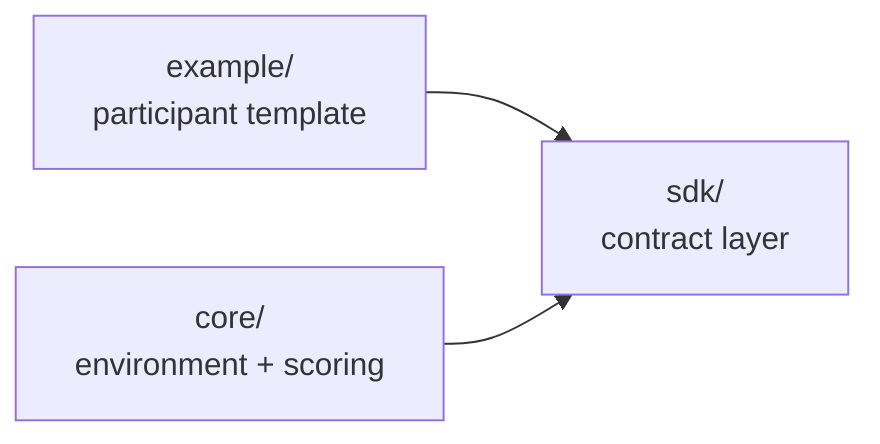
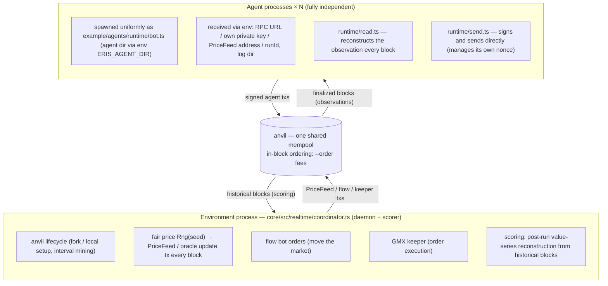

[← README](../../README.md)

# Architecture (separating the environment from agent execution)

The package is split into 3 workspaces + a bundled deployer (ADR 0015). The only allowed dependency direction is **`example → sdk ← core`** (enforced by `npm run check:boundaries`):

| workspace | role |
|---|---|
| `sdk/` | Contract layer — types / action schema (zod) / chain / markets / protocols / observation / SimConfig |
| `core/` | Environment daemon + scoring — realtime coordinator / anvil / flow / stress / vuln / backtest / cli. Participants do not touch this |
| `example/` | Participant template — `example/agents/<id>/` is the unit of copy and submission. `runtime/` (generic driver) and `lib/` (shared strategy helpers) are reserved names |
| `deployer/` | Venue deployment (self-contained subpackage outside the workspace) |

The environment and the agents are separate OS processes that only meet on-chain:

- **Fair price is distributed on-chain** (`contracts/PriceFeed.sol`; read via `sdk/src/priceFeed.ts`, write via `core/src/realtime/priceFeed.ts`). The write tx lands in the next block, so the information is delayed by 1 block for everyone equally (by design).
- **Scoring is reconstructed after the run** (`core/src/realtime/reconstruct.ts`) — a Multicall3 keyed on blockNumber writes each agent's value series at the same cross-section into `events.jsonl`, aggregated into `runs/<id>/summary.json`.
- **Rule enforcement is post-hoc detection** (`core/src/postRunCheck.ts`) — it inspects `blocks.csv` for fee cap overruns and records violating runs in `violations`. The entry-side gate is `npm run check:strategy` (static cheatcode inspection).
- **Orderflow is an independent process** — the generation logic is `core/src/flow/logic.ts` (pure functions) and the bot itself is `core/src/flow/market-maker.ts`. It is driven every round by a stdin/stdout synchronous protocol with the coordinator, and runs deterministically off its own `Rng(ERIS_FLOW_SEED)`.
- Protocol adapters (`sdk/src/protocols/*.ts`) implement `readState` / `observe` / `buildTxs` / `valueUsdc` etc., and the environment's scoring and the agent's observation reconstruction use **the same adapter and the same `observationFor`**.

## Why separate them

Agents are never handed an RPC, other participants' private keys, pending transactions, or the txpool — only **observations of finalized state**. This structurally prevents front-running by peeking at the mempool, and creates a fair arena where everyone competes on the same information and the same mempool. The market is moved by the environment's flow bot, and agents react to the resulting price dislocations = arbitrage opportunities.

## How to write an agent (1 agent = 1 directory, ADR 0015)

Drop exactly one of the following into `example/agents/<id>/` and add the id to the roster — that is all it takes to add an agent. Spawning is always handled by `runtime/bot.ts` (for a step-by-step tutorial see [Writing strategies](writing-agents.md)):

| content | kind | how it runs |
|---|---|---|
| `agent.ts` (exports `decide(obs, ctx)`) | rule strategy | bot.ts drives a read→decide→send loop (interval can be set via `export const config = { intervalMs }`) |
| `agent.ts` (exports `run(ctx)`) | self-driven | bot.ts does not loop; it delegates by passing ctx (clients / latestObservation / onObservation / submit / log) (e.g. liquidator) |
| `prompt.md` (frontmatter: name/description required) | prompt type | bot.ts attaches the observation and has the LLM emit an action on every decision ([LLM agents](llm-agents.md)) |

runtime/send.ts appends mempool activity (`kind:"mempool"`: submitted / submit_failed / rejected) to `runs/<id>/agents/<id>.jsonl` as a self-report (closing the gap where the coordinator can no longer count submissions).

## Execution modes

The same coordinator is used from two entry points:

- **`npm run sim:realtime`** — a normal realtime run, either fork (`ARB_RPC_URL`) or [local deploy](local-deploy.md).
- **`npm run backtest -- --regime <name>`** — participant backtest (ADR 0016). It replays an official regime on top of a dedicated anvil loaded with the distributed state dump, repeated via `--repeat`. See [Backtest](backtest.md) for details.
