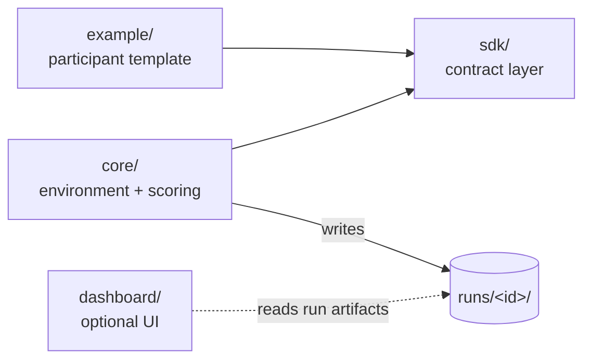
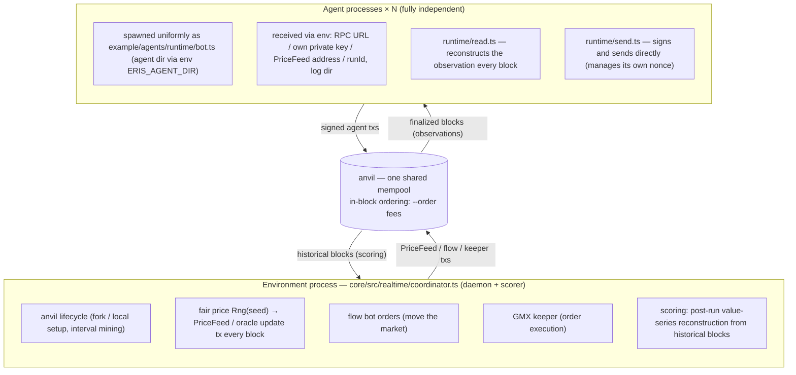

[← README](../../README.md)

# Architecture (separating the environment from agent execution)

The package is split into 4 workspaces + a bundled deployer (ADR 0015). Among the first three the only allowed dependency direction is **`example → sdk ← core`** (enforced by `npm run check:boundaries`):

| workspace | role |
|---|---|
| `sdk/` | Contract layer — types / action schema (zod) / chain / markets / protocols / observation / SimConfig |
| `core/` | Environment daemon + scoring — realtime coordinator / anvil / flow / stress / vuln / backtest / scoring / cli. Participants do not touch this |
| `example/` | Participant template — `example/agents/<id>/` is the unit of copy and submission. `runtime/` (generic driver) and `lib/` (shared strategy helpers) are reserved names |
| `dashboard/` | Optional web UI (issue #63). Reads `runs/<id>/` off disk and the anvil over JSON-RPC; nothing in the run depends on it ([Dashboard](dashboard.md)) |
| `deployer/` | Venue deployment (self-contained subpackage outside the workspace) |

```mermaid
graph LR
  example["example/<br/>participant template"] --> sdk["sdk/<br/>contract layer"]
  core["core/<br/>environment + scoring"] --> sdk
  dashboard["dashboard/<br/>optional UI"] -.->|"reads run artifacts"| runs[("runs/&lt;id&gt;/")]
  core -->|"writes"| runs
```

The environment and the agents are separate OS processes that only meet on-chain:

```mermaid
flowchart TB
  subgraph ENV["Environment process — core/src/realtime/coordinator.ts (daemon + scorer)"]
    direction TB
    E1["anvil lifecycle (fork / local setup, interval mining)"]
    E2["fair price Rng(seed) → PriceFeed / oracle update tx every block"]
    E3["flow bot orders (move the market)"]
    E4["GMX keeper (order execution)"]
    E5["scoring: post-run value-series reconstruction from historical blocks"]
  end
  subgraph AGENTS["Agent processes × N (fully independent)"]
    direction TB
    A1["spawned uniformly as example/agents/runtime/bot.ts (agent dir via env ERIS_AGENT_DIR)"]
    A2["received via env: RPC URL / own private key / PriceFeed address / runId, log dir"]
    A3["runtime/read.ts — reconstructs the observation every block"]
    A4["runtime/send.ts — signs and sends directly (manages its own nonce)"]
  end
  CHAIN[("anvil — one shared mempool<br/>in-block ordering: --order fees")]
  ENV -- "PriceFeed / flow / keeper txs" --> CHAIN
  AGENTS -- "signed agent txs" --> CHAIN
  CHAIN -- "finalized blocks (observations)" --> AGENTS
  CHAIN -- "historical blocks (scoring)" --> ENV
```

- **Fair price is distributed on-chain** (`contracts/PriceFeed.sol`; read via `sdk/src/priceFeed.ts`, write via `core/src/realtime/priceFeed.ts`). The write tx lands in the next block, so the information is delayed by 1 block for everyone equally (by design).
- **Scoring is reconstructed after the run** (`core/src/realtime/reconstruct.ts`) — a Multicall3 keyed on blockNumber writes each agent's value series at the same cross-section into `events.jsonl`, aggregated into `runs/<id>/summary.json`. The epoch boundaries of that series are what the risk-adjusted score is computed over, and they are stored alongside it so a finished run can be rescored under a different metric ([Scoring](scoring.md)). The same historical reads also produce `market.json`, a reporting-only per-venue series that never feeds scoring.
- **Rule enforcement is post-hoc detection** (`core/src/postRunCheck.ts`) — it inspects `blocks.csv` for fee cap overruns and records violating runs in `violations`. The entry-side gate is `npm run check:strategy` (static cheatcode inspection).
- **Orderflow is an independent process** — the generation logic is `core/src/flow/logic.ts` (pure functions) and the bot itself is `core/src/flow/market-maker.ts`. The coordinator pushes a flow context down stdin on every new block and relays each line the bot writes back to stdout into the mempool (the same push/stream model the agent processes use). The bot never touches RPC and runs deterministically off its own `Rng(ERIS_FLOW_SEED)`.
- Protocol adapters (`sdk/src/protocols/*.ts`) implement `readState` / `observe` / `buildTxs` / `valueUsdc` etc., and the environment's scoring and the agent's observation reconstruction use **the same adapter and the same `observationFor`**.

## Why separate them

Agents are never handed an RPC, other participants' private keys, pending transactions, or the txpool — only **observations of finalized state**. This structurally prevents front-running by peeking at the mempool, and creates a fair arena where everyone competes on the same information and the same mempool. The market is moved by the environment's flow bot, and agents react to the resulting price dislocations = arbitrage opportunities.

## How to write an agent (1 agent = 1 directory, ADR 0015)

Drop exactly one of the following into `example/agents/<id>/` and add the id to the roster — that is all it takes to add an agent. Spawning is always handled by `runtime/bot.ts` (for a step-by-step tutorial see [Writing strategies](writing-agents.md)):

| content | kind | how it runs |
|---|---|---|
| `agent.ts` (exports `decide(obs, ctx)`) | rule strategy | bot.ts drives a read→decide→send loop (interval can be set via `export const config = { intervalMs }`) |
| `agent.ts` (exports `run(ctx)`) | self-driven | bot.ts does not loop; it delegates by passing ctx (clients / latestObservation / onObservation / submit / log) (e.g. liquidator) |
| `agent.ts` + `prompt.md` (frontmatter: kind: improve / name / description required) | self-improving | decide() drives every block as usual, and an LLM periodically rewrites the strategy out of the trade path ([Self-improving agents](llm-agents.md)) |

runtime/send.ts appends mempool activity (`kind:"mempool"`: submitted / submit_failed / rejected) to `runs/<id>/agents/<id>.jsonl` as a self-report (closing the gap where the coordinator can no longer count submissions).

## Execution modes

The same coordinator is used from two entry points:

- **`npm run sim:realtime`** — a normal realtime run, either fork (`ARB_RPC_URL`) or [local deploy](local-deploy.md). One world from start to finish (`run.resetUnit: continuous`).
- **`npm run backtest -- --regime <name> --seed <N>`** — participant backtest (ADR 0016). It replays one scenario on top of a dedicated anvil loaded with the distributed state dump, repeated via `--repeat`.
- **`npm run backtest -- --scenarios <path>`** — the scenario matrix (ADR 0017): the whole set on one anvil with snapshot/revert between scenarios, writing `matrix.json` + `standings.json`. This is the competition's shape and the only mode that may declare `resetUnit: scenario` (ADR 0020). See [Backtest](backtest.md).

Neither entry point has to decide the scoring rule at run time. Both store the raw value series, so
`npm run metrics` can rescore a finished run or a finished matrix under any candidate metric and
aggregator ([Scoring](scoring.md)).
