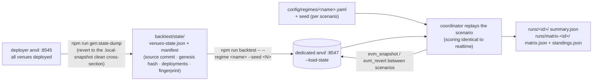

[← README](../../README.md)

# Backtest (scenario replay, ADR 0016 / ADR 0017)

A mode for participants to validate their own strategy "cheaply and repeatedly, under conditions equivalent to historical market data." On top of a **dedicated local anvil** loaded with the distributed venue state dump, the existing coordinator replays a scenario as-is. Fills are computed by the real contracts (no fill model), and scoring is fully identical to realtime (the `summary.json` format is the same except for `mode: "backtest"`). No fork and no external RPC required.

A **scenario is `(regime, seed)`**, written `<regime>#<seed>`. The regime YAML holds the market conditions; the seed picks which realization out of that family you get. Both have to be supplied — a regime alone is not runnable (ADR 0017 §1).

```bash
npm run backtest -- --regime calm --seed 101                    # one scenario: calm#101
npm run backtest -- --regime lending-incident --seed 202        # collateral crash + Aave liquidations
npm run backtest -- --regime calm --seed 101 --repeat 5         # same scenario 5x (see the spread)
npm run backtest -- --regime calm --seed 101 --agents my-roster.yaml   # swap the roster

npm run backtest -- --scenarios config/scenarios/public.yaml    # the whole public set + standings
```



## Prerequisites

| thing | how to get it |
|---|---|
| anvil binary | one-shot `foundryup` |
| state dump (`backtest/state/`) | drop in the operators' distribution. To build your own, run `npm run gen:state-dump` against an anvil already deployed by the deployer (see below) |

`gen:state-dump` reverts a running deployer anvil ([local deploy](local-deploy.md)) to the clean cross-section at `.local-snapshot`, dumps state, and writes out a `venues-state.json` that can be passed straight to `--load-state` plus a manifest (source commit, anvil version, genesis hash, the entire deployments.json bundled + a fingerprint). `sdk/src/constants.local.ts` is also regenerated from the same deployments.

## Regime = a label for market conditions

A regime is **a YAML in the existing config schema** (same format as [Configuration](configuration.md)) describing a family of market conditions: the fair-price OU parameters, flow intensity, and the stress event ranges. It carries no seed. Given one, the fair-price path, flow orders, and stress event schedule all replay deterministically.

- `config/regimes/calm.yaml` — normal market (no stress)
- `config/regimes/crash.yaml` — trapezoidal crash, no victims: a price gap plus a `liquidityPull` on the same window, so uniswap, balancer and curve all thin exactly while the price moves ([#52](https://github.com/NyxFoundation/eris-agent-simulator/issues/52)). At a 50% pull the cost of taking 10 WETH roughly doubles (uniswap/balancer) to quadruples (curve), while the price a small trade sees is unchanged
- `config/regimes/lending-incident.yaml` — the same crash plus 2 liquidation-target victims and a liquidator roster slot
- `config/regimes/lst.yaml` — the liquid staking venue (not part of the competition set)

`blockTimeSec` and `blocks` are part of the regime (fixed to the same values as production). Short-circuit overrides like `--blocks` / `--seconds` are for behavior checks and smoke tests only; **runs whose scores you read should use the regime defaults** (ADR 0016 §3).

## Scenario sets and standings

`--scenarios <path>` replays a whole set on one anvil and ranks the roster.

```yaml
# config/scenarios/public.yaml — the cartesian product of the two lists
regimes: [calm, lending-incident, crash]
seeds: [101, 202, 303, 404, 505]
```

The published (public) set exists for tuning. The competition's private set is the same regimes with a disjoint, unpublished seed list — same distribution family, different realizations. **Because the generator is open source, sample your own seeds rather than overfitting to the published five**: generalizing across the distribution is what is being measured.

<details>
<summary>Operators: building the private set</summary>

`config/scenarios/private.yaml` is deliberately not in the repository — the regimes are public and
only the realized seeds are withheld, so the file *is* the secret. Build it the same shape as
`public.yaml`, and keep it out of the working tree (it is covered by the same ignore rules as any
untracked file; do not `git add` it).

1. Draw the seeds from a wide range with a source the repository does not contain, and check them
   against `public.yaml` — the two sets must not intersect, or a participant has already tuned on
   part of the private set.
2. Use the same `regimes:` list as the public set. Different regimes would compare participants on
   conditions they were never told to prepare for.
3. Keep 20 seeds per regime as the baseline; expand only after the heat count is known, since heats
   multiply the run count (ADR 0017 §3).
4. Publish the seed list after the competition so participants can reproduce their own results.

Nothing else needs to be secret. The stress ranges, the OU parameters and the flow calibration are
all published on purpose — withholding them would measure who guessed the environment rather than
who traded it well.

</details>

Two artifacts land in `runs/matrix-<id>/`:

| file | what it is |
|---|---|
| `matrix.json` | raw per-scenario, per-agent scores — **both** `netPnlUsdc` and `alphaUsdc`, plus disqualifications and run directories |
| `standings.json` | the ranking derived from them |

The ranking is a derived view on purpose. The scoring rule is expected to change (ADR 0017 leaves both the metric and the formula open), and keeping the raw matrix means a new rule can be applied to a finished competition without re-running anything.

Ranking today: score each scenario with `--metric` (default `netPnlUsdc`), normalize to a z-score **across the agents within that scenario** — they all ran in the same world, so that is the one comparison the design guarantees is fair — then average within a regime and average the regimes with equal weight. Equal weight per regime is what stops a big-opportunity regime like `crash` from deciding the ranking on its own, and it makes the result insensitive to how many seeds each regime got.

An agent that broke a rule (priority fee cap), whose process died mid-run, or that never reported is **disqualified for that scenario and placed below every finisher** — scoring it zero would make crashing a viable tactic. A scenario that produced no result at all is excluded from the aggregation entirely: an environment failure is not charged to the participants.

## Repetition and reproducibility

- **The environment (initial state + market conditions) is perfectly identical every time**: each launch builds a fresh anvil from the same state dump, and between scenarios (and between the runs of `--repeat N`) it returns to the clean cross-section via `evm_snapshot`/`evm_revert` (no victim leftovers).
- **The only thing that varies is tx ordering** (same property as production realtime, ADR 0005). Results converge into a narrow band but are not bit-identical.
- **`--repeat` is a diagnostic, not part of scoring.** Repeating a scenario reduces the tx-timing noise but does nothing about the variation between market conditions, and since the wall-clock budget is `scenarios x repeats`, spending it on repeats is the same as halving the number of scenarios. The competition runs each scenario once and buys precision with more seeds instead (ADR 0017 §3). Use `--repeat` when you want to *measure* how much a scenario moves run to run; standings fold the repeats with a median.
- Bit-identical regression comparison (diff-checking a single line of code) is planned but unimplemented as B2 synchronous-step replay (ADR 0016 §3).

## What the competition actually scores (ADR 0017 §6)

Every participant runs in the **same world at the same time** — one scenario is one run with the
whole field co-located on one chain. That is not a convenience: the score is a z-score computed
across the agents *within a scenario*, so "who did better" only means anything because everybody met
the same market on the same blocks. It also means three things are part of the competition whether
you engage with them or not:

- **Opportunities are finite and shared.** A liquidation or an arbitrage gap is taken by whoever
  gets there first; it does not exist separately for each participant. In pilot runs, arbitrage
  profit per agent fell by roughly 30x going from 4 co-located agents to 16.
- **In-block ordering is bought with gas.** anvil orders the block by priority fee (`--order fees`),
  so when two agents chase the same gap in the same block, the higher bid executes first
  (ADR 0011). Bidding is a real lever, and over-bidding is a real cost.
- **Speed counts.** Blocks are mined every `blockTimeSec` seconds regardless of whether your agent
  has finished thinking. A rule agent (`decide`) runs once per block; a prompt agent waits for an
  LLM round trip (~10 s), so at the production 2-second block it acts roughly once every five
  blocks and holds its position in between. This is a structural difference between the two agent
  kinds, not a tuning detail — pick the kind that suits your strategy knowingly.

Scoring itself is unaffected by any of this: it reads the same value cross-sections for everyone at
the same blocks.

## Sparring (compete against other agents)

Line up multiple agents in the roster and they compete in the same run, on the same mempool. `--agents` swaps the regime's default roster (YAML/JSON; the content is baked into the effective regime):

```yaml
# my-roster.yaml
agents:
  - id: noop
    wallet: AGENT1_PRIVATE_KEY
    baseline: true
  - id: my-strategy          # your strategy (example/agents/my-strategy/)
    wallet: AGENT2_PRIVATE_KEY
  - id: multi-arb            # rival: bundled strategy
    wallet: AGENT3_PRIVATE_KEY
  - id: multi-arb-2          # multiple instances of the same strategy (see them eat each other's opportunities)
    dir: multi-arb
    wallet: AUTO
```

## What you can / cannot measure (ADR 0016 §8)

| measurable | not measurable (realtime / production only) |
|---|---|
| Correctness and regression of strategy logic (crashes / validate violations / repeated noop) | Competition against real production participants (roster only goes as far as sparring against known strategies) |
| Per-regime α tendency including your own fills' market impact | Behavior at production roster density |
| Prompt behavior, self-revision tendency, and the full tx path (signing, revert) | Score at the production seed (same regime, but a different seed sample) |

## CLI reference

| flag | description |
|---|---|
| `--regime <name\|path>` | `config/regimes/<name>.yaml` (or a YAML path). Requires `--seed` |
| `--seed <N>` | The scenario's seed. Regimes carry none, so this is not optional |
| `--scenarios <path>` | Replay a whole set (regimes x seeds) and write `matrix.json` + `standings.json`. Mutually exclusive with `--regime` |
| `--metric <name>` | Metric the standings rank on: `netPnlUsdc` (default) or `alphaUsdc` |
| `--agents <roster>` | Swap the regime's default agents with a roster file (YAML/JSON) |
| `--repeat <N>` | Repeat each scenario N times (default 1). A calibration diagnostic; standings take the median |
| `--port <N>` | Port for the backtest-dedicated anvil (default 8547; use a different port for parallel runs) |
| `--state <dir>` | State dump directory (default `backtest/state`) |
| `--keep-anvil` | Keep anvil alive after exit (for reading receipts in post-hoc analysis / debugging) |
| `--score-every <N>` | Reconstruct the value cross-section every Nth block instead of every block. Score-neutral (only the first and last cross-sections reach `summary.json`); it just coarsens the equity curve in `events.jsonl` |
| `--blocks` / `--seconds` / `--protocols` / `--economic-gas` | One-shot override of regime values (for smoke tests) |

> Run overrides are written out as an "effective regime YAML" that both the coordinator and the agent processes read, so they read the same settings (applying it only to the coordinator would kill the agents on observation).

## Troubleshooting

- **`state manifest not found`** — Drop the distribution into `backtest/state/`, or generate it with `npm run gen:state-dump`.
- **`state dump is missing a venue: gmx`** — The deployment used to generate the dump had no GMX. Re-bake from a full deploy (`cd deployer && npm run deploy -- --keep-fresh`), or narrow it down with `--protocols uniswap,balancer,curve,aave`.
- **`port 8547 is in use`** — Another backtest / anvil is present. Change it with `--port` (do not use the deployer anvil's 8545).
- **Fingerprint mismatch log** — It auto-regenerates `constants.local.ts` from the deployments bundled in the manifest and continues (normal behavior). It fails fast only if regeneration still does not match (a wrong combination of state dump and repo version).
- **Warning that the source commit differs from HEAD** — Harmless if you have not changed the deployer / constants. If you have, re-bake with `npm run gen:state-dump`.
