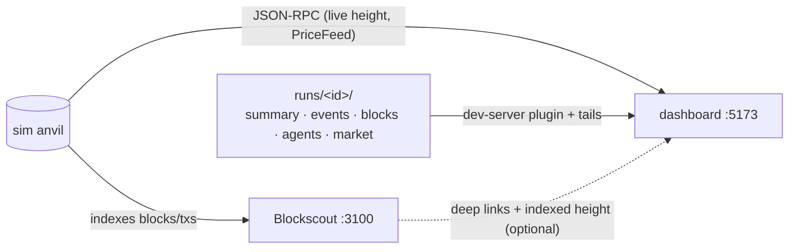

[← README](../../README.md)

# Dashboard and Explorer (watching a run, and reading one afterwards)

Two optional local UIs. Neither is needed to run or score anything — every number they show comes
out of `runs/<id>/` or straight off the anvil, and a run is complete without either of them being up.

| | what it is | when |
|---|---|---|
| **Dashboard** (`dashboard/` workspace, issue #63) | renders a run: standings, prices, portfolios, event tape, per-agent decision logs | `npm run dashboard` → http://localhost:5173 |
| **Explorer** (`infra/blockscout/`, issue #31) | stock Blockscout indexing the sim anvil: blocks / txs / addresses / logs | `npm run explorer` → http://localhost:3100 |

## Dashboard

```bash
npm run dashboard        # Vite dev server at http://localhost:5173
```

The dashboard's selection has three nested levels, the same three the data has:

```
competition  ⊃  scenario (= one run, "regime#seed")  ⊃  round (= one scoring epoch)
```

**The landing page is the competition's standings**, because that is the unit the competition is
scored on (ADR 0020). One scenario is a single draw from a regime's distribution, and
`config/scenarios/public.yaml` says what to do with it: *"Generalizing across the distribution is the
thing being measured; the published seeds are five draws from it, not the target."* Opening on one
scenario invites exactly the reading that sentence warns against — in the 35-scenario `full-8h`
set, `full-calm#404` and `full-calm#505` have different winners, and neither of them is the one
the standings pick.

**There is no second model for a run that is not part of a competition.** A `sim:realtime` run is a
competition with one scenario in it, and the dashboard says so: choosing **— single run —** in the
competition picker makes the selected run the outer unit, read as a competition of one — same
standings, same round cursor. The normalization happens once, at the data layer's entry point
(`src/data/competition.ts`), so every page downstream processes exactly one kind of object.

The sidebar picks a competition, then a scenario inside it (labelled `regime#seed`, not by
timestamp):

| route | level | what it is |
|---|---|---|
| `/` | competition | **Standings** — ranked by the competition rule; the score column shows the score itself (×10⁴, no unit suffix), plus one reference net-PnL column. A row opens the agent's page |
| `/scenario` | scenario | one world as a board walked block by block: its wallets, the chain, its contracts, with the ranking inside it, the picked agent's log and the venue/balance history beside it. Titled by what it is a draw of (`full-crash#303`), not by when the file was written |
| `/markets`, `/explorer` | scenario | venue state and blocks — they only mean anything inside one world |
| `/agent/<id>` | both | the agent's competition standing (its **Standing** tab) and its scenario-level detail |

The ranking rule is fixed on the page and is the competition's (rules §4.4, ADR 0023); there is no
metric to vary — the dashboard is what competition participants read, and a headline that quietly
depends on a control is the thing it exists to avoid.

Two more things participants see, because they are participants: **names, not storage ids** — a
competition is its scenario set and date ("full-8h · 8/29"), a scenario is `regime#seed`, the yaml
path and the timestamped directory live in tooltips, and nothing is numbered "Run N" over the local
runs/ directory — and **two languages**: every string lives in `dashboard/src/i18n/messages.ts` in
English and Japanese, switched from the sidebar and persisted per browser.

Two cases have no standings, and say so rather than inventing them: a **live** run — `summary.json`
is written at the end, so its results do not exist yet — and seed-provider mode, which serves
fixtures. Both open on the scenario view, which for a live run is the only view with anything to say.

Every view is built from the run's own artifacts, served by a small Vite dev-server plugin
(`/runs/index.json` + `/runs/<id>/<file>`). The index also lists competition directories, tagged
`kind: "matrix"` — they hold `matrix.json` instead of run artifacts:

| artifact | what it drives |
|---|---|
| `summary.json` | standings (score = T for that epoch; net PnL, max drawdown) and P per agent |
| `events.jsonl` | price and portfolio series (the reconstructed observations), the event tape |
| `blocks.csv` | the blocks/transactions view (methods joined from the agent logs) |
| `agents/<id>.jsonl` | decision logs and submitted-tx self-reports |
| `market.json` | per-venue quotes and depth, GMX OI/funding, Aave reserve totals, market-priced stable quotes, multi-asset fair prices, **per-agent end-of-run positions on every venue** (perp, LST vault, Trove / Stability Pool / eUSD, Aave account), and decoded per-tx USD notionals — the venue panels, the cross-venue arb chart, the agent pages' positions and the volume aggregates |

`market.json` is written after each run by `core/src/realtime/marketSeries.ts`, on the same historical
reads that score the run, so it costs the live loop nothing. It is **reporting only and never an
input to scoring**. Runs recorded before it existed still render — the fields that need it degrade to
`—` / `n/a` / empty rather than disappearing.

Two venues are *not* in `market.json`: the LST vault and the Liquity system. The coordinator already
emits their whole state every block (`lst_block` / `liquity_block` in `events.jsonl`), so the
dashboard reads it from there rather than reconstructing it twice — which also means those panels
work for runs recorded before `market.json` grew any of its fields.

### The round cursor

**The round is the dashboard's clock.** Everything in this system is measured in scoring epochs — the
score is the mean and spread of per-epoch returns, ranks change at epoch boundaries, an environment
window opens in one — so the round axis is what every view is read against, and there is exactly one
position on it (`src/data/roundCursor.ts`). Selecting a round on a scenario page and scrubbing the
competition are the same act; they used to be separate stores that could disagree.

The cursor spans the whole competition: **at round k every scenario is at its own round k**, which is
what makes 35 independent worlds watchable as one competition. Pressing play advances it.

- **Standings become "through round k"** — recomputed over the first k rounds of every scenario, never
  read off the finished run, with the rank move since round k−1 beside each agent.
- **Scenarios are not all the same length.** In `full-8h`, depeg runs 9 rounds against everyone
  else's 29. Past its last round a scenario's world has *ended*, so its result stays in the standings
  — dropping it would move the field for a reason that is not a result — and the bar says how many
  are in that state (`30 of 35 still running · 5 ended earlier`).
- **Net PnL cannot be scoped to a round** — it prices both ends at the run's last prices, so there
  is no value at round k to take. While the cursor is mid-competition the standings show it greyed
  rather than putting the finished number under a round label.
- **Round k tells you why the standings moved.** The panel lists the environment windows covering it,
  drawn from each scenario's seed before its first block. Measured on `full-8h` seed 101:

  | regime | scheduled windows, as rounds |
  |---|---|
  | `calm` / `cex-drift` / `informed-flow` | none |
  | `whale` | r5, r13, r19, r24–25 |
  | `crash` | crash + liquidityPull r14–15 |
  | `lending-incident` | crash + liquidityPull r15–16 |
  | `depeg` | depeg r4–7 |

  Which is why the standings at round 7 are not a preview of the final ones: at round 7 the arbitrage
  agents lead, and the crash windows that cost them their lead have not opened yet.

Sub-round movement — walking the individual blocks inside one scenario — stays in `replay.ts`. It is
a refinement of this position, not a competing notion of it, and it only exists once a single
scenario is open. The scenario page walks blocks on an axis of its own, over frames it already
holds, and hands its position to `replay.ts` once when you leave it mid-walk, so the other pages
open at the same block.

### Standings

One table, under the one rule the competition is scored by (rules §4.4, ADR 0023): per scenario
(= one epoch) every agent's P = V_K − V_0 becomes a deviation score T = 50 + 10 (P − μ) / σ over
the field, and the score is the average of T across epochs with a weight rising linearly from 1 to
1.5 on the epoch's order. The benchmark is valued but never in the population. A scenario whose run
dir was not collected still ranks by the P `matrix.json` stored, and simply has no round detail.
The arithmetic is imported from `core/src/scoring/deviationScore.ts`, the same pure module the
matrix runner uses, so the dashboard and the CLI agree by construction rather than by coincidence.

**The score column shows Score at two decimals** — the precision the rules rank on (§4.6) — and
its tooltip carries the tie-breaks (the std of the agent's own T series, its worst epoch). Regime
columns are the agent's mean T within that regime: an explanation of where the score comes from,
not a second ranking.

The table carries one reference column, **net PnL (final marks)**, summed across scenarios. It is
not the ranking: it prices both ends at the run's last prices, so β cancels and `noop` is exactly 0
— it is the raw number a trader reads first, and it greys out while the cursor is mid-competition
(it has no per-round value).

#### The standings as a leaderboard people come back to

Compared against the leaderboards of Kaggle, Hyperliquid, Alpha Arena, CTFd and IMC Prosperity
(2026-09-06), the standings carry the conventions a returning reader expects:

- **A status line** under the title: epochs scored out of the plan, when the table last changed
  (the matrix directory's mtime), whether an epoch is running, and when the next one starts. The
  start comes from the plan's timetable — `npm run competition -- plan … --starts-at <ISO 8601>
  --every-minutes <N>` stamps every epoch with `startsAt`, and the backtest runner writes the
  planned ordinals with their times into `matrix.json` as `schedule` (ordinal and time only; which
  scenario an epoch is stays hidden). Without a timetable the line simply has no "next" part.
- **Score by epoch**: every agent's cumulative Score after each completed epoch, on one chart. The
  lines are `standingsThroughEpoch` at each ordinal — the same arithmetic as the table, so the last
  point of every line is the number in the table. The top 10 are drawn in the accent, the followed
  agent in pink with its name, the rest as grey threads; 50 (the field's average) is always on the
  axis. Clicking a line or a legend name follows that agent.
- **Δ** beside every rank: the change since the previous completed epoch. While the round cursor
  scrubs it becomes the change since the previous round (`rankMoves`), as before.
- **Form**: T per epoch as a small line with 50 dotted, and the count of scored epochs — whether an
  agent is where it is by being steadily above the field or by one big epoch.
- **Follow** (★): one agent per browser (`localStorage`), highlighted in the table and the chart.
  There is no sign-in, so "mine" is the viewer's choice.
- **Details**: included transactions and reverts per agent, summed over the scored scenarios, behind
  a switch — activity, never a second ranking.
- **About this competition** folds the unit ladder and the Overview / Environment / Scoring / Data
  tabs under the scenario list. A first-time reader opens it; a daily reader never scrolls past it.
- Under 720px the regime, form and net-PnL columns are dropped and the tables lose their minimum
  widths, so the page reads on a phone.

### Rounds

**A round is an evaluation interval of the rules (§0.1), not a run.** The score is one number per
epoch (= one run), so rounds are the leaderboard's running progress rather than what a result is
earned in — and they are the unit the bar across the top of every page shows: one segment per
12-block interval of the selected run, filled by chain progress through its own block range.

Clicking a segment opens that round's result: per-agent Δ value and log return, the rank each agent
held at the round's close and how it moved, and the environment events that landed inside the block
range. Two columns that are easy to confuse:

- **Δ value** is the raw change in account value, market exposure included. A do-nothing agent still
  moves with the price, which is why every agent's Δ value is roughly the same in a quiet round.
- **Log return** is the same round as a log ratio of account value. Context only — nothing in the
  score averages it.

The boundaries come from `summary.json` (`valueSeries.epochSeries.boundaryBlocks`), so a run scored
with `run.epochBlocks: 0`, or one too short for a single epoch, has no rounds and the bar says so. A
**live** run has no scored series yet — the coordinator records `epochBlocks` in
`run_started_realtime`, so the bar lays the rounds out and tracks progress, but the results appear
when the run completes.

One live-mode detail worth knowing: a live view reads only a recent window of the chain over RPC, so
a round older than that window has no transaction count to report. It says so
(`tx count outside the live window`, and `—` in the explorer's stat) rather than printing `0`, which
would be a claim that the round was quiet. Rounds that have not started yet are a real `0`.

Each agent's page has the same breakdown for that agent alone (its **Rounds** tab), and the explorer
scopes its block and transaction lists to the selected round.

**The agent page is where the standings are explained.** A standings row opens the agent's page,
whose **Standing** tab lists every epoch the agent was scored in (ordinal, scenario, P, T, w), the
mean, std and worst of its T series — the §4.6 tie-breaks — the distribution of T, and a per-regime
split. This is *not* an alternative ranking; it answers the one question the standings cannot: why
an agent sits where it does. A strategy that wins big in one regime and loses in the rest can place
below a steady one, and the per-regime T shows exactly that.

The agent earning fifteen times more per round than the winner finishes last, and the whole of the
difference is the spread. Nothing above the round level shows that. The per-regime split is where it
becomes actionable — `levered-long-max` earns +48.3 bp/round in `cex-drift` and loses in all six
other regimes, so its placing is a statement about regime fit, not about execution.

### An agent's page

**Portfolio value** is the reconstructed value series — the same `inventory.valueUsdc` cross-sections
the score is computed from, one point per scored block. Both axes are drawn and named: **y is the
account value in USDC**, **x is block height** — not wall-clock time and not a point index, which is
why the ticks read `1,272 … 1,329`. The caption carries the first and last value, and the curve is
red when the run lost value (it was previously an axis-less sparkline drawn green whatever it did).

**Open positions** is every venue position the run's end-of-run reads recorded for that agent: a GMX
perp, an LST stake with its withdrawal queue, a Liquity Trove with its ICR, a Stability Pool deposit,
a spot eUSD holding, an Aave account with its health factor. It was previously fed by GMX alone, so
an agent that spent the whole run staking or borrowing showed an empty table — indistinguishable
from a broken view. An agent that really ended flat now says so in words.

The table is deliberately not perp-shaped: a stake has no entry price and a Trove has no PnL%, so
the columns are venue / kind / size / **what it is marked against** (an entry price, a redemption
rate, an ICR, an HF) / detail.

### Markets (per-venue state)

`/markets` is one tab per deployed application, built from that run's own artifacts, and only for
the venues the run enabled (`run_started_realtime.enabledProtocols`):

| tab | what it shows |
|---|---|
| **Scenario** | the run's seed, the stress schedule drawn from it (window, ramp/hold/decay, magnitude, which rounds it covers, whether it fired and how it ended), and every liquidation / redemption / slash / open arb window in block order |
| **AMM** | cross-venue price/spread chart with the agents' own swap markers, pool depth per venue over the run, the executable two-sided quote at the final block, and the decoded agent swaps |
| **Perp** | GMX long/short open interest and funding over the run, positions still open at the final block, keeper failures |
| **Lending** | Aave borrowed and utilization per reserve, the seeded victims' worst health factor against the liquidation line, liquidations, and each agent's collateral/debt/HF |
| **Stablecoin** | every market-priced stable's measured price against par, the Liquity system's TCR against the CCR, redemption and borrowing fees, redemptions, trove liquidations, and the environment's depeg windows |
| **LST** | the vault's redemption rate against what its pool actually pays, the discount, the exit queue, the reward reserve, and any slash |

The fair price is still on the page, but as what it is — the environment's own input, written on-chain
every block — rather than the subject. What an agent trades against is venue state.

**Every panel is scoped to the selected round.** Clicking a round in the bar narrows the page's
series, stats and tables to that round's blocks, and the header states the window
(`Round 03 · blocks 1,296–1,308`, with a link back to the whole run). So "widest cross-venue gap",
"swap volume", pool depth and the LST redemption rate all answer *for that round* — the same
question the round results answer for the agents. The per-round volumes add up to less than the
run's, and should: the scorer drops a trailing partial epoch, so the blocks after the last boundary
belong to no round.

The three end-of-run tables are the exception, and say so in their own titles ("at the run's final
block"): GMX positions, Aave accounts and the venue reserves are a single cross-section taken when
the run ends, not a per-round quantity. **Scenario** is the other exception — a schedule belongs to
the run, not to a round — so it is always run-wide and the scope line says so.

#### Reading the scenario history

The coordinator draws the stress schedule from the seed at run start and writes it once, as blocks
*relative* to the run's first block (`stress_schedule`). The panel turns that into what a reader
wants: the absolute window, the rounds it covers, and what actually happened in it.

`crash` / `spike` / `cexDrift` / `flowTrend` leave **no per-block record** — they change the
fair-price walk itself rather than acting on a venue — so their row says where to look (the price
chart) instead of reporting "never fired", which would be a different and false claim. The events
that do act on a venue (`liquidityPull`, `eusdDepeg`, `depeg`, `lstSlash`, `whale`) report the
blocks they fired on and whether the environment restored the venue afterwards.

The **seed** is recorded in `run_started_realtime`; runs from before that degrade to no seed stat
rather than showing a wrong one.

### Replay

An archived run can be walked forward as if it were happening: `▶ replay` in the rounds bar arms it,
and the transport (play/pause, a block scrubber, 1x/2x/4x) moves the head. Everything on every page
is then derived as of that block — the rounds fill in, the tx counts climb, the venue panels and the
explorer show only what had happened by then.

This exists because live mode cannot cover the two cases that matter most: a run that has already
finished, and a run that happened somewhere else (a spot box) and was collected afterwards. Live
mode needs the run's own machine — the file tails are the dev server's filesystem and the chain
reads go to the agents' anvil. Replay needs only `runs/<id>/`, and an archived run carries *more*
than a live one (market.json, the scored epoch series, the complete blocks.csv), so it is a stronger
view rather than a simulation of a weaker one.

**The rule it keeps is that it never shows the future.** A round that has not closed at the head
carries no result, and the standings are *recomputed* from the returns up to the head
(P = V_k − V_0 over the closed rounds, standardised over the field) rather than read off the
finished run — otherwise every frame of the walk would have the answer printed on it. The end-of-run position
cross-sections are dropped for the same reason until the head reaches the end: they are a single
read taken when the run finished and are not knowable earlier.

Replay is per-browser and in-memory: it survives moving between pages, and a page reload ends it.

The scenario page does not use the transport: its block axis walks the frames its snapshot already
holds (a replay head there would refetch on every step). Leaving that page mid-walk arms replay at
the board's block — or moves the head, if one is already armed — so `/markets`, `/explorer` and an
agent's page open where the board was. Its rounds bar shows an armed replay and the way out of it,
nothing more. Coming back with a replay armed, the board opens at the head; its frames are never
clamped by replay — the walk's own head is what keeps the future out of the log, the charts and the
ranking beside the board, which is the standings through the rounds closed by that block.

**Runs collected from a remote box work unchanged.** `spot-run` brings back the box's whole `runs/`
as a tarball, which lands at `runs/<collection>/runs/<id>/` — every artifact present, one or two
levels deeper than a local run. The dev server's index scans that far down and uses the path
relative to `runs/` as the id, so a collected run appears in the picker as
`<run id>  ← <collection>` and replays like any other. Nothing has to be moved or renamed.

### Live mode

A run that is still going (no `summary.json` yet, `events.jsonl` still growing) appears in the picker
as `● <id> (live)` and every view refreshes in place. **None of the live data comes from the
coordinator**:

- **file tails** — `/runs/<id>/tail/<file>?offset=N` streams the appended bytes of `events.jsonl`
  (run meta, event tape, tx attribution) and `agents/<id>.jsonl` (the live decision log)
- **JSON-RPC** — the anvil endpoint is discovered from the agents' own `runtime_start` log lines, and
  the browser reads the chain height, recent blocks, and the on-chain `PriceFeed` directly
- **Blockscout** (optional) — its indexed height is shown next to the RPC height, so indexer lag stays
  visible instead of looking like a stalled chain

Scores, portfolio curves, per-venue series and tx notionals are post-run artifacts by design
(ADR 0006 §4). They appear the moment the run completes: the picker drops the live marker and the
views switch to the archived rendering on the next poll, no reload needed.

`VITE_DATA_PROVIDER=seed` falls back to the IndexedDB seed provider for UI development against no
run at all.

### Public view (audience mode)

The dashboard is public during the trial period (rules §2.7) and the live week (§4.7.1). The run
directory is the complete record and stays complete — it is what §7.2 publishes after the results —
so what a competition in progress must not publish is withheld **by the server**, not by the pages:
a panel that does not render a file is not the same as a file nobody can fetch.

```bash
ERIS_DASHBOARD_AUDIENCE=1 npm run dashboard:serve          # the live week
ERIS_DASHBOARD_AUDIENCE=1 ERIS_DASHBOARD_STANDINGS=0 npm run dashboard:serve   # the trial environment
ERIS_DASHBOARD_COMPETITIONS=practice-2026-09-23 …          # …and only this competition
```

With `ERIS_DASHBOARD_AUDIENCE=1` the runs API (`dashboard/server/runsApi.ts`):

- serves only `summary.json`, `matrix.json`, `standings.json`, `market.json(l)`, `blocks.csv`,
  `events.jsonl`, `epochs.jsonl`, `manifest.json`. Decision logs (`agents/*.jsonl` — a participant's
  own reasoning and their not-yet-included bids, §2.6), raw LLM exchanges (`*.llm.jsonl`) and
  `disclosures/` return 404
- rewrites `events.jsonl` line by line: `seed` / `flowSeed` leave `run_started_realtime`, the
  `stress_calibration_warning` (it names crash magnitudes) and `vulnerability_exploited` (regime-7
  ground truth) lines go, `pool_created` loses `rigged` / `rugBps` / `rugThresholdUnits` /
  `baitBps`, any `stderrTail` goes, and `stress_schedule` depends on what the run is: for a
  **continuous** world (a practice period) it keeps only the windows that have **already closed** by
  the run's current block (read off the end of `blocks.csv`) — past windows happened to everyone,
  future ones are what the manifest withholds (ADR 0021 §1); for one epoch of a **scenario**
  matrix it is dropped entirely, because even a closed window's kind ("crash", "whale") names the
  regime §3.3 does not announce. The run's kind is read from `summary.json`, or from
  `run_started_realtime` while the run is live; a run that states neither is treated as a scenario
- rewrites `matrix.json` / `standings.json` of a **scenario** matrix so every scenario is
  `regime: "hidden"`, `seed: null` — the pages call it "epoch s" (§3.3: an epoch's scenario is not
  announced, and with equal regime counts the ones already run would give away the rest). A practice
  period (`resetUnit: continuous`) keeps its day labels: days are not scenarios. **Null, not 0**: a
  withheld seed, a segment's placeholder and a real seed 0 are three different things, and printing
  `seed 0` claimed a draw nobody made
- drops `seed` / `flowSeed` and each agent's `stderrTail` from `summary.json`
- **serves only the competitions `ERIS_DASHBOARD_COMPETITIONS` lists**, when it is set: a
  comma-separated list of directories under `runs/`. What belongs to one is what its `matrix.json`
  names and what its directory contains — never what happens to be running. Applies to the index,
  to direct fetches and to tails alike. Unset serves everything under `runs/`, which on an
  operator's box is every smoke and test run they ever made.
  A **practice period** is fully covered, current segment included, because its segments live
  inside the period's own directory. A **scenario matrix's running epoch** is not served until it
  completes: it is a sibling directory that nothing on disk yet connects to the matrix, and
  admitting "whatever is live" instead would admit every live directory under `runs/` for as long
  as the matrix was incomplete — which is the entire competition. The standings still say the
  competition is in progress; that comes from the plan's epoch count, not from finding a live run

`/runs/mode.json` reports the switches, and the pages say what is absent rather than rendering it
empty: the decision-log tab and the mempool feed are replaced by a sentence (for operator-run agents
too — in the live week nothing is `external`, and the withholding is the audience switch's, not the
agent's; issue #69, rule in `dashboard/src/data/logVisibility.ts`), the scenario list's
episode column carries a note, the regime columns are gone, and live mode stops reading the chain
(the RPC an audience would need is the competition node itself). Until that endpoint answers, the
pages hold **both** restrictions on: a browser that could not reach it must not render what either
switch withholds, and defaulting to the operator's view meant a failed fetch posted trial standings.

What the public view *does* read while a run is going: `blocks.csv`, `epochs.jsonl` and
`market.jsonl`, all of which the coordinator appends as it goes and all of which the server already
serves. Without them the explorer and the board reported `blocks 0–0` and every venue `—` for a
whole practice period — which is exactly when a self-hosted participant is asking whether their
transaction landed. The block rows are the coordinator's record first and the chain (where it can be
read at all) only past them, and the range they cover is carried with them: a round that starts
before it has **no** transaction count rather than a count of zero.

The scenario panel's schedule follows the same rule as the server: for one epoch of a scenario
matrix it says the plan is withheld (§3.3) rather than reporting "0 scheduled", and for a practice
period it says the windows listed are the ones that have already closed. The public view also
re-reads the head of `events.jsonl` periodically, because a window the server withheld at first is
served once it closes, and a tail that had already read past that line would never see it.

`ERIS_DASHBOARD_STANDINGS=0` is rules §4.7 — the trial environment posts no standings — and hides the
standings table, the scenario list's leader column, the per-run rankings on `/scenario` and
`/markets`, the rounds bar's per-round ranking, and on an agent's page its Standing tab, its rank
badge, its deviation score and the rank column of its Rounds tab (the page opens on Overview
instead). The venue state, the episode history, the transactions and the explorer stay — and so does
the participant lookup on the landing page, which is how someone reaches their own agent when there
is no table to click.

Switching the flags off after the results are announced is the §7.2 publication: the same
directories, served whole.

The same handler mounts on the dev server, so `ERIS_DASHBOARD_AUDIENCE=1 npm run dashboard` shows
exactly what the public will see. Responses carry `Cache-Control` (a finished run's artifacts are
immutable; competition indexes and live files are `max-age=5`; the tail is `no-store`) and gzip, and
the index is held for three seconds between directory walks — enough for a CDN or nginx in front to
do the rest.

## Explorer (local Blockscout)

```bash
npm run explorer          # start → http://localhost:3100
npm run explorer:reset    # wipe the indexer DB and reindex — run after every chain reset
npm run explorer:tag      # name agent wallets from the latest run's summary.json
npm run explorer:down     # stop (the indexer DB survives)
```

Stock Blockscout: official images pinned by tag, nothing vendored or patched. All knobs live in
`infra/blockscout/explorer.env` — anvil port, chain id, explorer port, image tags. The defaults match
local-deploy mode (deployer anvil on 8545, chain 31337), which is what `npm run sim:realtime` uses
out of the box.

**Reset the explorer whenever the chain resets.** Every run rewinds the chain — local deploy
snapshot/reverts to the clean deploy cross-section, fork mode re-forks — and no indexer can follow a
height rewind, because it holds blocks that no longer exist. The supported lifecycle is: chain resets
→ `npm run explorer:reset` → optionally `npm run explorer:tag` once the run has a `summary.json`.
Reindexing a run-sized chain takes well under a minute. Skipping the reset crashes nothing, but the
explorer will show stale and current blocks mixed at the same heights.

`explorer:tag` reads `agents[].{id,address}` from a run's `summary.json` and inserts them as address
tags, plus `env:deployer` for anvil account 0 — whose txs (venue seeding, `liquidityPull` reconciles)
would otherwise read as a participant's. Tags live in the indexer DB, so a reset wipes them; re-tag
after the next run.

Pointing it at a different anvil (edit `explorer.env`, then `explorer:reset`):

| target | `RPC_PORT` | `CHAIN_ID` | `FIRST_BLOCK` |
|---|---|---|---|
| deployer anvil (local deploy, default) | 8545 | 31337 | 0 |
| backtest replay anvil | 8547 | 31337 | 0 |
| Arbitrum fork anvil | 8545 | 42161 | **the fork block** |

`explorer.sh` cross-checks the configured `CHAIN_ID` against what the anvil actually reports and
refuses to start on a mismatch. Fork-mode caveats (mandatory `FIRST_BLOCK`, per-tx receipt fetching,
no archive balances) and the Linux `host.docker.internal` note are in
[`infra/blockscout/README.md`](../../infra/blockscout/README.md).

## How they fit together

The dashboard never depends on the explorer. When the explorer is up, the dashboard turns tx hashes,
blocks and addresses into deep links; when it is down the links stay plain text and nothing else
changes.

The dashboard's own `/explorer` page is the front door to it. It states the connection outright —
connected with the indexed height, or offline with the command to start it — because silence there is
indistinguishable from a stalled chain.

**Whether the links actually work is a separate question, and the height cannot answer it.** Every
run rewinds the chain and no indexer can follow a rewind, so Blockscout can sit at a perfectly
plausible height while the blocks at those heights belong to a *previous* run; and a healthy indexer
routinely sits a few blocks past a run's last scored block, because the environment's teardown keeps
mining after scoring stops. So the page asks the indexer for one transaction the selected run really
produced. Found means the deep links work; not found prints
`this run's transactions are not indexed … run npm run explorer:reset`, which is the actual remedy.
Switching the run picker to an older run after a reset shows exactly that.

Search resolves what you type before it links: a 32-byte hash to a transaction, a 20-byte address or
an **agent name** to an address (Blockscout only knows wallets — `explorer:tag` names them, but the
name is not addressable in a URL), a number to a block. Enter opens it in Blockscout; the lists below
filter locally either way, so the search still works with the explorer down.



For what the underlying files contain, see [Run Output and Analysis](run-output.md); for how the
scores in the standings are computed, see [Scoring](scoring.md).
