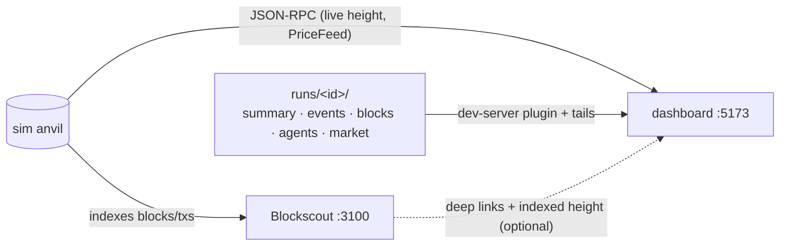

[← README](../../README.md)

# Dashboard and Explorer (watching a run, and reading one afterwards)

Two optional local UIs. Neither is needed to run or score anything — every number they show comes
out of `runs/<id>/` or straight off the anvil, and a run is complete without either of them being up.

| | what it is | when |
|---|---|---|
| **Dashboard** (`dashboard/` workspace, issue #63) | renders a run: standings, prices, portfolios, event tape, per-agent decision logs | `npm run dashboard` → http://localhost:5173 |
| **Explorer** (`infra/blockscout/`, issue #31) | stock Blockscout indexing the sim anvil: blocks / txs / addresses / logs | `npm run explorer` → http://localhost:3100 |

## Dashboard

```bash
npm run dashboard        # Vite dev server at http://localhost:5173
```

The sidebar's run picker lists `runs/<id>/`, newest first, and the selection persists per browser.
Every view is built from the run's own artifacts, served by a small Vite dev-server plugin
(`/runs/index.json` + `/runs/<id>/<file>`):

| artifact | what it drives |
|---|---|
| `summary.json` | standings (score = M9 in bps/epoch, PnL%, Sharpe, max drawdown) |
| `events.jsonl` | price and portfolio series (the reconstructed observations), the event tape |
| `blocks.csv` | the blocks/transactions view (methods joined from the agent logs) |
| `agents/<id>.jsonl` | decision logs and submitted-tx self-reports |
| `market.json` | per-venue quotes and depth, GMX OI/funding, Aave reserve totals, multi-asset fair prices, end-of-run positions, and decoded per-tx USD notionals — the cross-venue arb chart, market stats, positions/trades tables and volume aggregates |

`market.json` is written after each run by `core/src/realtime/marketSeries.ts`, on the same historical
reads that score the run, so it costs the live loop nothing. It is **reporting only and never an
input to scoring**. Runs recorded before it existed still render — the fields that need it degrade to
`—` / `n/a` / empty rather than disappearing.

### Live mode

A run that is still going (no `summary.json` yet, `events.jsonl` still growing) appears in the picker
as `● <id> (live)` and every view refreshes in place. **None of the live data comes from the
coordinator**:

- **file tails** — `/runs/<id>/tail/<file>?offset=N` streams the appended bytes of `events.jsonl`
  (run meta, event tape, tx attribution) and `agents/<id>.jsonl` (the live decision log)
- **JSON-RPC** — the anvil endpoint is discovered from the agents' own `runtime_start` log lines, and
  the browser reads the chain height, recent blocks, and the on-chain `PriceFeed` directly
- **Blockscout** (optional) — its indexed height is shown next to the RPC height, so indexer lag stays
  visible instead of looking like a stalled chain

Scores, portfolio curves, per-venue series and tx notionals are post-run artifacts by design
(ADR 0006 §4). They appear the moment the run completes: the picker drops the live marker and the
views switch to the archived rendering on the next poll, no reload needed.

`VITE_DATA_PROVIDER=seed` falls back to the IndexedDB seed provider for UI development against no
run at all.

## Explorer (local Blockscout)

```bash
npm run explorer          # start → http://localhost:3100
npm run explorer:reset    # wipe the indexer DB and reindex — run after every chain reset
npm run explorer:tag      # name agent wallets from the latest run's summary.json
npm run explorer:down     # stop (the indexer DB survives)
```

Stock Blockscout: official images pinned by tag, nothing vendored or patched. All knobs live in
`infra/blockscout/explorer.env` — anvil port, chain id, explorer port, image tags. The defaults match
local-deploy mode (deployer anvil on 8545, chain 31337), which is what `npm run sim:realtime` uses
out of the box.

**Reset the explorer whenever the chain resets.** Every run rewinds the chain — local deploy
snapshot/reverts to the clean deploy cross-section, fork mode re-forks — and no indexer can follow a
height rewind, because it holds blocks that no longer exist. The supported lifecycle is: chain resets
→ `npm run explorer:reset` → optionally `npm run explorer:tag` once the run has a `summary.json`.
Reindexing a run-sized chain takes well under a minute. Skipping the reset crashes nothing, but the
explorer will show stale and current blocks mixed at the same heights.

`explorer:tag` reads `agents[].{id,address}` from a run's `summary.json` and inserts them as address
tags, plus `env:deployer` for anvil account 0 — whose txs (venue seeding, `liquidityPull` reconciles)
would otherwise read as a participant's. Tags live in the indexer DB, so a reset wipes them; re-tag
after the next run.

Pointing it at a different anvil (edit `explorer.env`, then `explorer:reset`):

| target | `RPC_PORT` | `CHAIN_ID` | `FIRST_BLOCK` |
|---|---|---|---|
| deployer anvil (local deploy, default) | 8545 | 31337 | 0 |
| backtest replay anvil | 8547 | 31337 | 0 |
| Arbitrum fork anvil | 8545 | 42161 | **the fork block** |

`explorer.sh` cross-checks the configured `CHAIN_ID` against what the anvil actually reports and
refuses to start on a mismatch. Fork-mode caveats (mandatory `FIRST_BLOCK`, per-tx receipt fetching,
no archive balances) and the Linux `host.docker.internal` note are in
[`infra/blockscout/README.md`](../../infra/blockscout/README.md).

## How they fit together

The dashboard never depends on the explorer. When the explorer is up, the dashboard probes it once
through the Vite proxy and turns tx hashes, blocks and addresses into deep links; when it is down the
links simply vanish and nothing else changes.



For what the underlying files contain, see [Run Output and Analysis](run-output.md); for how the
scores in the standings are computed, see [Scoring](scoring.md).
