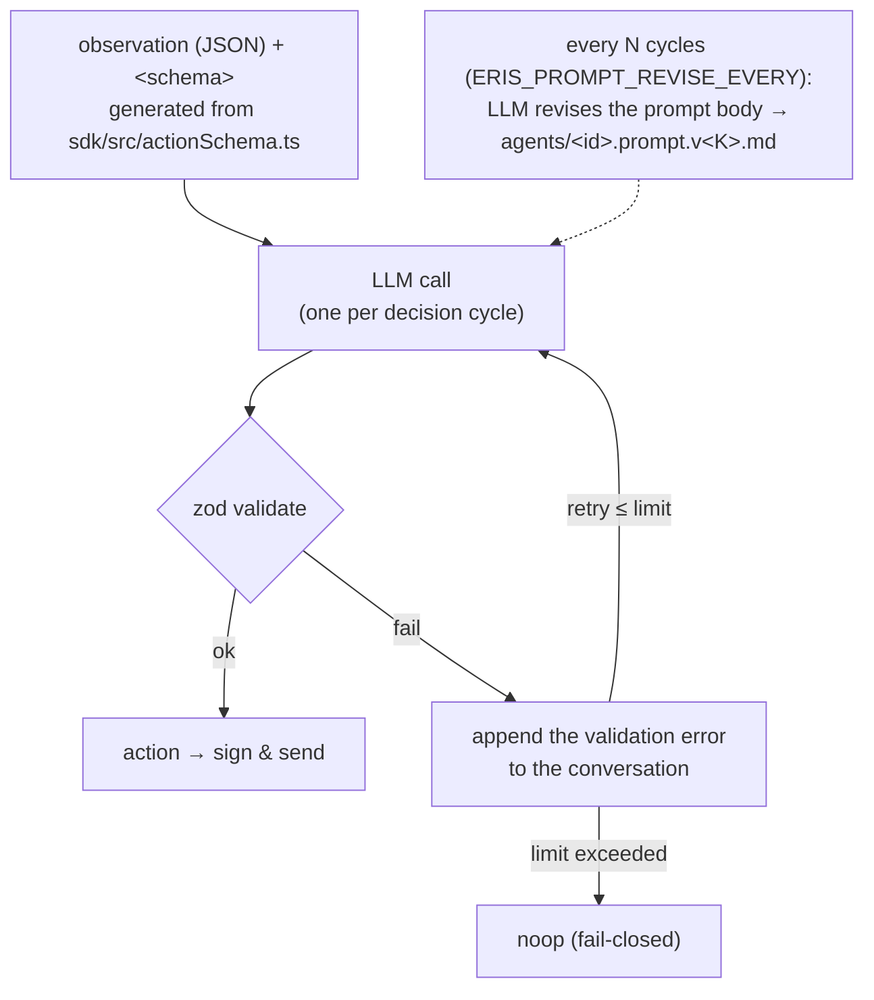

[← README](../../README.md)

# LLM-driven autonomous agents (prompt.md type)

Drop **a single `prompt.md`** into `example/agents/<id>/` and that agent becomes a prompt type: on every decision cycle, `runtime/bot.ts` calls the LLM with the observation attached and has it emit a JSON action. There is no hand-written trading logic — **the prompt.md is the strategy itself** (the submission). The bundled sample is `example/agents/my-arb/prompt.md`.

```markdown
---
name: my-arb                      # required
description: cross-venue arb; push toward fair above 30bps   # required
intervalMs: 5000                  # decision cycle interval (optional)
model: gpt-oss:120b               # model to use (optional; "claude..." = Anthropic API, "codex[:m]" / "claude-cli[:m]" = subscription CLIs)
---
# Mission
(the strategy in natural language: how to read the observation, order conditions, sizing, risk constraints)
```

## How it runs (runtime/bot.ts + runtime/llm.ts)



- Each cycle, bot.ts puts the observation (JSON) and the action's **`<schema>`** (generated from the zod schema in `sdk/src/actionSchema.ts`) into the system prompt and calls the LLM once.
- The response is validated with zod, and **on failure the error is appended to the conversation and retried** (on exceeding the retry limit that cycle is `noop` = fail-closed).
- The decisions and actions are recorded in `runs/<run_id>/agents/<id>.jsonl` ([Run output and analysis](run-output.md)).
- When agent.ts and prompt.md are **co-located**, the runtime default is agent.ts (rule strategy). Switch to prompt.md driving with the roster's `env: { ERIS_AGENT_MODE: "prompt" }`.
- Note that the **shipped `config/example.yaml` roster opts the trading agents into prompt mode** (the Quick Start default is LLM-driven; it needs an LLM endpoint — see "Backends" below). Remove the `env:` line from an agent to run it rule-based.

## Self-revision (optional)

With `ERIS_PROMPT_REVISE_EVERY=<N>`, the LLM **self-revises the prompt body** every N decision cycles (default 0 = off). The revised version is saved with a version tag at `runs/<run_id>/agents/<id>.prompt.v<K>.md` and used in subsequent cycles. With `ERIS_PROMPT_REVISE_PERSIST=1` it is also written back to the prompt.md in the agent directory.

## LLM conversation log (optional; for debugging prompt tuning)

With `ERIS_PROMPT_LOG_CALLS=1`, the **raw conversation** with the LLM is recorded in `runs/<run_id>/agents/<id>.llm.jsonl`:

- `kind: "llm_system"` — the full system prompt (only on the first call and right after each self-revision; the version is identified by `revision`)
- `kind: "llm_call"` — a record of every call: `purpose` (decision / revise), `round`, `attempt`, the sent `messages` (including the observation and the retry feedback on validate failures), and the raw `response` (or `error` if the call failed)

Because you can trace "where in the observation the LLM misread" and "how many times it failed validate" per decision, use this log as the primary source for the prompt-improvement cycle. Keep it off for normal runs (the log grows by a few KB per decision).

## Backends (runtime/llm.ts)

The provider is selected by the frontmatter `model` name:

| model | provider | auth |
|---|---|---|
| `gpt-oss:120b` etc. (default) | Ollama (default Ollama Cloud `https://ollama.com/api`; point at local `http://127.0.0.1:11434/api` via `ERIS_OLLAMA_BASE_URL`) | `OLLAMA_API_KEY` / `ERIS_OLLAMA_API_KEY` (not needed for local ollama) |
| starts with `claude...` | Anthropic SDK (structured output via tool use) | `ANTHROPIC_API_KEY` |
| `codex` / `codex:<model>` | Codex CLI (spawns `codex exec` in a read-only sandbox) | ChatGPT subscription (`codex login`; **no API key**) |
| `claude-cli` / `claude-cli:<model>` | Claude Code CLI (spawns `claude -p` with all built-in tools disallowed) | Claude subscription (Claude Code OAuth login; **no API key**) |

The per-call timeout is `ERIS_LLM_CALL_TIMEOUT_MS` (default 60000; the CLI providers default to 120000 because each call pays process startup). Put the secret API keys in `.env.local` ([Configuration](configuration.md)).

## Running on a Codex / Claude Code subscription (no API key)

If you have a ChatGPT (Codex) or Claude (Claude Code) subscription, prompt agents can run on it directly — set the frontmatter `model` (or the roster env `ERIS_LLM_MODEL`) to a CLI provider and make sure the CLI is logged in on the machine:

```markdown
---
name: my-arb
description: cross-venue arb
model: claude-cli:haiku    # or "codex" (empty model = the CLI's own configured default)
intervalMs: 15000          # CLI calls are slower than HTTP; widen the decision cycle
---
```

Notes:

- **Latency**: one decision costs a CLI process spawn + a subscription model call (measured: `claude-cli:haiku` ~6s, `codex` default model ~12s). Set `intervalMs` accordingly; cycles are locked so a slow call never overlaps the next one.
- **Quota**: every decision cycle consumes subscription quota (a 100-block run ≈ 20-60 calls per agent depending on `intervalMs`). Keep rosters small; codex and claude draw on separate pools, so mixing providers raises the parallel ceiling.
- **Auth isolation**: the `claude-cli` provider strips `ANTHROPIC_API_KEY` from the spawned CLI's env so the call always bills the subscription OAuth login, and strips the enclosing Claude Code session markers so it can be launched from inside a Claude Code session without the CLI's nested-session hang.
- **Binary override**: `ERIS_CLAUDE_BIN` / `ERIS_CODEX_BIN` point at a non-PATH binary if needed.
- The JSON contract is unchanged: the CLI's output goes through the same zod validation + retry loop, and any provider failure fails closed to `noop`.

## Run example

```yaml
# roster in config/local.yaml
agents:
  - id: my-arb                       # example/agents/my-arb/ (prompt.md only → prompt type)
    wallet: AGENT1_PRIVATE_KEY
  - id: venue-arb                    # to run an agent.ts co-located agent via prompt.md
    wallet: AGENT2_PRIVATE_KEY
    env:
      ERIS_AGENT_MODE: "prompt"
      ERIS_PROMPT_REVISE_EVERY: "10" # self-revise the prompt every 10 cycles
```

```bash
set -a; source .env.local; set +a   # only secrets like OLLAMA_API_KEY
npm run sim:realtime                 # or npm run backtest -- --regime calm-01
```

> The prompt type is bottlenecked by LLM latency on top of the wall-clock wait for block time. The LLM calls remain even in a backtest ([Backtest](backtest.md)).
