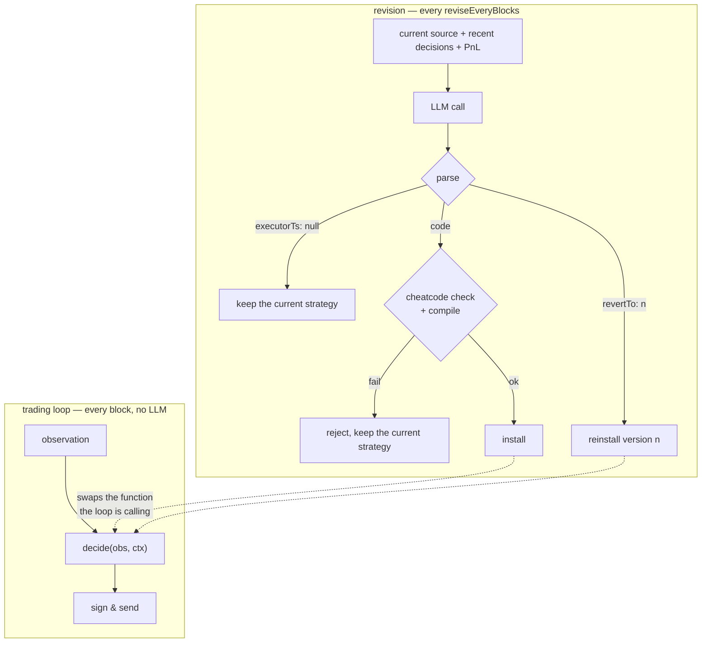

[← README](../../README.md)

# Self-improving agents (agent.ts + prompt.md)

An LLM in this simulator **rewrites the strategy; it does not make the trades**. Put a `prompt.md`
beside your `agent.ts` and the agent becomes self-improving: `decide()` runs every block exactly as
fast as any rule agent, and periodically the model is handed the current strategy source plus how it
has been doing, and may return a replacement.

```markdown
---
kind: improve                     # required — says which contract this file is written against
name: my-arb                      # required
description: cross-venue arb that widens its margin under adverse selection   # required
reviseEveryBlocks: 60             # blocks between revision opportunities (optional; default 60)
model: gpt-oss:120b               # optional ("claude..." = Anthropic API, "codex[:m]" / "claude-cli[:m]" = subscription CLIs)
---
# When to change the strategy, on what evidence, and what to change

(not "what should I trade this block" — see below)
```

> **Prompt mode was removed (ADR 0018).** Until recently an agent could be a `prompt.md` that the LLM
> consulted for *every action*. Measured at production settings, that managed one decision every
> 8-28 blocks and **1/64 the actions** of the same strategy in rule mode — it could not compete.
>
> **This file has the same name and the opposite meaning.** The old `prompt.md` answered "given this
> observation, what do you do"; this one answers "when, on what evidence, and how should the strategy
> change". Nineteen files of the old kind were deleted when prompt mode went, and they still exist in
> git history and in any bundle taken before it — both formats carry the same `name` / `description`
> frontmatter, so nothing but `kind: improve` can tell them apart. A `prompt.md` without the marker is
> **refused at startup** rather than loaded, because loading one would hand the reviser a set of
> trading instructions as its brief and say nothing about it. (The file was briefly called
> `improve.md`; that name is also refused, so a directory that still uses it fails instead of quietly
> running with no LLM at all.)

## How it runs


```mermaid
flowchart TB
  subgraph loop["trading loop — every block, no LLM"]
    OBS["observation"] --> DEC["decide(obs, ctx)"] --> TX["sign & send"]
  end
  subgraph rev["revision — every reviseEveryBlocks"]
    CTX["current source + recent decisions + PnL"] --> CALL["LLM call"]
    CALL --> P{"parse"}
    P -->|"executorTs: null"| KEEP["keep the current strategy"]
    P -->|"code"| CHK{"cheatcode check<br/>+ compile"}
    CHK -->|"fail"| REJ["reject, keep the current strategy"]
    CHK -->|"ok"| INST["install"]
    P -->|"revertTo: n"| BACK["reinstall version n"]
  end
  INST -.->|"swaps the function<br/>the loop is calling"| DEC
  BACK -.-> DEC
```

The model returns one JSON object:

```json
{ "notes": "why", "executorTs": "<new decide body>" }   // install this
{ "notes": "why", "executorTs": null }                  // leave it alone
{ "notes": "why", "revertTo": 1 }                       // go back to an earlier version
```

`"executorTs": null` means **keep the current strategy**, and that is often the right answer: a
strategy that is working does not need help.

**Nothing reverts automatically.** Undoing a change is the model's call, made with `revertTo` and the
version number — the context it receives lists every version, when it went in, and what the agent
was worth at the time. An automatic "revert when value went down" would need a threshold and there
is no defensible one: the previous implementation's never fired in 18 runs, and the obvious opposite
(any loss at all) reverts every revision in a regime where everyone is losing. Whether a dip is the
strategy or the market is a judgment, so `prompt.md` is where you state how to make it.

## What the model is shown (the revision context)

Until issue #76 the context was a **snapshot**: the PnL since the run started and since the last
revision, the version history, the last twelve decisions as `action` + `reason`, and one
observation — the latest. Nothing said what the market had done across the interval, and nothing
connected a decision to what happened to its transaction. So "I lost money during the depeg" and
"my arbitrage does not win" both arrived as a dip, and every bundled `prompt.md` correctly answered
"leave it alone".

The reference runtime now does the reading. Four sections, all of them derived from things the
agent could already see — no new chain call, and no privilege:

| section | what it carries | where it comes from |
|---|---|---|
| `transactions since the last revision` | the transactions as a partition (succeeded / mined-but-reverted / never mined), mean inclusion latency in blocks, mean `txIndex`, the mean venue gap the strategy fired on, and the marked-value change across trades that have had time to settle | `runtime/evidence.ts` `TradeLedger`, fed by `send.ts` and by the receipts `computeCompetition` already resolves (ADR 0011) |
| `market history, blocks A..B` | per base: fair price high/low/now; per venue and base: the gap against fair in bps with high/low/now, how many blocks it spent over 5 / 10 / 25 / 50 bps, and the widest round-trip cost the venue quoted; per market-priced stable: departures from par as **signed windows**, with the worst price and whether the window is still open; and the discount venues (`lst:market-vs-redemption`, `liquity:EUSD-vs-par`) as windows of their own | `runtime/evidence.ts` `MarketHistory`, one sample per observed block |
| `recent decisions` | the last 24, each annotated with what its transaction did — `[swap: included @+1 idx 3, value +12.40 after 3b, decided on a 31.0 bps gap]`, `[swap: reverted @+2 idx 9]` — plus send-stage failures as `rejected (...)` / `submit_failed (...)` | the decision ring in `bot.ts`, joined to the ledger by the block the strategy decided on |
| `latest observation` | the current block in full | unchanged |

Two design choices worth knowing, because a participant replacing the runtime inherits them:

- **It is a digest, not the rows.** Sixty whole observations would be the entire token budget.
  Context size is your inference cost (rules §2.5) and the proxy records every call (§2.3), so the
  history is reported as extremes, bucket counts and windows.
- **No threshold is assumed.** The runtime does not know the strategy's entry threshold, so the gap
  series is counted into a fixed ladder (5 / 10 / 25 / 50 bps) instead of against a guess. A
  strategy that fires at 10 bps can read its own threshold off the counts, and so can one that
  should move it.

### Where to do the reading

`ctx.publicClient` is handed to `decide()` **and** to generated executors — the vm sandbox removes
ambient capability (`require`, `process`, `fetch`), not the trading interface, so generated code can
read the chain exactly as your hand-written strategy can. Reads through it are ordinary RPC and are
not cheatcodes.

**Do the reading in the runtime, not inside `decide()`.** Every decision runs in a worker under
`DECIDE_TIMEOUT_MS` (5,000 ms, `runtime/strategyRunner.ts`; rules §2.3), for both shipped and generated
strategies. Past the bound, the parent terminates the worker and discards its answer and queued
submissions. The next decision reloads the selected source; synchronous loops cannot block the
parent observation or revision loop. Loading the module has its own, looser bound
(`STRATEGY_STARTUP_TIMEOUT_MS`, 60 s): a compile on a loaded host is slow, not stuck, and the
decision bound is not applied to it. A strategy that fails three decisions in a row is backed off
(1, 2, 4 … up to 64 blocks between attempts, said once in the log) rather than reloaded every
block; one decision that returns clears it. But the bound is not the binding constraint:
blocks are two seconds long, so a decision that takes three has already missed its block without
timing out, and the miss reaches the model as a gap in the decisions rather than as an error. An RPC
round trip inside `decide` on a loaded node is the usual way in. The reference runtime reads once
per block in the observation loop and hands `decide` a finished observation; the evidence above is
bookkeeping over that same read.

### What this does not add

No failure-driven revision trigger. The cadence stays `reviseEveryBlocks`, which is yours to set and
to pay for (rules §2.5, appendix A). A window that opens and closes inside one interval is still
missed by the *revision* — that is the cadence trade-off, and it is the participant's.

## What the generated code may do

The body runs in a `node:vm` context with `obs` and `ctx` in scope and nothing ambient — no
`require`, no `import`, no `process`, no `fetch`. It has the same trading capability as your
hand-written strategy (it is handed the same `ctx`), and the same prohibitions: **generated code is
run through the cheatcode static check before it is installed**, so `anvil_*` / `evm_*` /
`hardhat_*` and the privileged chain helpers are refused exactly as they are in a submission.

Code that fails the check or fails to compile is not installed — the previous strategy keeps running
and the reason is logged. Once installed, every call is bounded at 5 seconds (rules §2.3, the same
bound a hand-written `decide()` gets); past it the block is no action.

## Guards

| guard | why |
|---|---|
| cheatcode static check on generated code | an LLM-authored strategy is not trusted code, and the submission gate cannot see code that does not exist yet |
| compile / call failure is never installed | a broken rewrite must not stop the agent trading |
| `revertTo` in the model's hands, not a threshold | whether a dip is the strategy or the market is a judgment; a fixed rule is either never right or always wrong (§5) |
| every outcome logged | the previous attempt at self-improvement shipped a rollback that never once fired and nobody noticed |

**Always run a frozen control.** `ERIS_AGENT_FROZEN: "1"` runs the same directory with the
improvement loop off. Without it you cannot tell whether revising helped or whether the strategy was
going to do that anyway.

## Logs

Revision outcomes (installed / declined / rejected / reverted, with the model's notes) land in
`runs/<id>/agents/<agentId>.jsonl` alongside the trading decisions.

`ERIS_IMPROVE_LOG_CALLS: "1"` additionally writes the raw exchange — the system prompt, the context
that was sent, and the response — to `runs/<id>/agents/<agentId>.llm.jsonl`. Off by default because
it holds every generated strategy in full. It is the log to turn on when tuning `prompt.md`.

## Carrying a strategy between epochs

Until issue #77 every epoch started the agent from `agent.ts` as version 0. Self-improvement was
therefore worth at most the remainder of one epoch and was thrown away k times over a competition —
the model relearned the same lesson forty times and was never allowed to keep it.

An agent can now be given a **persistent directory that only it can see**, at
`ERIS_AGENT_STATE_DIR`, created empty at the start of the competition and surviving every epoch.

```
<state dir>/
  versions.json      what the reference runtime keeps: the installed versions with their
                     notes, the epoch each went in, and the model's `memory` note
```

The reference runtime (`runtime/state.ts`) writes that file atomically on every accept and revert,
and on start it:

1. loads it, and **re-runs the cheatcode static check and the vm compile on every carried version**.
   A strategy that compiled last epoch is untrusted input this epoch;
2. starts from the newest version that survived re-validation, or from `agent.ts` if the newest did
   not — logging `revision_resume_failed` with the reason, because an agent that silently forgot
   everything looks exactly like one that had nothing to remember;
3. continues the version numbering, so a version number means one thing for the life of the agent
   and `revertTo` works across an epoch boundary.

The directory is yours beyond that. Write whatever your runtime wants in it, within the cap
(`ERIS_AGENT_STATE_CAP_BYTES`, 64 MiB total). Running out never stops the agent: persistence turns
itself off, says so in the agent log, and the strategy keeps trading.

### What the model sees differently

Two lines are added to the revision context when state is being carried:

```
epochs this agent has run: 4 (this one is 2026-09-06-s03). The PnL above is this epoch only;
the strategy history below spans all of them.
your note from the last revision:
  the depeg window closed before I could size up; the entry threshold is not the problem
```

and every version in the history says which epoch it was installed in. Without that the model reads
four epochs of versions as one run and attributes this epoch's loss to a change made two epochs ago.

`"memory"` is an optional field on any revision reply — alongside `executorTs`, `null`, or
`revertTo` — capped at 4,000 characters.

### Measuring it, and the control

```bash
npm run backtest -- --scenarios config/scenarios/public.yaml --agent-state-root runs/state
```

`--agent-state-root` carries each agent's directory across the scenarios of the matrix **in list
order**, which is the ordering the live competition has. Off by default, so every stored matrix
stays comparable with the ones taken before it.

Run three arms of the same agent: frozen (`ERIS_AGENT_FROZEN: "1"`), improving without persistence
(no `--agent-state-root`), improving with it. **`ERIS_AGENT_FROZEN` ignores the state directory as
well as `prompt.md`** — a control that resumed would not be a control. Persistent below frozen means
the carried strategy is drifting rather than learning, which is the failure this feature has to be
watched for.

### It is also a rules change

§4.7.1 says every participating unit starts each epoch from identical initial conditions and does
not mention agent state. Carrying it needs that clause reworded, plus §2.5, §4.4.2, §7 and appendix
A. The rules live in a different repository (ascon-web, `content/legal/rules.md`); the proposed
wording and the five decisions behind it are in
[Cross-epoch learning: the rules amendment](../proposals/cross-epoch-learning-rules.md). **Nothing
there is in force until it lands in ascon-web.**

## Backends (runtime/llm.ts)

The provider is selected by the frontmatter `model` name:

| model | provider | auth |
|---|---|---|
| `gpt-oss:120b` etc. (default) | Ollama (default Ollama Cloud `https://ollama.com/api`; point at local `http://127.0.0.1:11434/api` via `ERIS_OLLAMA_BASE_URL`) | `OLLAMA_API_KEY` / `ERIS_OLLAMA_API_KEY` (not needed for local ollama) |
| starts with `claude...` | Anthropic SDK (structured output via tool use) | `ANTHROPIC_API_KEY` |
| `openai:<model>`, or starts with `gpt-` / `o1` / `o3` / `o4` | OpenAI-compatible chat completions (`response_format: json_object`) | `OPENAI_API_KEY` (+ `OPENAI_BASE_URL` for a compatible endpoint) |
| `codex` / `codex:<model>` | Codex CLI (spawns `codex exec` in a read-only sandbox) | ChatGPT subscription (`codex login`; **no API key**) |
| `claude-cli` / `claude-cli:<model>` | Claude Code CLI (spawns `claude -p` with all built-in tools disallowed) | Claude subscription (Claude Code OAuth login; **no API key**) |

The per-call timeout is `ERIS_LLM_CALL_TIMEOUT_MS` (default 60000; the CLI providers default to
120000 because each call pays process startup). Put the secret API keys in `.env.local`
([Configuration](configuration.md)).

**In the competition there is no key in the agent at all.** The coordinator sets
`ERIS_INFERENCE_BASE_URL` (the operator's inference proxy, rules §2.3 / §2.5) and a per-agent
`ERIS_INFERENCE_TOKEN`; the Ollama, OpenAI-compatible and Anthropic families then all route through
the proxy, which holds the upstream keys, enforces the published model list and records every
exchange for replay (`infra/inference-proxy/README.md`). The CLI providers are a local-development
convenience: an agent container has no `codex` or `claude` binary and no network to log in with.

**Latency no longer bounds the strategy.** Under prompt mode a slow backend meant a slow trader; now
it only means fewer revision opportunities, and the strategy trades at full speed throughout. A
backend failure is recorded and the strategy continues unchanged, so a run without an API key still
completes — you just get no revisions.

## Running on a Codex / Claude Code subscription (no API key)

Set the frontmatter `model` (or the roster env `ERIS_LLM_MODEL`) to a CLI provider and make sure the
CLI is logged in on the machine:

```markdown
---
name: my-arb
description: cross-venue arb
model: claude-cli:haiku    # or "codex" (empty model = the CLI's own configured default)
---
```

Notes:

- **Quota**: each revision is one call, capped per run, so a self-improving agent costs a handful of
  calls per run rather than one per decision. Codex and Claude draw on separate pools, so mixing
  providers raises the parallel ceiling.
- **Auth isolation**: the `claude-cli` provider strips `ANTHROPIC_API_KEY` from the spawned CLI's env
  so the call always bills the subscription OAuth login, and strips the enclosing Claude Code session
  markers so it can be launched from inside a Claude Code session without the CLI's nested-session hang.
- **Binary override**: `ERIS_CLAUDE_BIN` / `ERIS_CODEX_BIN` point at a non-PATH binary if needed.

## Run example

```yaml
# roster in config/local.yaml
agents:
  - id: venue-arb                    # example/agents/venue-arb/ (agent.ts + prompt.md)
    wallet: AGENT1_PRIVATE_KEY
    env: { ERIS_LLM_MODEL: "claude-cli", ERIS_IMPROVE_LOG_CALLS: "1" }
  - id: venue-arb-frozen             # the control: same strategy, no improvement loop
    dir: venue-arb
    wallet: AGENT2_PRIVATE_KEY
    env: { ERIS_AGENT_FROZEN: "1" }
```

```bash
set -a; source .env.local; set +a   # only secrets like OLLAMA_API_KEY
npm run sim:realtime                 # or npm run backtest -- --regime calm --seed 101
```

A measured example of what this looks like: over 150 blocks the model noticed the strategy had been
emitting the same "cannot fund this side of the gap" reason for a dozen blocks, rewrote it, and then
**declined** to touch it again at the next opportunity because it had started working. That agent
finished at +57.6 against its frozen control's +10.0. One run and one seed — an existence proof that
the loop works, not evidence that self-improvement wins.
