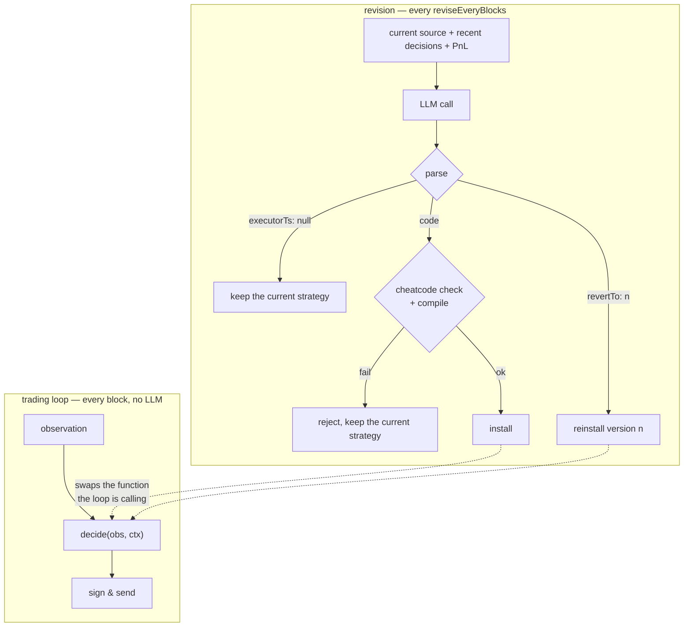

[← README](../../README.md)

# Self-improving agents (agent.ts + improve.md)

An LLM in this simulator **rewrites the strategy; it does not make the trades**. Put an `improve.md`
beside your `agent.ts` and the agent becomes self-improving: `decide()` runs every block exactly as
fast as any rule agent, and periodically the model is handed the current strategy source plus how it
has been doing, and may return a replacement.

```markdown
---
name: my-arb                      # required
description: cross-venue arb that widens its margin under adverse selection   # required
reviseEveryBlocks: 60             # blocks between revision opportunities (optional; default 60)
model: gpt-oss:120b               # optional ("claude..." = Anthropic API, "codex[:m]" / "claude-cli[:m]" = subscription CLIs)
---
# When to change the strategy, on what evidence, and what to change

(not "what should I trade this block" — see below)
```

> **Prompt mode was removed (ADR 0018).** Until recently an agent could be a `prompt.md` that the LLM
> consulted for *every action*. Measured at production settings, that managed one decision every
> 8-28 blocks and **1/64 the actions** of the same strategy in rule mode — it could not compete.
> `improve.md` is not a renamed `prompt.md`: the old file answered "given this observation, what do
> you do", the new one answers "when, on what evidence, and how should the strategy change".

## How it runs


```mermaid
flowchart TB
  subgraph loop["trading loop — every block, no LLM"]
    OBS["observation"] --> DEC["decide(obs, ctx)"] --> TX["sign & send"]
  end
  subgraph rev["revision — every reviseEveryBlocks"]
    CTX["current source + recent decisions + PnL"] --> CALL["LLM call"]
    CALL --> P{"parse"}
    P -->|"executorTs: null"| KEEP["keep the current strategy"]
    P -->|"code"| CHK{"cheatcode check<br/>+ compile"}
    CHK -->|"fail"| REJ["reject, keep the current strategy"]
    CHK -->|"ok"| INST["install"]
    P -->|"revertTo: n"| BACK["reinstall version n"]
  end
  INST -.->|"swaps the function<br/>the loop is calling"| DEC
  BACK -.-> DEC
```

The model returns one JSON object:

```json
{ "notes": "why", "executorTs": "<new decide body>" }   // install this
{ "notes": "why", "executorTs": null }                  // leave it alone
{ "notes": "why", "revertTo": 1 }                       // go back to an earlier version
```

`"executorTs": null` means **keep the current strategy**, and that is often the right answer: a
strategy that is working does not need help.

**Nothing reverts automatically.** Undoing a change is the model's call, made with `revertTo` and the
version number — the context it receives lists every version, when it went in, and what the agent
was worth at the time. An automatic "revert when value went down" would need a threshold and there
is no defensible one: the previous implementation's never fired in 18 runs, and the obvious opposite
(any loss at all) reverts every revision in a regime where everyone is losing. Whether a dip is the
strategy or the market is a judgment, so `improve.md` is where you state how to make it.

## What the generated code may do

The body runs in a `node:vm` context with `obs` and `ctx` in scope and nothing ambient — no
`require`, no `import`, no `process`, no `fetch`. It has the same trading capability as your
hand-written strategy (it is handed the same `ctx`), and the same prohibitions: **generated code is
run through the cheatcode static check before it is installed**, so `anvil_*` / `evm_*` /
`hardhat_*` and the privileged chain helpers are refused exactly as they are in a submission.

Code that fails the check, fails to compile, or does not return within 2 seconds is not installed —
the previous strategy keeps running and the reason is logged.

## Guards

| guard | why |
|---|---|
| cheatcode static check on generated code | an LLM-authored strategy is not trusted code, and the submission gate cannot see code that does not exist yet |
| compile / call failure is never installed | a broken rewrite must not stop the agent trading |
| `revertTo` in the model's hands, not a threshold | whether a dip is the strategy or the market is a judgment; a fixed rule is either never right or always wrong (§5) |
| revision cadence clamped | a co-located run shares one LLM budget; "revise every block" from one agent would starve the field |
| every outcome logged | the previous attempt at self-improvement shipped a rollback that never once fired and nobody noticed |

**Always run a frozen control.** `ERIS_AGENT_FROZEN: "1"` runs the same directory with the
improvement loop off. Without it you cannot tell whether revising helped or whether the strategy was
going to do that anyway.

## Logs

Revision outcomes (installed / declined / rejected / reverted, with the model's notes) land in
`runs/<id>/agents/<agentId>.jsonl` alongside the trading decisions.

`ERIS_IMPROVE_LOG_CALLS: "1"` additionally writes the raw exchange — the system prompt, the context
that was sent, and the response — to `runs/<id>/agents/<agentId>.llm.jsonl`. Off by default because
it holds every generated strategy in full. It is the log to turn on when tuning `improve.md`.

## Backends (runtime/llm.ts)

The provider is selected by the frontmatter `model` name:

| model | provider | auth |
|---|---|---|
| `gpt-oss:120b` etc. (default) | Ollama (default Ollama Cloud `https://ollama.com/api`; point at local `http://127.0.0.1:11434/api` via `ERIS_OLLAMA_BASE_URL`) | `OLLAMA_API_KEY` / `ERIS_OLLAMA_API_KEY` (not needed for local ollama) |
| starts with `claude...` | Anthropic SDK (structured output via tool use) | `ANTHROPIC_API_KEY` |
| `codex` / `codex:<model>` | Codex CLI (spawns `codex exec` in a read-only sandbox) | ChatGPT subscription (`codex login`; **no API key**) |
| `claude-cli` / `claude-cli:<model>` | Claude Code CLI (spawns `claude -p` with all built-in tools disallowed) | Claude subscription (Claude Code OAuth login; **no API key**) |

The per-call timeout is `ERIS_LLM_CALL_TIMEOUT_MS` (default 60000; the CLI providers default to
120000 because each call pays process startup). Put the secret API keys in `.env.local`
([Configuration](configuration.md)).

**Latency no longer bounds the strategy.** Under prompt mode a slow backend meant a slow trader; now
it only means fewer revision opportunities, and the strategy trades at full speed throughout. A
backend failure is recorded and the strategy continues unchanged, so a run without an API key still
completes — you just get no revisions.

## Running on a Codex / Claude Code subscription (no API key)

Set the frontmatter `model` (or the roster env `ERIS_LLM_MODEL`) to a CLI provider and make sure the
CLI is logged in on the machine:

```markdown
---
name: my-arb
description: cross-venue arb
model: claude-cli:haiku    # or "codex" (empty model = the CLI's own configured default)
---
```

Notes:

- **Quota**: each revision is one call, capped per run, so a self-improving agent costs a handful of
  calls per run rather than one per decision. Codex and Claude draw on separate pools, so mixing
  providers raises the parallel ceiling.
- **Auth isolation**: the `claude-cli` provider strips `ANTHROPIC_API_KEY` from the spawned CLI's env
  so the call always bills the subscription OAuth login, and strips the enclosing Claude Code session
  markers so it can be launched from inside a Claude Code session without the CLI's nested-session hang.
- **Binary override**: `ERIS_CLAUDE_BIN` / `ERIS_CODEX_BIN` point at a non-PATH binary if needed.

## Run example

```yaml
# roster in config/local.yaml
agents:
  - id: venue-arb                    # example/agents/venue-arb/ (agent.ts + improve.md)
    wallet: AGENT1_PRIVATE_KEY
    env: { ERIS_LLM_MODEL: "claude-cli", ERIS_IMPROVE_LOG_CALLS: "1" }
  - id: venue-arb-frozen             # the control: same strategy, no improvement loop
    dir: venue-arb
    wallet: AGENT2_PRIVATE_KEY
    env: { ERIS_AGENT_FROZEN: "1" }
```

```bash
set -a; source .env.local; set +a   # only secrets like OLLAMA_API_KEY
npm run sim:realtime                 # or npm run backtest -- --regime calm --seed 101
```

A measured example of what this looks like: over 150 blocks the model noticed the strategy had been
emitting the same "cannot fund this side of the gap" reason for a dozen blocks, rewrote it, and then
**declined** to touch it again at the next opportunity because it had started working. That agent
finished at +57.6 against its frozen control's +10.0. One run and one seed — an existence proof that
the loop works, not evidence that self-improvement wins.
