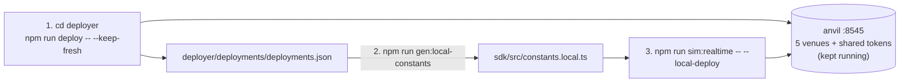

[← README](../../README.md)

# Local realtime simulation (non-fork)

A mode where, instead of forking Arbitrum, this repo's bundled `deployer/` deploys all protocols onto a local anvil and the poc connects to it to run realtime. It avoids the cold-state RPC round trips to the fork backend (fork RPC latency) and also works multi-asset (WETH/WBTC).

## Prerequisites

- `deployer/` is a subpackage bundled in this repo (it has a self-contained package.json / foundry.toml and supports local deployment of every venue).
- The poc side does not start anvil (the deployer owns anvil). When `ERIS_LOCAL_DEPLOY=1`, `npm run anvil` fails fast.

## First-time setup (deployer subpackage)

Because `deployer/` has its own build/dependencies, run the following once (a few minutes):

```bash
cd deployer
npm install
forge build                  # compile the shared mock tokens
cp .env.example .env
./scripts/setup-vendors.sh   # clone+patch external repos (GMX), install Aave deps
cd ..
```

> The heavy clones under `vendor/` (`gmx-src` / `curve-src` / `twocrypto-src`) are outside git, and `setup-vendors.sh` reproduces them at pinned commits. Only the `vendor/curve` prebuilt bytecode and `gmx-localhost.patch` are bundled.

## Steps



1. **Start anvil + deploy all venues with the deployer** (a separate terminal is recommended):

   ```bash
   cd deployer
   npm run deploy -- --keep-fresh
   ```

   - `--keep-fresh` resets `deployments.json` before deploying.
   - **Do not** pass `--exit`. Passing it stops anvil after the deploy. Without it, anvil stays up and waits on `127.0.0.1:8545`.
   - Deploys all 5 venues (Uniswap V3 / Balancer V2 / Aave V3 / Curve / GMX V2) + shared tokens (WETH/USDC/USDT/DAI/WBTC) + Multicall3. A few minutes to finish (GMX is the heaviest).
   - When done, `deployer/deployments/deployments.json` is written and it prints "anvil is still running."

2. **Generate `constants.local` in the poc** (import the deploy addresses into the poc). From the repository root:

   ```bash
   npm run gen:local-constants
   ```

   Reads `deployer/deployments/deployments.json` and generates `sdk/src/constants.local.ts` (the path can be overridden with the `DEPLOYMENTS_JSON` env). Because deploys are deterministic addresses, regenerating often produces no diff.

3. **Run realtime** (connects to `127.0.0.1:8545` in local-deploy mode):

   ```bash
   npm run sim:realtime -- \
     --local-deploy \
     --seed 1 --blocks 24 --seconds 70 \
     --protocols uniswap,balancer,curve
   # The roster is the inline agents in config/local.yaml (to swap, edit the YAML; in a config with
   # inline agents, --agents has no effect = inline wins. backtest's --agents is always effective)
   # USDC-only distribution (funding.wethWei: "0"), multi-asset (flow.baseMax), etc. are also in config/local.yaml
   ```

   > **The `--local-deploy` flag alone (or config `run.localDeploy: true`) is enough.** `sdk/src/constants.ts` reads `process.env.ERIS_LOCAL_DEPLOY` at import time to overlay the locally-deployed addresses (WETH/USDC/WBTC etc.), but the CLI entry (`core/src/cli/sim-realtime.ts`) peeks at the flag/config before loading the coordinator and sets `ERIS_LOCAL_DEPLOY=1` internally, so there is no need to pass the env by hand (the child agent / flow processes inherit `process.env`).

## Key settings (CLI flags / config/local.yaml keys)

| CLI flag | config key | description |
|---|---|---|
| `--local-deploy` | `run.localDeploy` | Enable local-deploy (non-fork) mode. **Required** |
| `--agents <path>` | `run.agentsConfig` | Roster file (YAML/JSON). **If the config has an inline `agents:`, that takes priority** and this flag has no effect |
| `--seed` | `run.seed` | Label for market conditions (for reproducing the price path) |
| `--blocks` | `run.blocks` | Run length (block count) |
| `--seconds` | `run.seconds` | Realtime cap (24 blocks ≒ 48 seconds, so allow around 70) |
| `--protocols` | `run.protocols` | Enabled venues (comma-separated on the CLI, an array in YAML) |
| — (YAML only) | `funding.wethWei` | USDC-only distribution (`"0"` eliminates initial directional exposure) |
| — (YAML only) | `flow.baseMax` | When trading multi-asset (WBTC) (e.g. `{ WBTC: "50000000" }`). Enables WBTC AMM flow to create price dislocations = arbitrage opportunities (default off) |

> **Note**: The "config key" column is the nested path in `config/local.yaml`. CLI flags override the YAML values for one run only. Local-deploy account 0 (account0) overlaps the deployer's deployment account and distorts value with leftover balance, so the roster uses AGENT1 onward (account1+) (`config/example.yaml` already does this).

## Troubleshooting

- **Cannot connect**: Check that the deployer's `npm run deploy -- --keep-fresh` is running (and that you did not pass `--exit`).
- **Address mismatch / contract missing**: Check that you re-ran `npm run gen:local-constants` after deploying.
- **The run exits early before reaching the price window**: Make `--seconds` (`run.seconds`) large enough.

## Tips

- **If you repeat runs, backtest is handy**: Bake a state dump from the deployed anvil with `npm run gen:state-dump`, and thereafter you can iterate without starting the deployer via `npm run backtest -- --regime <name> --repeat N` (regime replay + snapshot/revert; see [Backtest](backtest.md) for details).
- **Deploy only some venues (speedup)**: `npm run deploy -- --only uniswap,balancer` (avoids the heavy hardhat-deploy of GMX/Aave). Match the poc side's `--protocols` accordingly.
- **Multi-asset (WBTC)**: Enabling WBTC AMM flow with `flow.baseMax: { WBTC: "50000000" }` in `config/local.yaml` creates price dislocations = arbitrage opportunities (default off). You can also specify initial inventory and per-round caps with `funding.base` / `limits.agentBase`.
- **Sequential-run cross-section**: Since there is no fork locally, resetFork branches to `evm_snapshot` / `evm_revert`. The snapshot ID is persisted to `.local-snapshot`, and runs start from a clean cross-section between runs (parallel runs are not supported).
