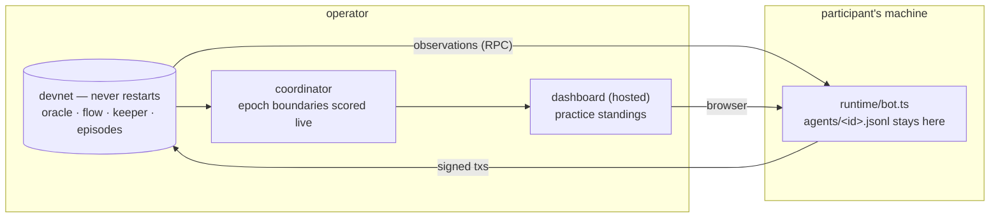

[← README](../../README.md)

# The practice devnet (ADR 0021)

A chain that does not stop, that participants connect their own agents to. It is a **practice
ground**: the competition itself is scored separately, from submitted bundles replayed over a
scenario matrix ([backtest](backtest.md), ADR 0017 / ADR 0020), and nothing that happens here feeds
into it. The standings page says so permanently, and so does the manifest.

What it is for: verifying that your agent connects, trades and survives against the real venues; and
building a feel for the market before the competition runs.



---

## For a participant

You need two things: the **environment manifest** (public, the same file for everyone) and **your own
wallet**. Nothing else is handed out, and nothing you run reports back.

### 1. Read the manifest

`manifest.json` is published by the operator and also written into every run directory. It carries
where the chain is, what is deployed on it, how long a round is, what the limits are, and which
addresses are registered.

```jsonc
{
  "status": { "scored": false, "label": "practice", "note": "…not the official scoring…" },
  "chain":  { "rpcUrl": "…", "chainId": 42069, "blockTimeSec": 2 },
  "round":  { "epochBlocks": 900, "approxSeconds": 1800 },
  "protocols": ["uniswap", "balancer", "curve", "lst", "liquity"],
  "actions": { "uniswap": ["swap", "mintLiquidity", …], … },
  "contracts": { "priceFeed": "0x…", "uniswap": {…}, … },
  "episodes": { "kinds": [{ "type": "crash", "count": 1 }, …] }
}
```

`episodes` is deliberately partial. The **kinds** of shock the period contains and **how many** are
published; **when each window opens is not** (ADR 0021 §1). Read the chain to know whether one is
open now.

There are no keys in it. That is not an oversight — the file is served over HTTP, so anything in it
is published. If the operator issued you a wallet, they hand it over separately.

### 2. Run your agent

Your agent is an ordinary Eris agent (see [writing agents](writing-agents.md)); nothing about the
strategy contract changes. What changes is that nobody spawns it, so you supply what the coordinator
used to inject:

```bash
ERIS_MANIFEST=./manifest.json \
ERIS_AGENT_ID=alice \
ERIS_AGENT_DIR=example/agents/my-strategy \
ERIS_AGENT_PRIVATE_KEY=0x… \
ERIS_RUN_DIR=./my-logs \
  node --import tsx example/agents/runtime/bot.ts
```

- `ERIS_MANIFEST` supplies the RPC URL and the PriceFeed address. Everything else still comes from
  your config file (`ERIS_CONFIG`, defaulting to `config/local.yaml`).
- `ERIS_RUN_DIR` is **your** directory. Your decision log lands there and nowhere else — the
  dashboard cannot show it, and says so rather than rendering an empty panel.
- On the first start the runtime grants its own venue approvals, because an approval is your
  signature and the operator does not hold your key. It skips the ones already in place, so a
  restart costs nothing.

### 3. Watch

The hosted dashboard shows everything the chain says about you: your transactions (named by
decoding their calldata, not by anything you report), your positions, your per-round returns and
your standing. What it cannot show is what you *sent and lost* — a transaction that never landed
leaves no trace anyone but you can verify.

---

## For the operator

### Running a period

```bash
# 1. a chain, and a treasury account genesis prefunded on it
#    .env.local:  ANVIL_RPC_URL=… CHAIN_ID=… TREASURY_PRIVATE_KEY=0x…

# 2. before anything else, confirm the two assumptions the design rests on
npm run check:ordering -- --live --rounds 5      # issue #35: does the builder order by fee?
npm run stress:rpc -- --agents 30 --seconds 60 --write   # issue #36: does the read load fit?

# 3. the period
npm run sim:realtime -- --config config/practice.yaml

# 4. hand out credentials, one participant at a time
npm run manifest -- --config config/practice.yaml
npm run manifest -- --config config/practice.yaml --participant alice

# 5. serve the dashboard
npm run dashboard:build && npm run dashboard:serve     # :5174
```

### Registering a participant

A roster entry is a registration, not a launch instruction:

```yaml
agents:
  - id: noop
    wallet: AGENT1_PRIVATE_KEY   # the operator's own baseline (ADR 0019 §2)
    baseline: true

  - id: alice
    external: true
    address: "0x…"               # they hold the key. Prefer this.

  - id: bob
    external: true
    wallet: AUTO                 # the operator issues a funded key and hands it over
```

`command` / `args` / `dir` / `env` on an external entry are **refused**, not ignored: a roster that
silently kept them would read as if the operator were running the agent.

### On a real chain

`run.chainMode: external` turns every anvil cheatcode into a refusal that names the mechanism
replacing it (issue #33). Funding becomes real transfers from the treasury; blocks come from the
sequencer; nothing resets. It also refuses a few combinations up front, because each of them is a
run that would look healthy and mean nothing:

| refused | why |
|---|---|
| no `TREASURY_PRIVATE_KEY` | every balance has to be *sent* from somewhere |
| `localDeploy: false` | the external chain runs our own venue deployment, and the address overlay is what names it |
| `economicGas: true` | that profile finalizes prices with a storage write, which no real chain permits |
| `stressVictimCount > 0` | victims need a fresh state per run, and this chain has none |
| a permissionlessly mintable token | free money for whoever notices, and no score computed against it means anything |

### What a period produces

One directory per day (`run.segmentHours`), under one competition:

```
runs/<period>/
  matrix.json           the index — one entry per day
  2026-09-01-s00/       summary.json · events.jsonl · blocks.csv · epochs.jsonl · market.jsonl · manifest.json
  2026-09-02-s01/
  …
```

Each segment is an ordinary run directory that every existing tool reads. The chain is continuous
across them, and the epochs partition exactly: a segment carries the previous boundary when it
starts mid-epoch, and does not when it starts on one — so no round is lost at a seam and none is
counted twice.

Scores come from cross-sections taken **at** each epoch boundary rather than swept up afterwards
(ADR 0021 §3), which is what makes standings exist during the period at all — and what removes the
dependency on a node's history depth. A run short enough to have both checks the two against each
other and reports the worst disagreement (`epoch_series_agreement`).

---

## What is deliberately missing

- **Your decision log, on the operator's side.** It is on your machine. The panels that would show
  it say that instead of rendering empty.
- **Submitted-but-not-included transactions.** They were never verifiable for an agent the operator
  does not run; included transactions are on the chain and are counted there.
- **`alphaUsdc` per segment.** Alpha needs the fixed-reference sweep over a whole run, and a segment
  of a continuous chain is not one. Net PnL and the round scores are per segment.

## See also

- [ADR 0021](../adr/0021-continuous-practice-devnet-with-self-hosted-agents.md) — the decisions and
  what they cost
- [backtest](backtest.md) — the official pipeline, which this does not touch
- [writing agents](writing-agents.md) — the strategy contract, unchanged
