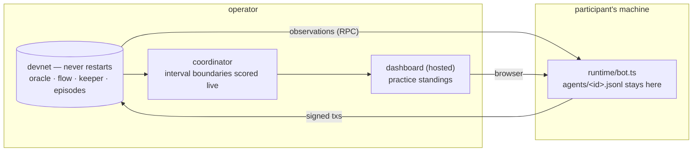

[← README](../../README.md)

# The practice devnet (ADR 0021)

A chain that does not stop, that participants connect their own agents to. It is a **practice
ground**: the competition itself is scored separately, from submitted bundles replayed over a
scenario matrix ([backtest](backtest.md), ADR 0017 / ADR 0020), and nothing that happens here feeds
into it. The standings page says so permanently, and so does the manifest.

What it is for: verifying that your agent connects, trades and survives against the real venues; and
building a feel for the market before the competition runs.

### What a good practice standing does — and does not — tell you

The configuration is the competition's (rules §2.7): the same seven venues, the same basket, the same
flow, and every kind of episode the official regimes run, every day. Doing well here means your agent
works, and that it had an edge **in this field, in the situations this period produced**. It does not
mean it will place the same way in the competition, for reasons no configuration can remove:

| | here | in the competition |
|---|---|---|
| the world | one, for the whole period — inventory, positions and drawdowns carry over | reset every epoch; every agent starts from the same basket |
| the situations | one of every kind of episode a day in an otherwise calm market; no victims, no mid-epoch pools | each epoch is one regime, drawn in equal numbers — including the ones this period cannot hold |
| the field | whoever is practising, plus the operator's reference agents | every submission; an arbitrage shared by more agents pays each of them less |
| where your code runs | your machine | the operator's container (2 vCPU / 4 GiB, 5 s per `decide`) |

To estimate your competition result, run the public set the competition is drawn like, on your own
machine — same regimes, same resets, same scoring:

```bash
npm run backtest -- --scenarios config/scenarios/public.yaml --agents my-roster.yaml --agent-sandbox docker
```

That removes the first two rows. The field is still your roster, not everyone's.

### Standings

The period posts standings, marked practice. They use the competition's deviation score (rules §4.4)
with two changes, both forced by the world not resetting:

- **One day is one epoch, and P is the day's return** — end value ÷ start value − 1 — not its USDC.
  In the competition every agent starts each epoch from the same basket, and dividing everyone's P by
  the same number moves no T: the two rank identically. Here the starting amounts drift apart, and on
  USDC an agent that doubled its capital on day one would earn twice as much for the same decisions
  on every day after. A return asks the competition's question — what did you do with what you
  started the epoch with — of a world where that amount is no longer the same for everyone.
- **Every day counts the same.** The competition weights later epochs up to 1.5× over a schedule
  fixed in advance; a period's day count grows while it runs, and a linear weight over "days so far"
  would re-weight every past day each midnight.

An agent that starts a day with less than a tenth of the field's median value is not placed that day:
a return on that little is decided by fees and rounding. Like a day you registered part-way through,
it is left out of your score rather than counted as zero. The arithmetic is
`core/src/scoring/practiceReturn.ts`.


```mermaid
flowchart LR
  subgraph OP["operator"]
    CHAIN[("devnet — never restarts<br/>oracle · flow · keeper · episodes")]
    COORD["coordinator<br/>interval boundaries scored live"]
    DASH["dashboard (hosted)<br/>practice standings"]
    CHAIN --> COORD --> DASH
  end
  subgraph P["participant's machine"]
    AGENT["runtime/bot.ts<br/>agents/&lt;id&gt;.jsonl stays here"]
  end
  CHAIN -->|"observations (RPC)"| AGENT
  AGENT -->|"signed txs"| CHAIN
  DASH -->|browser| AGENT
```

---

## For a participant

You need two things: the **environment manifest** (public, the same file for everyone) and **your own
wallet**, registered with the operator. Nothing else is handed out, and nothing you run reports back.

### 1. Create a wallet and register its address

Your trading capital arrives when your address is registered: every registered address receives the
same endowment, once. Registering is the `/faucet` command on Discord (below), which takes an address
-- so the first step is a key of your own. (The Aave deployment does contain the vendor's test `Faucet`, but it is owner-only and the
Pool does not accept the test tokens it mints -- their reserves are deactivated.)

**Create a key pair** — either of these, from the repository root:

```bash
cast wallet new                      # Foundry: prints Address and Private key

node --input-type=module -e "import { generatePrivateKey, privateKeyToAccount } from 'viem/accounts';
const key = generatePrivateKey(); console.log('address', privateKeyToAccount(key).address); console.log('key    ', key)"
```

The **private key** is what your agent signs with (`ERIS_AGENT_PRIVATE_KEY` in step 3). Keep it on your
own machine, outside the repository (a file with `chmod 600`, or your shell's secret store). Make a
fresh key for this devnet: never reuse one that holds anything real. Nobody — the operator included —
will ever ask you for it.

**Register the address with `/faucet` on Discord.** In the Discord server you joined at registration
(rules §1), run:

```
/faucet agent_id:<the name your agent shows under — lowercase letters, digits and hyphens> address:0x…
```

- **You need the participant role.** It is given to the Discord usernames on the registration form,
  on a periodic sync; if you registered after the last sync, `/faucet` looks you up on the form
  again when you run it.
- **One agent per Discord account.** A second agent, or tying two agents to one participant unit
  (rules §2.2), goes through the operator: post `team` / `agent id` / `address` in the ASCON channel.
- **Check the address before you send.** Nobody verifies that you hold its key, and registrations are
  add-only: a mistyped address is funded, and nobody can ever move that agent. The reply repeats the
  address for this reason.

Only the address. An address is public by design — it is what the dashboard and the explorer show
your transactions under — while a key posted anywhere has to be treated as everyone's key.

**What happens next.** The bot adds the address to the period's registration list, and within about
a minute the chain credits it with the endowment every agent gets: native ETH for gas, and the trading
assets. The bot waits for that and replies with the address's balances (only you see the reply). The amounts are the manifest's `funding` (`ethWei`, `wethWei`, `usdcUnits`, and `wbtcUnits`
for the rest of the basket). Your address then appears in the manifest's `participants`. The standings
place you from the **next day**: the day you register has no starting value for you, so it is left out
of your score rather than counted as zero.

**Check that it arrived**, with the three headers from your connection details (`RPC_URL` is the
manifest's `chain.rpcUrl`):

```bash
curl -s -X POST "$RPC_URL" \
  -H "X-ASCON-Key: $ASCON_KEY" -H "CF-Access-Client-Id: $CF_ID" -H "CF-Access-Client-Secret: $CF_SECRET" \
  -H "content-type: application/json" \
  --data '{"jsonrpc":"2.0","method":"eth_getBalance","params":["0xYOUR_ADDRESS","latest"],"id":1}'
```

A non-zero `result` is your ETH. The dashboard's "Find your agent" takes the address too.

- **A second agent** needs a second key and a post to the operator (`/faucet` takes one per account).
  A participant unit may enter two (rules §2.2); each is registered, funded and scored separately.
- **Registrations are add-only.** To move to a new address, ask the operator for a **new** agent id; an
  existing id cannot be pointed somewhere else.
- **Starting over** — capital spent, or a strategy you want to measure from a clean slate — is the same:
  a new key, a new id. It is scored from the day after, and the old record stays as it was.

### 2. Fetch and read the manifest

`manifest.json` is written by the running period and served by the dashboard at a fixed address:

```bash
curl -fsS -o manifest.json https://<dashboard>/runs/manifest.json    # ascon-dash.nyx.foundation for the hosted period
```

**Fetch it again whenever a new period starts.** The PriceFeed and the other per-run contracts are
deployed when a period starts, so a new period (announced on Discord) changes their addresses; a
manifest from before it points your agent at contracts that no longer exist. A restart of the
operator's coordinator *within* a period changes none of them: it resumes the period on the same chain
([infra/devnet](../../infra/devnet/README.md#a-restart-resumes-the-period)). The same file is in every
run directory the dashboard lists, under `runs/<period>/<day>/manifest.json`.

It carries where the chain is, what is deployed on it, how long an evaluation interval is, how long the
period is and where each day ends, what the limits are, and which addresses are registered.

```jsonc
{
  "status": { "scored": false, "label": "practice", "note": "…not the official scoring…" },
  "chain":  { "rpcUrl": "…", "chainId": 42069, "blockTimeSec": 2 },
  "round":  { "intervalBlocks": 900, "epochBlocks": 900, "approxSeconds": 1800 },
  "period": { "endsAt": "2026-10-31T14:59:59.000Z", "blocks": 1488969, "startBlock": 1234,
              "startedAt": "2026-09-28T01:00:00.000Z", "seconds": 3628800, "dayHours": 24 },
  "protocols": ["uniswap", "balancer", "curve", "gmx", "aave", "lst", "liquity"],
  "actions": { "uniswap": ["swap", "mintLiquidity", …], … },
  "contracts": { "priceFeed": "0x…", "uniswap": {…}, … },
  "episodes": { "kinds": [{ "type": "crash", "count": 1 }, …] }
}
```

`round` is the evaluation interval — interim progress, not what the score is taken over.
`epochBlocks` is `intervalBlocks` under its name before issue #140, kept with the same value until
the results are published; read `intervalBlocks`.

`period` is how long the run is, for a runtime nobody spawned. The run ends `blocks` blocks after
`startBlock`; `endsAt` is the date that count was converted from. `dayHours` is the length of a scored
day ([Standings](#standings)): day k ends at `startedAt` + (k + 1) × `dayHours`, on the wall clock.
The runtime turns these into `blocksRemaining` and `dayBlocksRemaining` (step 3). `startBlock` and
`startedAt` exist once the period has started, so a manifest built before then has the date and not
the rest — ask for the running period's.

`episodes` is deliberately partial. The **kinds** of shock the period contains and **how many** are
published; **when each window opens is not** (ADR 0021 §1). Read the chain to know whether one is
open now.

There are no keys in it. That is not an oversight — the file is served over HTTP, so anything in it
is published. If the operator issued you a wallet, they hand it over separately.

### 3. Run your agent

Your agent is an ordinary Eris agent (see [writing agents](writing-agents.md)); nothing about the
strategy contract changes. What changes is that nobody spawns it, so you supply what the coordinator
used to inject:

```bash
ERIS_MANIFEST=./manifest.json \
ERIS_CONFIG=config/practice.yaml \
ERIS_AGENT_ID=alice \
ERIS_AGENT_DIR=example/agents/my-strategy \
ERIS_AGENT_PRIVATE_KEY=0x… \
ERIS_RUN_DIR=./my-logs \
CF_ACCESS_CLIENT_ID=… CF_ACCESS_CLIENT_SECRET=… \
ERIS_RPC_HEADERS='{"X-ASCON-Key":"…"}' \
  node --import tsx example/agents/runtime/bot.ts
```

- The RPC takes the same three credentials as the `curl` in step 1. The runtime sends the two
  Cloudflare headers from `CF_ACCESS_CLIENT_ID` / `CF_ACCESS_CLIENT_SECRET`, and any other header
  from `ERIS_RPC_HEADERS`, a JSON object (`sdk/src/chain.ts`). Without the key the gateway answers
  every call with `missing or unknown X-ASCON-Key`. Keep the single quotes: without them the shell
  strips the double quotes, and what is left is not JSON.
- `ERIS_MANIFEST` supplies the RPC URL, the PriceFeed address, the chain id, which address table
  to use, and the period's length. The chain id and the address table are applied before anything
  else loads, because the address table is chosen at import time — setting `CHAIN_ID` or
  `ERIS_LOCAL_DEPLOY` in your shell overrides the manifest rather than the other way round.
- **The run's length is the manifest's, never your config's.** `blocksRemaining` counts down to the
  end of the period, and `dayBlocksRemaining` to the end of the day being scored — each day is one
  epoch of the practice standings ([Standings](#standings)). Both come from the manifest's `period`,
  whatever your config file says (a copy of `config/example.yaml` says 100 blocks) and whether or not
  you name one. `dayBlocksRemaining` is computed from your machine's clock against the day's end, so
  keep the clock synced: a clock that is off by 10 seconds moves it by 5 blocks. The runtime prints
  where its count came from on the first block.
- `ERIS_CONFIG` is read only when you set it; nothing is picked up from `config/local.yaml` unasked.
  Name `config/practice.yaml`, the period's own configuration: it sets the venues the agent observes
  and trades (all seven). Without it the runtime's default is five venues, and it says so at startup
  when the venues differ from the manifest's.
- `ERIS_RPC_URL` overrides the manifest's `chain.rpcUrl` — for reaching the same gateway another way
  (a tunnel, a proxy of your own). `ERIS_PRICE_FEED_ADDRESS` does the same for `contracts.priceFeed`.
  Neither is needed with the manifest the period serves.
- If the runtime exits with `missing env (… ERIS_PRICE_FEED_ADDRESS …)`, the manifest has no
  `contracts.priceFeed`: it was not fetched from the running period (see step 2). If preflight
  cannot reach `127.0.0.1` or `localhost`, the manifest names a loopback address — the operator's
  own machine — and the period is missing its public URL; say so on Discord and set `ERIS_RPC_URL`
  to the RPC endpoint from your connection details meanwhile.
- `ERIS_RUN_DIR` is **your** directory. Your decision log lands there and nowhere else — the
  dashboard cannot show it, and says so rather than rendering an empty panel.
- On the first start the runtime grants its own venue approvals, because an approval is your
  signature and the operator does not hold your key. It skips the ones already in place, so a
  restart costs nothing.
- **The chain keeps the last ten minutes of history** (300 blocks). Transactions, receipts, logs and
  state older than that are pruned — unbounded, the chain froze for longer and longer while writing
  its own backups, and a month of it would not fit anywhere (issue #135). Observations, your own
  receipts and anything read at the head are unaffected; a strategy that scans `eth_getLogs` from
  the start of the period, or calls a contract at an old block, gets nothing back. Keep what you need
  as you see it.

### If you sign transactions yourself: the fee rule

The runtime above signs every transaction for you, and signs its fees the way this chain requires.
If your own code signs instead (a hand-written sender, `cast send`, a script), it has to follow the
same rule, and the RPC gateway refuses what does not:

| transaction type | requirement |
|---|---|
| EIP-1559 / 4844 / 7702 (`maxFeePerGas`, `maxPriorityFeePerGas`) | `maxFeePerGas` **equal to** (never above) `maxPriorityFeePerGas`. No cap on the value (ADR 0011, since 2026-10-08) |
| legacy / EIP-2930 (`gasPrice`) | any `gasPrice` |
| any | gas limit ≤ 10,000,000 |

```ts
// viem: name both fields, with the same value
await walletClient.sendTransaction({ ...tx, maxFeePerGas: bid, maxPriorityFeePerGas: bid });
```

```bash
# cast: --gas-price is maxFeePerGas for an EIP-1559 tx, --priority-gas-price its tip
cast send … --gas-price 1gwei --priority-gas-price 1gwei
```

**Why maxFeePerGas and not just the tip.** The rules order a block by the priority fee, highest first
(§2.6). The chain's node sorts its pool on **maxFeePerGas**, and with base fee 0 a transaction pays
min(maxFeePerGas, tip) — so without the rule, a transaction signed with a high maxFeePerGas and a small
tip is placed ahead of bids that pay more. (Measured: tip 0.1 gwei + maxFeePerGas 7 gwei landed at
the top of its block ahead of a 6 gwei transaction, paying 0.1 gwei.) With maxFeePerGas equal to the
tip, the position you get is exactly the price you pay.

**There is no cap on the bid.** Until 2026-10-08 the tip was capped at 5 gwei so that the environment's
price update, sent at 6 gwei, stayed first in every block; with everyone who wanted a contested
opportunity at the cap, ties were settled by arrival. The prices are now written straight into the
contracts' storage and the environment mines the block right after, so nothing you bid can get ahead
of them, and the cap is gone (ADR 0011). A fee is real money: it comes off your ETH, which is part of
your score.

A refused transaction comes back as HTTP 403 with JSON-RPC error `-32003` and a message naming the
field; it never reached the chain and used no nonce. A transaction that reaches the chain another way
is still recorded with both fee fields, and the operator's post-run check flags it as a violation
(rules §8). Most libraries' defaults (`maxFeePerGas = 2 × baseFee + tip`) already equal the tip on a
base-fee-0 chain — set both explicitly anyway, so a default never decides your standing.

### 4. Watch

The hosted dashboard shows everything the chain says about you: your transactions (named by
decoding their calldata, not by anything you report), your positions, your per-interval returns and
your standing. What it cannot show is what you *sent and lost* — a transaction that never landed
leaves no trace anyone but you can verify.

---

## For the operator

### Before taking a running period down

A venue change can leave a startup check that the running chain no longer satisfies, and finding
that out by restarting is the expensive way: the coordinator refuses, and the only way forward may
be a redeploy, which opens a new competition directory and resets the period's standings.

```bash
ERIS_LOCAL_DEPLOY=1 npm run check:chain-readiness -- --rpc http://127.0.0.1:8545
```

It reads. It sends nothing and needs no key, and it calls the same functions the coordinator calls
at startup, so a PASS here is that check passing rather than something resembling it. Exit 0 means
a coordinator can start on the chain, 1 that a check refuses it, 2 that the probe could not read.

Two checks can refuse a chain that predates the change that introduced them:

| check | fixable on the running chain? |
|---|---|
| Aave's vendor test market is closed (issue #190) | **Usually.** `cd deployer && RPC_URL=<node> npm run close:aave-vendor`. Not when a participant still holds a position in one of those reserves: a frozen reserve passes only when nobody but the treasury is left in it, and the operator cannot clear somebody else's position |
| The environment holds an LQTY stake (issue #240) | **No.** `LQTYToken` refuses the multisig as a staking sender for a year, and on a deployment that predates this the multisig is the deployer — the account that holds the LQTY. A redeploy is the only route |

GMX's fee, leverage, impact, borrowing and funding settings are not startup checks, so a chain
carrying the old ones starts and runs. They are all in GMX `Config`'s `allowedBaseKeys`, so the
config keeper can write the competition's values on a running chain; the probe says so rather than
reading every market's keys.

### Running a period

```bash
# 1. a chain, and a treasury account genesis prefunded on it
#    .env.local:  ANVIL_RPC_URL=… CHAIN_ID=… TREASURY_PRIVATE_KEY=0x…
#    and the URL participants dial, which is what the served manifest names (issue #156):
#    .env.local:  ERIS_PUBLIC_RPC_URL=https://ascon-rpc.nyx.foundation/

# 2. before anything else, confirm the two assumptions the design rests on
npm run check:ordering -- --live --rounds 5      # issue #35: does the builder order by fee, and on which field?
npm run stress:rpc -- --agents 30 --seconds 60 --write   # issue #36: does the read load fit?

# 3. the period — in the foreground while you watch it start
npm run sim:realtime -- --config config/practice.yaml

# 4. hand out credentials, one participant at a time (the manifest itself is served; see below).
#    A `wallet: AUTO` key is derived from the period's wallet secret (issue #189), so this needs the
#    same ERIS_WALLET_SECRET_FILE the coordinator runs with (.env.practice); without it the command
#    refuses rather than print a key no run has
ERIS_WALLET_SECRET_FILE=~/.eris-secrets/practice-wallet-secret.yaml \
  npm run manifest -- --config config/practice.yaml --participant alice
#    (the manifest is not handed out: participants fetch <dashboard>/runs/manifest.json, which
#     names the gateway once ERIS_PUBLIC_RPC_URL is set. By hand, the same file:
#     npm run manifest -- --config config/practice.yaml --public-rpc <gateway URL> --from-run runs/<period>)

# 5. serve the dashboard
npm run dashboard:build && npm run dashboard:serve     # :5174
```

Step 4's manifest is the coordinator's own (`--from-run` takes the competition directory and
follows `current-segment`), with the public RPC put in place of the coordinator's. Built from the
config alone it has no PriceFeed address and no period start — both exist only once the coordinator
has started — so an agent cannot start from it, and the command says so.

A period runs for a week, so step 3 does not stay in a terminal. On the box that hosts it, run the
coordinator under systemd instead — `infra/devnet/` has the unit, what it needs, how a restart
resumes the period (and how a new one is started), and the Slack alert that fires when the chain
stops moving.

```bash
systemctl --user enable --now ascon-devnet.service
```

On anvil, step 2's ordering probe reports `key probe: max-fee`: the node sorts on maxFeePerGas, not on
the tip a transaction pays. That is safe only because participants may not sign maxFeePerGas above
their tip ([the fee rule](#if-you-sign-transactions-yourself-the-fee-rule)), which the RPC gateway
refuses at entry and `postRunCheck` flags afterwards. The period runs `economicGas: true` (ADR 0011),
so the gateway's `RPC_MAX_PRIORITY_FEE_WEI` is 0 (`infra/monitoring/docker-compose.yml`): no cap, the
maxFeePerGas half still enforced. A config with `economicGas: false` needs it back at
`fees.maxPriorityFeeWei` (5 gwei; `infra/rpc-gateway/README.md`).

### The chain's own keys (issue #74)

A chain participants can send transactions to must not run on anvil's public test mnemonic. The
gateway allows `eth_sendRawTransaction`, so with the default words every prefunded account —
including the deployer, which holds Aave's `POOL_ADMIN`, GMX's `CONFIG_KEEPER`, the LST vault's
owner and every seeded LP position — belongs to whoever reads anvil's banner. Draining the ETH is
the least of it; the roles are the exposure.

The fix is a redeploy under a secret mnemonic, not an allowlist in front of the RPC: the key is
public, so any path that reaches the chain reaches it.

```bash
# on the box that owns the chain, with the mnemonic never written into the repository
cd deployer
MNEMONIC="$(cat ~/.ascon-secret-mnemonic)" \
ADMIN_ADDRESS=0x…                    # the address of the ADMIN_PRIVATE_KEY the runs will use
  npm run deploy -- --keep-fresh
cd ..
npm run gen:local-constants          # every address is CREATE(deployer, nonce), so all of them moved
npm run gen:state-dump               # the dump the chain is restarted from

# .env.local
#   DEPLOYER_PRIVATE_KEY=0x…         (index 0 of that mnemonic: the stress events trade as it)
#   ADMIN_PRIVATE_KEY=0x…            (the key behind ADMIN_ADDRESS)
#   KEEPER_PRIVATE_KEY=0x…  SETUP_PRIVATE_KEY=0x…   (keys made for this chain)
```

The coordinator's own keys have public defaults too (`keccak256("eris-role:<role>")`, or an anvil
test key), and the admin one writes the PriceFeed every value in the standings is marked at. Two
venues are operated by it without the deployer key — the Liquity oracle adapter, which a run
repoints at its PriceFeed, and the LST vault — and the adapter's operator is immutable, so the deploy
has to be told which address that is: `ADMIN_ADDRESS`. With a secret `MNEMONIC` and no
`ADMIN_ADDRESS` the deploy refuses to start (`ADMIN_ADDRESS=default` keeps the public one on
purpose), and a run whose admin key is not the deployed operator refuses at `setupLiquity`.

Restart the chain from the new dump **with the same mnemonic** — `--load-state` restores the
contracts, but the dev accounts still come from the mnemonic anvil was started with, and the
addresses in the dump are the ones the secret deployer created:

```bash
anvil --port 8545 --code-size-limit 50000 --base-fee 0 --gas-limit 320000000 \
  --accounts 10 --balance 1000000 --mnemonic "$(cat ~/.ascon-secret-mnemonic)" \
  --load-state backtest/state/venues-state.json
```

A dump baked before the rotation is a default-mnemonic chain in a file: reloading it puts the
public deployer back in charge of every venue, whatever mnemonic the node was started with.
Rotate the two together.

On the hosted box the chain is the `ascon-anvil` service of `infra/monitoring`, not a bare command.
It reads the mnemonic from `ANVIL_MNEMONIC` in `infra/monitoring/.env` (gitignored; keep it `0600`)
and passes it to anvil, and when the variable is unset it says so on the container's first log line
(`WARNING: ANVIL_MNEMONIC is unset …`). After a rotation, check `docker logs ascon-anvil` for that
line before anything else.

The other two role keys are public by default as well: `keeper` executes GMX orders, and `setup`
owns the market registry when `agentMarkets` is on. Make all three for the period (`cast wallet new`)
and set them in `.env.local` as above; the coordinator gives admin and keeper their gas itself.

When participants can send to the chain — a `run.registrationsFile`, or an `external` roster entry —
the coordinator refuses to start while any of these is public (setup only when the market registry
runs), or while the venues' admin is one of anvil's test accounts (a dump deployed on the default
mnemonic), and names which (`core/src/realtime/roleKeyGuard.ts`). A private rehearsal on the default
dump says so with `ERIS_ALLOW_PUBLIC_ROLE_KEYS=1`, and the run records `public_role_keys_allowed`.

### Registering a participant

A roster entry is a registration, not a launch instruction:

```yaml
agents:
  - id: noop
    wallet: AUTO                 # the operator's own baseline (ADR 0019 §2). AUTO, not a named dev
    baseline: true               # key: on a real chain those come prefunded, and the endowment is a
                                 # floor rather than an assignment — see below.

  - id: alice
    external: true
    address: "0x…"               # they hold the key. Prefer this.

  - id: bob
    external: true
    wallet: AUTO                 # the operator issues a funded key and hands it over
    participant: team-b          # rules §2.2: the unit this agent is one submission of (optional)
```

`command` / `args` / `dir` / `env` on an external entry are **refused**, not ignored: a roster that
silently kept them would read as if the operator were running the agent.

`participant` names the **participant unit** of rules §2.2 — a person or a team that may enter two
agents and is scored on the higher. Two entries with the same value are that unit's two submissions.
It travels with the agent into `agents_registered`, the manifest, `summary.json` and `matrix.json`;
the standings still rank agents, and collapsing a unit to its better one is the reader's step.

### Registering during the period

The roster is read once, at startup, and it is part of what a period is: a restart resumes the period
with the roster it started with, and a different one is refused. A period runs for weeks and
participants register throughout, so the config can name a second list that is re-read while the
chain runs.

Most participants register themselves with the Discord `/faucet` bot ([step 1 of the participant
section](#1-create-a-wallet-and-register-its-address); setup and operation in
[`infra/discord-faucet/`](../../infra/discord-faucet/README.md)), which appends to this file the way
`register.sh` does. The rest — a second agent, a unit's two agents, a new address — post `team` /
`agent id` / `address` in the ASCON Discord channel; each post becomes one entry, with `participant`
set to the team. A post that carries anything that looks like a private key is a key
that has to be discarded: tell them, and register nothing from it.

```yaml
run:
  registrationsFile: config/registrations.yaml      # see config/registrations.example.yaml
```

```yaml
# config/registrations.yaml — a list of external registrations, YAML or JSON
- id: carol
  address: "0x…"
  participant: team-c          # optional
  description: joined day 12   # optional
```

The file is polled every ~30 blocks (a minute at the practice cadence). Each new entry goes through
exactly what the setup path does for an `external: true` + `address` roster entry: a runtime without
a key, attribution by address, the same endowment (cheatcode on anvil, treasury transfer on a real
chain), live scoring from the **next** interval boundary, and the roster republished
(`agents_registered` again, `manifest.json` rewritten, plus `agent_external_registered`).

- Entries already in the roster are a no-op. A duplicate id or address is ignored with a
  `registration_ignored` event that says why — an address is one agent, and a registration is not
  how an agent moves to a new key.
- A malformed file is reported once per edit (`registrations_reload_failed`) and never stops the run;
  fix the file and the next poll picks it up. A path that does not exist yet is said once
  (`registrations_file_missing`) and polled until it does.
- An agent registered mid-day has **no P for that day**: there is no interval it was measured at the
  start of, and the series does not invent one. It is scored from the next day's segment. Its
  transactions are recorded from the block it was registered.

### Transactions from addresses nobody registered

On this chain those are participants too — whoever sends before their registration is read, or
without registering. Their transactions used to be dropped from `blocks.csv` as "outside the run",
which made them invisible in the one artifact that could show them. They are now recorded with the
sender address as the owner and the role `external`: `method` still comes from the calldata, nothing
scores or rule-checks them, and the row answers "did my transaction land?" for a participant who has
not yet appeared in the roster.

One exception (issue #212): an address that a registered agent's wallet funded -- with ETH, with a
token the run prices, or by deploying it -- is that agent's, transitively. Its transactions are
recorded under the agent (role `agent`, the funder in `derivedFrom`), count in the agent's gas budget
per block, and show up in the unlogged-transaction reconciliation, because the agent's runtime never
signed them. `summary.json` lists them under `agents[].derivedSenders`. Sending from a second wallet
does not take a transaction out of the checks; it adds a flag next to the score for the operator.

### Switching between a local node and the devnet

A run's target has two axes, set in different places, and both have to move together:

| axis | where | local dev node | devnet |
|---|---|---|---|
| the chain | `.env.local` | `ANVIL_RPC_URL=http://127.0.0.1:8545` | the devnet's RPC, `CHAIN_ID`, `TREASURY_PRIVATE_KEY` |
| the mode | `run.chainMode` / `--chain-mode` | `anvil` (default) | `external` |
| the addresses | `sdk/src/constants.local.ts` | generated from the local `deployments.json` | generated from the devnet's |

The config file itself does not change:

```bash
# local
npm run sim:realtime -- --config config/practice.yaml

# the devnet — same file, one flag, plus the addresses for that deployment
DEPLOYMENTS_JSON=<devnet>/deployments.json npm run gen:local-constants
npm run sim:realtime -- --config config/practice.yaml --chain-mode external
```

There is one generated address overlay at a time, so moving between two deployments means
regenerating it. Forgetting to is the easy mistake, and it used to surface minutes into setup as
`Cannot decode zero data ("0x")` against a bare address — which is what a call to an address holding
no code looks like, and says nothing about what went wrong. Every run now checks the deployment
before it does anything else and names what is missing and how to fix it.

### On a real chain

`run.chainMode: external` turns every anvil cheatcode into a refusal that names the mechanism
replacing it (issue #33). Funding becomes real transfers from the treasury; blocks come from the
sequencer; nothing resets. It also refuses a few combinations up front, because each of them is a
run that would look healthy and mean nothing:

| refused | why |
|---|---|
| no `TREASURY_PRIVATE_KEY` | every balance has to be *sent* from somewhere |
| `localDeploy: false` | the external chain runs our own venue deployment, and the address overlay is what names it |
| `economicGas: true` | that profile finalizes prices with a storage write, which no real chain permits |
| `stressVictimCount > 0` | victims need a fresh state per run, and this chain has none |
| a permissionlessly mintable token | free money for whoever notices, and no score computed against it means anything |

That last one needs the minter-gated `MockERC20`, so a deployment (and any state dump built from it)
has to be rebuilt before external mode will start against it.

**The endowment is a floor, not an equalizer.** A cheatcode *assigns* a balance; a treasury *adds* to
one. So an address that already holds something keeps it — right for a chain that never resets, and a
trap at the start of a period: the first external run had two agents on prefunded dev accounts start
with $3.0bn against a fresh address's $34k, and their per-interval returns were a report on one large
ETH holding. Every run records `initial_endowment` and warns above a 2x spread; use fresh addresses
for a fresh field. It is a warning rather than a refusal because mid-period a spread is real history.

**Setup is minutes, not instants.** Every transaction waits for the sequencer, so funding N wallets
is N × (a few blocks) before the first agent trades. The treasury's transfers and each wallet's
approvals go out as batches — one sender, consecutive nonces, one wait — and the loop prints its
progress, because an environment that is silent for ten minutes reads as one that has hung.

### Length

A period ends on a **date**: `run.endsAt` (ISO 8601, with a time zone). `config/practice.yaml`
states `2026-10-31T23:59:59+09:00`, the end of the trial in rules §2.7; the live week starts the next
day. The coordinator converts the date into the blocks that remain at `blockTimeSec` when it starts
and records both in `run_started_realtime` (`runEndsAt`, `runBlocks`). A new period started later
therefore ends on the same day with fewer blocks (issue #136), and a restart within a period keeps the
block count its first start came to. Stated as a block count instead, the period used to end 42 days
after whenever the coordinator started: a start on 9/23 ran into the live week, and every restart got a
fresh 42 days.

**The episode list is written for a start.** Each day of the period holds one of every kind of
episode, and each episode's window is a fraction of the run, measured from the moment the coordinator
starts. So before every new period the list is regenerated for that start, merged like any other
change, and then **promoted onto the box** — which is a third step, not a consequence of the second:

```bash
npm run gen:practice-episodes -- --start 2026-10-01T10:00:00+09:00   # rewrites config/practice.yaml
# merge it, then on the box, before the new period is started:
infra/dashboard/sync-main.sh promote <tag|sha>                       # moves the checkout to it
```

Not before a restart within a period: the episodes are part of the period, and a resume with a
regenerated list is refused (the config would describe a different world).

The box's checkout is **pinned**, not following `main` (issue #211,
[infra/dashboard](../../infra/dashboard/README.md)): a merge changes nothing there until a ref is
promoted. The coordinator reads `config/practice.yaml` out of that same checkout, so a restart
without the promotion starts on **the pinned commit's episode table** — windows measured from the
start it was generated for, which is the thing the regeneration exists to avoid, and nothing says so
at startup. `git -C <checkout> log -1 --format=%H` is what is actually there. Editing the file on the
box instead is worse than it looks: a modified tracked file stops the dashboard build (the sync
refuses to build a dirty tree), so the public page then freezes at whatever it last built.

A coordinator that starts within 1.5 hours of the planned time still puts exactly one of each kind in
every day (`core/src/practiceEpisodes.ts`, `test/practiceEpisodes.test.ts`); further off, regenerate.

It is still a length, not a wall-clock limit on an open-ended run: an episode's window is placed as a
fraction of the run's length (ADR 0009), so a run with no length has nowhere to put one and fails at
startup — `blocks: 0` with a week-long time limit is the shape a never-ending chain suggests and the
one that does not start. The run stops on its block count, so a chain running behind its cadence ends
a little after the date, and the last segment still gets its `summary.json` (a stop by hand does
not). `seconds` stays a generous ceiling rather than the stop condition. `run.blocks` and
`run.endsAt` together are refused; for a short smoke run of the practice config, `--blocks N` on the
command line replaces the date.

**The LST pays yield on the chain's clock.** The vault pays out of a fixed reward reserve (50 WETH in
the state dump), one block's worth at a time, and a block counts as `run.blockTimeSec` seconds of
staking — the same clock Aave's interest and GMX funding run on (ADR 0028). A day of the period is a
day of 3%/yr, ~0.8bps, and the reserve outlasts the period at any plausible stake. (The default used
to be an hour a block: over a month-long period that is over a century of yield, and the reserve ran
dry after ~3.3 days, issue #129.) Should the reserve still run out, the venue says so rather than
going quiet: `apyBps` / `yieldPerBlockBps` drop to 0,
`rewardRunwayBlocks` (the blocks the reserve still pays) counts down to it in every observation, the
run records `lst_reward_reserve_exhausted`, and `lst_setup` records whether the reserve covered the
run at the start (`reserveCoversRun`).

The seed is **not** the one in `config/practice.yaml`. The price walk, the flow and every episode
window are pure functions of the seed, and the file is public — with its `seed: 1`, anyone can compute
the block each crash lands on. The hosted period reads its seed from `.env.practice` (gitignored) and
passes it as `--seed`; the unit refuses to start without one ([infra/devnet](../../infra/devnet/README.md)).

### Segments are an operator's word

A segment is where files are written, and participants never see the term. In the dashboard a
period's segments appear by date (`2026-09-02`), the competition by its name, and the standings by
agent — the word "segment" is in the config, the console and the directory names, and nowhere on
screen. The manifest handed to participants does not contain it at all.

That is the same discipline the rest of the UI follows (internal ids stay out of it), and it has one
consequence worth stating: **segments are also the unit the standings average over**. Each segment
is one epoch of the practice score (its return, [Standings](#standings)), so daily segments mean one
epoch per day whatever each day's interval count. Cutting the period differently changes that
weighting — it does not change a single interval's return, which is placed on a fixed grid from the run's first block and is entirely
independent of where the cuts fall.

The cuts are on a fixed wall-clock grid too: segment k closes at the first block the coordinator
processes at or after `startedAt` + (k + 1) × `run.segmentHours`, where `startedAt` is the moment the
run's first block was declared. They used to be `segmentHours` after the previous cut, which itself
landed a block or a flush late, so every day started a little later than the one before. The grid's
origin is published as the manifest's `period.startedAt`, which is how a self-hosted agent's
`dayBlocksRemaining` agrees with the cut (to within the two clocks and a block).

### How many intervals a period has

An interval is a fixed length, so the count grows with the period — but the dashboard reads a **segment**,
not the period, so what it renders is bounded by the segment:

| | 30-minute intervals |
|---|---|
| per 24h segment | **48 intervals** — the steady state, whatever the period's length |
| per week, unsegmented | 336 intervals in one bar |

The artifacts follow the same split. Measured at ~1.4 KB of `events.jsonl` and ~0.7 KB of
`blocks.csv` per block on a five-venue run, one week unsegmented is a **435 MB events.jsonl and a
221 MB blocks.csv**; cut into days it is ~62 MB and ~32 MB each. That is what §6 is for, and a run
longer than about eleven hours with `segmentHours: 0` says so at startup rather than finding out
later.

Nothing grows without bound while segmenting. Every artifact is per segment (`events.jsonl`,
`blocks.csv`, `intervals.jsonl`, `market.jsonl` all restart), and the only thing the coordinator holds
across the whole period is the interval series — one number per agent per interval, which is 336 × N for a
week.

### What a period produces

One directory per day (`run.segmentHours`), under one competition:

```
runs/<period>/
  matrix.json           the index — one entry per day
  2026-09-01-s00/       summary.json · events.jsonl · blocks.csv · intervals.jsonl · market.jsonl · manifest.json
  2026-09-02-s01/
  …
```

Each segment is an ordinary run directory that every existing tool reads. The chain is continuous
across them, and the intervals partition exactly: a segment carries the previous boundary when it
starts mid-interval, and does not when it starts on one — so no interval is lost at a seam and none
is counted twice. (A coordinator started before issue #140 writes `epochs.jsonl` instead of
`intervals.jsonl`; the dashboard and the exporter read either.)

Every segment opens with the same header the first one did — `run_started_realtime`,
`agents_registered`, `manifest.json` and, when the period has episodes, the `stress_schedule` — so
a viewer landing on Thursday does not have to read Monday. The schedule is written complete,
resolved windows included, because the on-disk record is what the period is audited from (rules
§7.2); keeping future windows from the public is the hosted dashboard's job, not the writer's.

Scores come from cross-sections taken **at** each interval boundary rather than swept up afterwards
(ADR 0021 §3), which is what makes standings exist during the period at all — and what removes the
dependency on a node's history depth. A run short enough to have both checks the two against each
other and reports the worst disagreement (`interval_series_agreement`).

---

## What is deliberately missing

- **Your decision log, on the operator's side.** It is on your machine. The panels that would show
  it say that instead of rendering empty.
- **Submitted-but-not-included transactions.** They were never verifiable for an agent the operator
  does not run; included transactions are on the chain and are counted there.
- **`alphaUsdc` per segment.** Alpha needs the fixed-reference sweep over a whole run, and a segment
  of a continuous chain is not one. Net PnL and the interval results are per segment.

## See also

- [ADR 0021](../adr/0021-continuous-practice-devnet-with-self-hosted-agents.md) — the decisions and
  what they cost
- [backtest](backtest.md) — the official pipeline, which this does not touch
- [writing agents](writing-agents.md) — the strategy contract, unchanged
