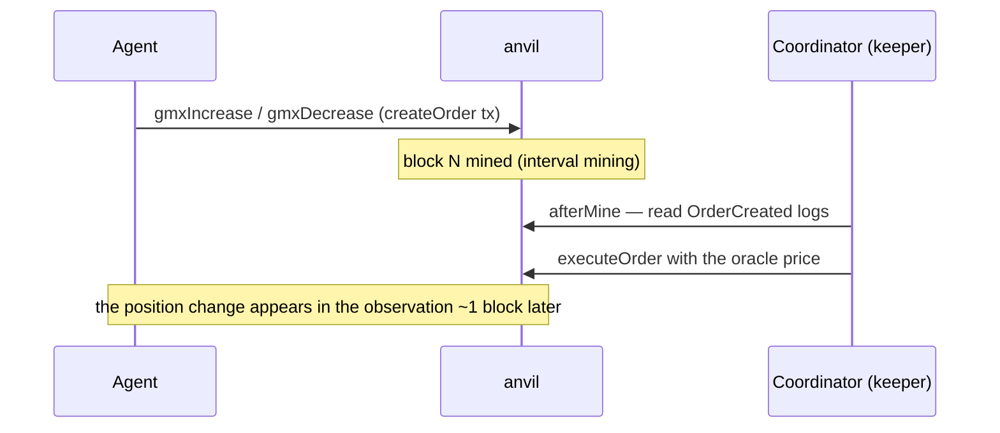

[← README](../../README.md)

# Protocols and Actions

Each adapter (`sdk/src/protocols/<name>.ts`) implements parse/validate, calldata construction (buildTxs), observation (readState / observe), PnL valuation (valueUsdc), and a setup hook (orderflow generation is the environment's job in `core/src/flow/`). Active protocols are chosen per run via the config's `run.protocols` (YAML array) or the CLI flag `--protocols uniswap,balancer,curve,aave,gmx,lst,liquity`. `sdk/src/action.ts`'s `ACTION_TYPES_BY_PROTOCOL` is the single source for which actions a given run offers — it is also what the strategy-revision prompt enumerates, so a strategy is never left unaware of an action it has simply never used. Agent JSON actions:

| Protocol | Actions | Markets (local deploy = the competition) |
|---|---|---|
| Uniswap V3 | `swap`, `mintLiquidity`, `removeLiquidity`, `collectFees`, `createPool` | WETH/USDC and WBTC/USDC, 0.3% fee, full-range liquidity (about 1,000 WETH / 50 WBTC + 3M USDC each at the start) |
| Balancer v2 | `balancerSwap` | 50/50 weighted WETH/USDC and WBTC/USDC, 0.3% fee, same starting depth |
| Curve | `curveSwap`, `stableSwap` | twocrypto-ng WETH/USDC and WBTC/USDC (dynamic fee 0.26–0.45%, same starting depth), plus the stableswap-ng pools that quote each market-priced stable (USDC/DAI 100k/100k) |
| Aave v3 | `aaveSupply`, `aaveWithdraw`, `aaveBorrow`, `aaveRepay` | WETH / USDC / WBTC reserves; the LST as a collateral-only reserve (LTV 70% / LT 75%), named `asset: "LST"` (not `"ERLST"`) |
| GMX v2 | `gmxIncrease`, `gmxDecrease` | ETH/USD perp (default; WETH or USDC collateral) and BTC/USD perp (`base: "WBTC"`; WBTC or USDC collateral). WETH collateral is sent from the native ETH balance |
| LST | `lstDeposit`, `lstSwap`, `lstRequestWithdraw`, `lstClaimWithdraw` | a wstETH-style vault (ERLST) plus its LST/WETH stableswap-ng market |
| Liquity (eUSD) | `liquityOpenTrove`, `liquityAdjustTrove`, `liquityCloseTrove`, `liquityRedeem`, `liquityProvideToSP`, `liquityWithdrawFromSP`, `liquityLiquidate`, `liquitySwapEusd` | a Liquity V1 fork issuing eUSD, plus its eUSD/USDC stableswap-ng market (100k/100k) |
| Permissionless lending (`lending`) | `createLendingMarket`, `lendingSupply`, `lendingWithdraw`, `lendingSupplyCollateral`, `lendingWithdrawCollateral`, `lendingBorrow`, `lendingRepay`, `lendingLiquidate` | the `SimpleLending` singleton (issue #40). Not in the official regimes; only the verification regime `config/regimes/agent-markets.yaml` enables it |

Only Uniswap has dedicated LP actions. On the Balancer and Curve WETH/USDC and WBTC/USDC pools you can
still provide liquidity by calling the pool directly through `rawTx`, and the BPT / Curve LP token you
receive is valued in scoring (issue #41). LP tokens of the stableswap pools are not valued.

The competition and every official regime run on the local deploy (`run.localDeploy: true`), with
all seven protocols enabled except that `depeg` and `depeg-persist` leave out GMX. The Arbitrum fork
mode (`localDeploy: false`) is a development path with different pools (Uniswap WETH/USDC 0.05%,
Balancer 33/33/34 WETH/USDC/USDT, Curve tricrypto WETH↔USDT), and it cannot run `lst` or `liquity`,
which have no Arbitrum counterpart. For what each protocol is and how it works, written for readers
new to DeFi, see the "seven protocols" section of the
[participant guide](../competition-start.en.md#the-seven-protocols).

`stableSwap` (issue #27) trades a **market-priced stable** against USDC on the pool that quotes it:
`{"type":"stableSwap","stable":"DAI","tokenIn":"USDC","amountIn":"…"}`. It lives on the Curve
adapter because those pools come off the Curve factory, so a run has to enable `curve` to reach any
of them — and a stable whose owning venue is disabled is not tradable, not swept and not priced,
which is the only combination that leaves nothing to fall through the cracks. There is no order-size
cap. Size each leg against the token's actual balance and decimals (USDC has six; DAI/eUSD have
eighteen), then account for pool depth, fees and slippage.

The LST venue (issue #38) has no fork counterpart (Liquity has none either) — the vault is deployed
by `deployer/`, so a fork run that lists `lst` fails fast at startup. It is also the one venue where an
asset has two prices at once: `protocols.lst` reports the vault's `redemptionRateWeth` (reachable
only through a withdrawal queue that takes `withdrawalDelayBlocks`) and the pool's
`marketPriceWeth` (instant, at whatever discount it trades) separately.

**Scoring marks the position at what an exit would realize**, not at par (issue #40 axiom 3 /
ADR 0022 Amendment 1). Realizable is the better of selling into the pool at your own size and a
queued redemption that *finalizes before the run ends*. Face value — what the vault owes, which is
also the number Aave's oracle uses — is reported as `markedValueUsdc` in `summary.json` for the
agents where the two differ, so the gap is legible rather than silent. Pending WETH that finalizes
after the run is excluded and reported under `scoring_unpriced_holdings` with
`reason: "unrealizable"`. `obs.blocksRemaining` is what lets a strategy tell which exits can still
complete — and under this rule that is a scoring question, not a preference.

Actions default to the WETH market. Add `base: "WBTC"` to the swap, Uniswap LP and GMX actions to trade the WBTC/USDC spot pools and the GMX BTC/USD market instead (multi-asset; ADR 0013; the legs are listed in `MARKET_LEGS`). Aave actions take no `base`: the reserve is chosen by `asset` (`"WBTC"`).

In addition there are the protocol-agnostic `noop` / `bundle` (multiple bundleable leaves in a single tx) / `rawTx` / `rawBundle`.

> Actions are expressed as JSON. `bundle` groups bundleable leaves into a single tx (GMX is async, so it can only be sent alone). `rawTx` / `rawBundle` also let you send raw calldata. There are no per-order amount caps. Semantic actions validate inventory and action fields; raw calldata is not decoded for semantic inventory checks. Both paths enforce priority-fee and gas bounds, including the per-agent block gas budget. Post-run checks record violations in `summary.json`.

## Stablecoin Accounting

In the local deploy every venue quotes USDC, and USDC is the numéraire: `$1` by definition, 6
decimals (`setActiveStables` / `getBalances` in `sdk/src/chain.ts`). The Arbitrum fork mode also
treats USDC.e and USDT as **USDC-equivalent** at `$1`, because Arbitrum's deep WETH/stable liquidity
lives in those pools (there Curve uses USDT, and Balancer's pool is seeded at fork time).

Two things changed in issue #27, and both are visible to agents:

- **`balances.usdcUnits` is native USDC alone.** It used to be every active stable summed, which is
  not a number anyone can spend — USDT is not accepted in a USDC pool. Treat it as a budget for a
  USDC leg; what the wallet is *worth* is `inventory.valueUsdc`.
- **A stable with a market is worth what that market pays**, not `$1`. `balances.stables` carries
  each one's balance, decimals and `priceUsdc` (the two-sided executable mid of its own pool), and
  the scorer marks spot balances and LP legs at the same number. `marketQuoted: false` means
  `priceUsdc: 1` is par by assumption rather than an observation, so do not read it as "the peg is
  holding". USDC itself stays `$1` by definition: it is the numéraire every metric is denominated
  in. Today the market-priced stables are **eUSD** (from the Liquity venue) and **DAI** (local
  deploy); funding never grants either, so any exposure to one is a position somebody chose.

## Oracle Control (Aave v3 / GMX v2)

Mock oracles (`contracts/MockAggregator.sol` / `contracts/MockOracleProvider.sol`) are deployed in setup (in a local deploy they connect to the deployer's venues the same way). For Aave, the coordinator impersonates the ACL admin to point `AaveOracle` at the mock; for GMX, it impersonates `ROLE_ADMIN` to grant the keeper / controller roles and registers the mock provider in `DataStore`. Each round, `updateOracles` writes the fair price into both mocks, moving the health factors of loans and the mark price of perps. Runs that build stress victims in a local deploy calibrate the Aave oracle to the initial fair price before victim setup (see [Market Stress Events](stress-events.md)).

## GMX Async Execution

GMX is async (order creation → keeper execution). In realtime, each block advances via interval mining, and after each block (`afterMine`) the coordinator reads the `OrderCreated` logs of the latest block and executes each order as the keeper. Intra-block ordering is determined by anvil's `--order fees` (descending priority fee). GMX position changes become visible to agents about one block late. GMX actions can only be sent alone (no bundling).

