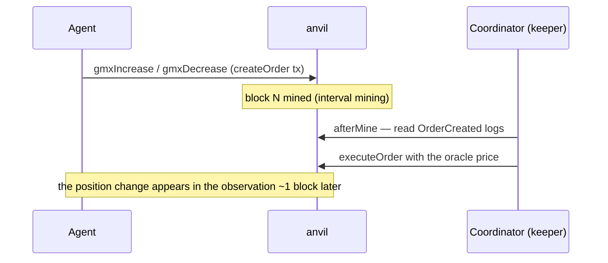

[← README](../../README.md)

# Protocols and Actions

Each adapter (`sdk/src/protocols/<name>.ts`) implements parse/validate, calldata construction (buildTxs), observation (readState / observe), PnL valuation (valueUsdc), and a setup hook (orderflow generation is the environment's job in `core/src/flow/`). Active protocols are chosen per run via the config's `run.protocols` (YAML array) or the CLI flag `--protocols uniswap,balancer,curve,aave,gmx`. Agent JSON actions:

| Protocol | Actions | venue (fork = Arbitrum / local = deployer-deployed) |
|---|---|---|
| Uniswap V3 | `swap`, `mintLiquidity`, `removeLiquidity`, `collectFees` | fork: WETH/USDC 0.05% pool / local: WETH/USDC 0.3% pool |
| Balancer v2 | `balancerSwap` | fork: 33/33/34 WETH/USDC/USDT weighted (seeded at fork time) / local: 50/50 WETH/USDC |
| Curve | `curveSwap`, `stableSwap` | fork: tricrypto WETH↔USDT / local: twocrypto-ng WETH/USDC, plus the stableswap-ng pools that quote each market-priced stable |
| Aave v3 | `aaveSupply`, `aaveWithdraw`, `aaveBorrow`, `aaveRepay` | native USDC / WETH reserves |
| GMX v2 | `gmxIncrease`, `gmxDecrease` | ETH/USD perp market |
| LST | `lstDeposit`, `lstSwap`, `lstRequestWithdraw`, `lstClaimWithdraw` | **local only**: a wstETH-style vault plus its LST/WETH stableswap-ng market |
| Liquity (eUSD) | `liquityOpenTrove`, `liquityAdjustTrove`, `liquityCloseTrove`, `liquityRedeem`, `liquityProvideToSP`, `liquityWithdrawFromSP`, `liquityLiquidate`, `liquitySwapEusd` | **local only**: a Liquity V1 fork issuing eUSD, plus its eUSD/USDC stableswap-ng market |

`stableSwap` (issue #27) trades a **market-priced stable** against USDC on the pool that quotes it:
`{"type":"stableSwap","stable":"DAI","tokenIn":"USDC","amountIn":"…"}`. It lives on the Curve
adapter because those pools come off the Curve factory, so a run has to enable `curve` to reach any
of them — and a stable whose owning venue is disabled is not tradable, not swept and not priced,
which is the only combination that leaves nothing to fall through the cracks. Both legs are bounded
by `limits.maxUsdcInUnits`, which is denominated in USDC's six decimals: an 18-decimal stable needs
that scaled (`limit * 10n ** 12n`) before you size a sell against it.

The LST venue (issue #38) is the one venue with no fork counterpart — the vault is deployed by
`deployer/`, so a fork run that lists `lst` fails fast at startup. It is also the one venue where an
asset has two prices at once: `protocols.lst` reports the vault's `redemptionRateWeth` (reachable
only through a withdrawal queue that takes `withdrawalDelayBlocks`) and the pool's
`marketPriceWeth` (instant, at whatever discount it trades) separately, and scoring marks the
position at whichever exit it could actually realize before the run ends.

The table shows the default WETH markets. If a WBTC leg (`MARKET_LEGS`) is deployed in the local deploy, add `base: "WBTC"` to the same actions to also trade the WBTC/USDC spot, GMX WBTC market, and Aave WBTC reserve (multi-asset; ADR 0013).

In addition there are the protocol-agnostic `noop` / `bundle` (multiple bundleable leaves in a single tx) / `rawTx` / `rawBundle`.

> Actions are expressed as JSON. `bundle` groups bundleable leaves into a single tx (GMX is async, so it can only be sent alone). `rawTx` / `rawBundle` also let you send raw calldata. The per-round trade size limits (config's `limits`: `agentWethWei` / `agentUsdcUnits` / `agentBase`) are applied as **pre-validation of semantic actions** — `rawTx` / `rawBundle` do not interpret calldata and so are exempt from the amount limits (only priority fee and bundle count are validated; fee violations are detected after the fact = recorded in `violations` by `postRunCheck`).

## Stablecoin Accounting

Arbitrum's deep WETH/stable liquidity lives in the USDC.e / USDT pools, so native USDC, USDC.e and
USDT are all treated as **USDC-equivalent** at `$1` and 6 decimals (`setActiveStables` /
`getBalances` in `sdk/src/chain.ts`). Uniswap / Aave / GMX use native USDC, Balancer uses native
USDC (its pool is seeded at fork time), and Curve uses USDT on fork and USDC on local.

Two things changed in issue #27, and both are visible to agents:

- **`balances.usdcUnits` is native USDC alone.** It used to be every active stable summed, which is
  not a number anyone can spend — USDT is not accepted in a USDC pool. Treat it as a budget for a
  USDC leg; what the wallet is *worth* is `inventory.valueUsdc`.
- **A stable with a market is worth what that market pays**, not `$1`. `balances.stables` carries
  each one's balance, decimals and `priceUsdc` (the two-sided executable mid of its own pool), and
  the scorer marks spot balances and LP legs at the same number. `marketQuoted: false` means
  `priceUsdc: 1` is par by assumption rather than an observation, so do not read it as "the peg is
  holding". USDC itself stays `$1` by definition: it is the numéraire every metric is denominated
  in. Today the market-priced stables are **eUSD** (from the Liquity venue) and **DAI** (local
  deploy); funding never grants either, so any exposure to one is a position somebody chose.

## Oracle Control (Aave v3 / GMX v2)

Mock oracles (`contracts/MockAggregator.sol` / `contracts/MockOracleProvider.sol`) are deployed in setup (in a local deploy they connect to the deployer's venues the same way). For Aave, the coordinator impersonates the ACL admin to point `AaveOracle` at the mock; for GMX, it impersonates `ROLE_ADMIN` to grant the keeper / controller roles and registers the mock provider in `DataStore`. Each round, `updateOracles` writes the fair price into both mocks, moving the health factors of loans and the mark price of perps. Runs that build stress victims in a local deploy calibrate the Aave oracle to the initial fair price before victim setup (see [Market Stress Events](stress-events.md)).

## GMX Async Execution

GMX is async (order creation → keeper execution). In realtime, each block advances via interval mining, and after each block (`afterMine`) the coordinator reads the `OrderCreated` logs of the latest block and executes each order as the keeper. Intra-block ordering is determined by anvil's `--order fees` (descending priority fee). GMX position changes become visible to agents about one block late. GMX actions can only be sent alone (no bundling).

