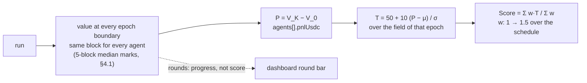

[← README](../../README.md)

# Scoring (the value series, P per epoch, and the deviation score)

Scoring never happens in the trading loop. The coordinator values every agent at the same block
cross-sections — the epoch boundaries, read live as the run goes (ADR 0021 §3) — so nobody is scored
on a snapshot taken at a moment nobody else was measured at. Everything below is a reading of that
one series, and all of it is stored in `summary.json`, which is what makes a finished run rescorable
without re-running it (ADR 0017 §4).



## The rule (competition rules §4.4, ADR 0022)

```
P(a, s)   = V_K − V_0                      USDC profit over epoch s, each end at its own marks
μ_s, σ_s  = mean / population std of P over every agent placed in the epoch (benchmark excluded)
T(a, s)   = 50 + 10 (P − μ_s) / σ_s        the deviation score
w_s       = 1 + 0.5 (s − 1) / (k − 1)      first epoch 1, last 1.5 (k = 1 → 1)
Score(a)  = Σ_{s∈S} w_s T(a, s) / Σ_{s∈S} w_s      S = valid epochs with σ_s > 0
```

`core/src/scoring/deviationScore.ts` is the whole implementation; `epochPnl.ts` reads P off the
boundary series. Five details are decisions, not formalities:

- **One number per epoch.** An epoch is one run (360 blocks). The 12-block intervals inside it
  ("rounds" on the dashboard) are the leaderboard's running progress, not an input to the score.
- **No floor, no freeze.** An agent that ends at or below zero counts at its negative value
  (§4.4.2), and one whose process died is scored on the positions it left behind (§2.3). Both are
  reported as `flags` next to the number; neither is a disqualification.
- **The benchmark is out of the population.** The roster's `baseline: true` agent is valued and
  shown for reference (§4.3) but does not move μ or σ.
- **σ = 0 and invalid epochs leave S for everyone**, and the other weights stay where the schedule
  put them: w_s depends on the scheduled ordinal, not on how many epochs actually ran.
- **Ranking at two decimals**, ties broken by the std of the agent's own T series, then its worst
  epoch, then its submission time (§4.6).

`run.markMedianBlocks` (default 5) marks the manipulable surfaces at each boundary with a median
over the preceding window instead of a single live probe, so a boundary cannot be moved by a trade
placed on the boundary block. `valueSeries.markMedian` reports which surfaces are covered and the
largest deviation seen.

## Where it lands in summary.json

| field | contents |
|---|---|
| `resetUnit` | `continuous` / `scenario` — which world shape this run was (see below) |
| `agents[].pnlUsdc` | P for this run: V_K − V_0 off the epoch boundaries (`pnlFinalBoundaryIndex` when the last boundary did not report and an earlier one was used) |
| `agents[].baseline` | `true` for the benchmark — valued, shown, never in the population |
| `agents[].netPnlUsdc` | `finalValueUsdc − initialValueUsdc`, both ends at the final marks. A per-run constant away from P when everyone starts with the same basket |
| `agents[].unloggedTxCount` | included transactions the agent's own runtime never reported sending (a flag, rules §8) |
| `valueSeries.epochSeries` | `epochBlocks` / `epochs` / `boundaryBlocks` / `valuesByAgent` (`null` = a boundary that did not report, never a zero) |
| `valueSeries.markMedian` | `windowBlocks` / `surfaces` / `maxDeviationBps` per stable |
| `valueSeries.alphaByAgent` | β-removed PnL per agent (`alphaUsdc` is the last minus the first) — context, not the score |
| `valueSeries.liquidatableValueByAgent` | what an exit would actually have returned, where a venue marks a position at something other than that (LST; see [Protocols](protocols-and-actions.md)) |
| `valueSeries.unpricedHoldings` | holdings the scorer could not price, reported rather than silently zeroed |
| `valueSeries.failedReads` | cross-sections that could not be read (`0` if healthy) |

## A matrix is a rehearsal of the competition

`npm run backtest -- --scenarios <set>` runs every scenario as one epoch, in order, and writes
`matrix.json` (P per agent per scenario, plus the endpoints, `baseline` and `flags`) and
`standings.json` (`computeStandings`: T per epoch, μ/σ per epoch, the set S, the ranked agents with
their tie-break inputs, the benchmark's P). The ordinal `s` is the run order for a `{regimes, seeds}`
product and explicit for a plan:

```bash
npm run competition -- commit config/competition/hidden-set.yaml      # publish this hash (§7.1)
npm run competition -- plan --hidden hidden-set.yaml --lottery lottery.yaml --k 40 --out plan.yaml
npm run backtest -- --scenarios plan.yaml --agents <roster>           # replays the k epochs in order
```

The plan is derived from the lottery seed (`core/src/competition/schedule.ts`): every regime k / R
times, the order decided by nobody (rules §3.3). Both input files are committed to before use and
published after the results, and the derivation is plain SHA-256 + Fisher-Yates so anyone can
reproduce it.

`standings.json` is a derivative: it recomputes from `matrix.json` alone, and `matrix.json` stores
`runDir` relative to the poc root, so a matrix collected off a remote box reads from wherever the
tarball was unpacked.

## `run.resetUnit` — what one world is (ADR 0020)

`continuous` (default) or `scenario`. It is **a label for whether this run is one world or one
scenario out of a set that rebuilt the world per (regime, seed)** — the field itself resets nothing
(the resetting is `backtest --scenarios`'s snapshot/revert).

- **The competition runs `scenario`** (ADR 0020 §2). Carrying inventory across regimes, recovering
  from a drawdown, and allocating capital across a week are outside what is being measured.
- **Only the matrix runner may declare it.** Writing `resetUnit: scenario` in a config and running
  `sim:realtime` **fails fast at startup**: one world labelled as many is a stored run that lies.
- Runs stored before the axis existed carry no field and are read as `continuous`.

## What is decided and what is not

| | |
|---|---|
| **Decided** | Shared cross-sections at the epoch boundaries (ADR 0006 / 0021). The deviation score with a linear 1 → 1.5 weight and no free parameter (rules §4.4, ADR 0022). The benchmark out of the population. No floor, no freeze, no disqualification. The epoch order from the lottery seed. |
| **Open** | The value of k (Appendix A; 40 recommended). The actual hidden set and lottery seed. Whether an LST position is scored at par or at what an exit would return ([#38](https://github.com/NyxFoundation/eris-agent-simulator/issues/38)). |

Measured results from the metric selection that preceded this rule are kept for the record in
[docs/scoring-metric-measurements.md](../scoring-metric-measurements.md); they are superseded.
