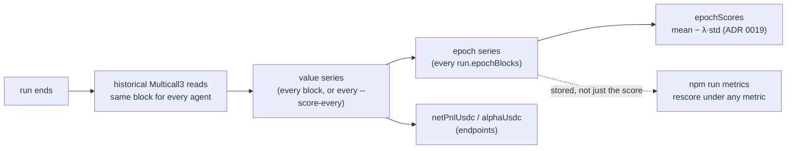

[← README](../../README.md)

# Scoring (value series, epoch scores, and rescoring stored runs)

Scoring never happens in the trading loop. After the run ends, the coordinator re-reads historical
blocks and reconstructs every agent's value at the same cross-sections
(`core/src/realtime/reconstruct.ts`), so nobody is scored on a snapshot taken at a moment nobody else
was measured at. Everything below is a different reading of that one series, and all of it is stored
in `summary.json` — which is what makes a finished run rescorable without re-running it
(ADR 0017 §4).



## The two layers

**Endpoint numbers** — `netPnlUsdc` is `finalValueUsdc − initialValueUsdc`, and `alphaUsdc` is the
same with the price drift (β) of free spot inventory removed. They are what
[Backtest](backtest.md)'s standings rank on by default, and the only figures every stored run has.

**The epoch series** — the value at each epoch boundary, from which the risk-adjusted score is
computed. `run.epochBlocks` (default 12) sets the boundary spacing; `run.epochBlocks: 0` disables
the series entirely.

## The competition score (ADR 0019)

```
x_e   = ln(W_e / W_{e−1}) − ln(B_e / B_{e−1})     e = 1..E   (excess over the benchmark)
W     = max(V, 0.01 · W_init)                                (G1, the bankruptcy floor)
score = mean_e(x_e) − λ · std_e(x_e)                         (λ default 0.25)
```

`core/src/scoring/epochScore.ts` is the whole implementation. Five details are decisions, not
formalities:

- **The benchmark is the roster's `baseline: true` agent**, not a synthetic series. Every agent
  carries an ETH gas reserve that moves with the price, and subtracting a real entry that carries
  the same reserve cancels it epoch by epoch. Measured: scoring raw returns gave the noop agent a
  std that was 93% of an active agent's whole dispersion. **A roster with no `baseline: true` entry
  scores raw returns and logs a warning** — every "excess" figure is then off by the benchmark's own
  drift.
- **G1, the floor.** Aave's `valueUsdc` is collateral − debt and is not clamped, so a liquidated
  agent's total value can go negative, where `ln` is NaN. Flooring at 1% of the starting value makes
  bankruptcy a defined event and bounds how much one blowup can move the field's std.
- **G2, the freeze.** Once an agent touches the floor its excess returns are 0 from there on. This
  is a scoring rule, not a chain rule: its transactions are never blocked.
- **E is fixed for the whole field**, not "however many epochs this agent survived". Dividing by a
  shorter series shrinks std, which would make failing early pay.
- **A missing boundary is carried forward at a return of 0** and reported in
  `carriedForwardEpochs`. A gap is the environment's failure, not the agent's — and dropping the
  epoch instead would shorten the series for exactly the agents the environment failed to read.

`run.markMedianBlocks` (default 5) marks the manipulable surfaces at each boundary with a median
over the preceding window instead of a single live probe, so a boundary cannot be moved by a trade
placed on the boundary block. `valueSeries.markMedian` reports which surfaces are covered and the
largest deviation seen.

**λ and the epoch length are one knob, not two.** λ is a threshold on the per-epoch Sharpe ratio,
and a per-epoch ratio scales with `√(epoch length)`, so changing `epochBlocks` changes what a given
λ rejects. Both are provisional: ADR 0019 is still **Proposed** and the choice is open in
[issue #56](https://github.com/NyxFoundation/eris-agent-simulator/issues/56).

## Where it lands in summary.json

| field | contents |
|---|---|
| `resetUnit` | `continuous` / `scenario` — which world shape this run was (see below) |
| `epochScores[<agentId>]` | `score` / `meanLogReturn` / `stdLogReturn` / `logReturns` (the E returns the score came from) / `bankruptAtEpoch` / `carriedForwardEpochs` / `floorUsdc` / `lambda` / `benchmarkApplied` |
| `valueSeries.epochSeries` | `epochBlocks` / `epochs` / `boundaryBlocks` / `valuesByAgent` (`null` = a boundary that did not report, never a zero) |
| `valueSeries.markMedian` | `windowBlocks` / `surfaces` / `maxDeviationBps` per stable |
| `valueSeries.alphaByAgent` | β-removed PnL per agent (`alphaUsdc` is the last minus the first) |
| `valueSeries.markedValueByAgent` | the **face mark**, where a venue carried a position above what it could have realized. Every venue is scored at recoverable value (issue #40 axiom 3), so this is the number that was not used — an LST redemption whose queue outlives the run, a lending supply whose collateral is worthless, a Trove under 100% ICR |
| `valueSeries.unpricedHoldings` | holdings the scorer could not price, reported rather than silently zeroed (`reason: "unrealizable"` / `erc20-unaccounted`) |
| `valueSeries.failedReads` | cross-sections that could not be read (`0` if healthy) |

`benchmarkApplied: false` means the score is raw returns, not excess. It is reported so a score is
never read as something it is not.

## Rescoring stored runs: `npm run metrics`

Reads `summary.json`'s epoch series and nothing else — no chain, no re-run — and scores every
candidate metric side by side:

```bash
npm run metrics -- runs/<id> [runs/<id>...]        # one row per metric, per agent
npm run metrics -- runs/<id> --lambda 0.15         # M9's risk aversion (default 0.25)
npm run metrics -- runs/<id> --rho 3               # M7's risk aversion (default 2)
npm run metrics -- runs/<id> --out compare.json    # also write the full table as JSON
```

| metric | what it is |
|---|---|
| **M1** `totalPnlUsdc` | the endpoint difference. Risk-neutral, and the one every other metric corrects |
| **M4** `excessLogGrowth` | excess log growth over the benchmark, both legs floored and normalised by their own start |
| **M9** `score` | `mean − λ·std` of the excess epoch returns — ADR 0019's decision |
| **M13** `sharpePerEpoch` | the per-epoch Sharpe of the same returns. Not a headline candidate (a ratio is scale-invariant, so "stay small" optimises it), but it is what λ is a threshold on |
| **M7** `mppm` | MPPM (Goetzmann–Ingersoll–Spiegel–Welch) at ρ over the excess gross returns |
| **M27** Borda | ordinal totals across a set of runs, so a regime with ten times another's spread cannot dominate |

The point is not to produce a ranking. It is to see **where the candidates disagree**: if two metrics
order every run identically, the choice between them is theoretical. Because M4 and M9 are read off
the same stored series, the difference between them is exactly `λ·std`, and an agent's rank moves
only when its per-epoch Sharpe crosses λ.

The baseline is taken from `agents[].baseline`, falling back to an agent named `noop`; if neither
exists the excess figures fall back to raw returns and say so.

Measured results, and the reasoning behind each verdict, are in
[docs/scoring-metric-measurements.md](../scoring-metric-measurements.md).

## `run.resetUnit` — what one world is (ADR 0020)

`continuous` (default) or `scenario`. It is **a label for whether this run is one world or one
scenario out of a set that rebuilt the world per (regime, seed)** — the field itself resets nothing
(the resetting is `backtest --scenarios`'s snapshot/revert).

- **The competition runs `scenario`** (ADR 0020 §2). Carrying inventory across regimes, recovering
  from a drawdown, and allocating capital across a week are outside what is being measured.
- **Only the matrix runner may declare it.** Writing `resetUnit: scenario` in a config and running
  `sim:realtime` **fails fast at startup**: one world labelled as many is a stored run that lies,
  and nothing downstream could detect it later. A misspelt value fails fast too.
- It is stamped into `summary.json` and `matrix.json`, and **`npm run metrics` refuses a mixed set**.
  A world holds a different number of epochs in each mode, and λ's effective severity moves with
  `λ/√(epoch length)`, so a Borda over both would average two different competitions.
- Runs stored before the axis existed carry no field and are read as `continuous` — every one of
  them was a single world.
- **λ is uncalibrated on the `scenario` side.** The known values (ADR 0019's 0.25, the measurement
  log's 0.15) are both from a continuous economy with 12-block epochs. A scenario's epoch count
  depends on the scenario count S, which is still open.

## Aggregating a scenario matrix: `npm run metrics -- --matrix`

In `continuous` mode there is nothing to aggregate — one world, one series, one number per agent.
`scenario` mode always needs a second rule for turning N per-scenario numbers into one standing, and
that rule is a **separate choice** from the metric. So this mode crosses every metric with every
aggregator (`core/src/scoring/aggregate.ts`) and reports where the pairs disagree:

```bash
npm run metrics -- --matrix runs/matrix-<id>
```

| aggregator | property |
|---|---|
| `zscore` | the incumbent. Scale-free within a scenario, and vulnerable exactly as [#55](https://github.com/NyxFoundation/eris-agent-simulator/issues/55) describes — a z-score is a ratio to a spread the *other* participants control |
| `borda` | rank within the scenario, then average. One extreme result costs a place, never eight-tenths of the field's spread — at the cost of throwing away *how much* better the winner was |
| `mean` | the metric itself, averaged. Keeps absolute scale, at the cost of letting one high-variance regime dominate |

All three weight regimes equally regardless of how many seeds each contributed (ADR 0017 §3).

The output also reports **#55 as a number** — a "sd inflation" section giving the field's standard
deviation with its single most extreme agent over the same figure without it. `1.0` means no
participant is setting the scale on their own; the measured case that opened the issue was `8.7`,
where one entry at −1,113 USDC took the field's sd from 20.9 to 181.5 and compressed everyone else by
the same factor. It is a property of the *scenario*, so it says how much damage `zscore` would take
before any aggregator is picked.

`matrix.json` stores `runDir` relative to the poc root that produced it, so a matrix collected off a
remote box reads correctly from wherever the tarball was unpacked.

## What is decided and what is not

| | |
|---|---|
| **Decided** | Post-run reconstruction at shared cross-sections (ADR 0006). The benchmark is a real roster entry (ADR 0019 §2). Bankruptcy floor + freeze. E fixed across the field. `scenario` is the competition's world reset unit (ADR 0020 §2) |
| **Open** | The headline metric (ADR 0019 is Proposed; issue #56). The cross-scenario aggregator. λ on the scenario side. The scenario count S. Whether the LST venue is scored at par or at the realizable mark |

Because every candidate is recomputable from stored artifacts, none of these has to be settled before
running: `matrix.json` and `summary.json` keep the raw numbers, and the rule can be applied to a
finished competition afterwards.
