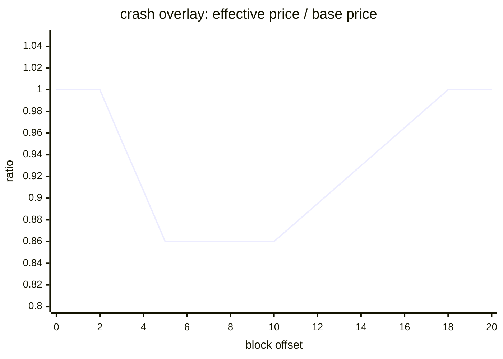

[← README](../../README.md)

# Market Stress Events (`stress.events`; off by default)

One config section holds every seed-placed shock a run can carry, because from the run's point of
view they are the same thing: **something the agents have to survive, placed by the seed rather than
by a constant they could memorise**. Ranges are given instead of values, and the actual timing and
magnitude are drawn deterministically from SEED using an Rng independent of the price path and the
flow bot — so the schedule is reproducible without being guessable across a published regime's seeds
(ADR 0009 / ADR 0004).

```yaml
stress:
  events:
    - { type: crash, magnitudeRange: [0.12, 0.16], windowFrac: [0.3, 0.7], rampBlocks: 3, holdBlocks: 6, decayBlocks: 8 }
    - { type: liquidityPull, magnitudeRange: [0.4, 0.6], windowFrac: [0.3, 0.7], alignWith: crash, rampBlocks: 3, holdBlocks: 6, decayBlocks: 8 }
  victimCount: 0   # >0 builds liquidatable Aave victims (fresh state required; see below)
```

Every event needs `run.blocks > 0` (a window is a fraction of a fixed run length), and stress or vuln
runs **automatically disable the time limit** and end on block count — otherwise `run.seconds` can
expire before the window is ever reached (recorded as `stress_run_time_limit_disabled`).

The fastest way to see one is an official regime through [Backtest](backtest.md):
`npm run backtest -- --regime lending-incident --seed 202`.

## The nine event types

They differ in *kind*, not just in parameters, and the kind decides how the run consumes them:

| kind | how the run consumes it | types |
|---|---|---|
| `overlay` | a multiplier layered on the fair price every block of the window | `spike` `crash` |
| `point` | executed once, on the block it lands on | `lstSlash` `whale` |
| `state` | a target the coordinator holds the venue at, reconciled every block | `liquidityPull` `eusdDepeg` `depeg` |
| `process` | a parameter the generator itself reads while the window is open | `cexDrift` `flowTrend` |

`rampBlocks` / `holdBlocks` / `decayBlocks` describe a trapezoid and are required for every kind
except `point`, which lands on a single block and takes them as optional.

`state` events reconcile toward a target **every block** rather than firing once, because a one-shot
write gets stranded by a dropped block — `pointEventsAt` shipped with exactly that hole once.
`process` events change the generator instead of correcting its output: an overlay leaves the base
path intact and multiplies the result, which is right for a gap that heals, but a drift episode has
to change the walk itself or mean reversion pulls the price back to a path the drift never touched.

### `spike` / `crash` — the fair price moves

The effective price ramps away from the base price, holds, then decays back. It propagates
consistently to the `PriceFeed`, the Aave oracle, GMX, and scoring, and holds β≈0 outside the window,
so ADR 0007 is not compromised. `magnitudeRange` is the deviation width (`spike` up, `crash` down);
`base` targets a non-WETH asset (ADR 0013).



A trapezoid rather than a jump on purpose: an instantaneous move interacts badly with the 1-block
delay of oracle updates, and the ramp leaves everyone the same lag to react in.

### `whale` — a single large order moves the pool, not the fair price

A point event: one market order of `magnitudeRange` **whole base units** (30 = a 30 WETH order),
printed on `venue` (default `uniswap`, the deepest book, so the size has to be real to move it).
`side` is `buy` / `sell` / `random`, and `random` — the default — lets the seed pick, which is what
keeps the direction from being memorisable.

This is the opposite direction of dislocation from `crash`: the fair price does not move at all, the
pool is knocked away from an unchanged fair. Different trade, different skill. Emits `stress_whale`
(+ `_funded` / `_failed` / `_reverted`).

### `liquidityPull` — the book thins for the length of the window

Seeded pool depth is withdrawn while the window holds and put back afterwards (issue #52).
`magnitudeRange` is **the fraction of depth withdrawn** at the top of the trapezoid.

- **`venue:` omitted thins every enabled venue.** Thinning one while the others keep block-0 depth
  just moves execution elsewhere, so narrowing is opt-in.
- **1.0 is rejected.** With no depth at all every swap reverts and the venue stops existing for the
  window — that is a halt, not a thin book.
- **Depth is pulled proportionally on both sides**, so the mid does not move and no risk-free
  arbitrage opens. It changes what a trade *costs*, not what it is worth.
- **Local deploy only.** It moves the LP the environment seeded (the deployer = anvil account 0), so
  a fork — where no such LP exists — fails fast, and so does a roster using `AGENT0_PRIVATE_KEY`
  (nonce collision with the deployer).
- Measured at a 50% pull: taking 10 WETH costs roughly 2x more on uniswap/balancer and 4x on curve,
  while the price a small trade sees moves ≤0.1bps.

Emits `stress_liquidity_pull` (+ `_setup` / `_failed` / `_reverted` / `_stuck`) and
`stress_liquidity_teardown_restore`. For attribution, read `poolLiquidityBefore` (measured) and
`targetLiquidity` off the events.

### `eusdDepeg` / `depeg` — a stable stops being a dollar

The environment sells the stable into its own pool for the length of the window and buys it back
afterwards. `magnitudeRange` is **the fraction of the pool's seeded depth of that stable** the
environment has dumped at the top of the trapezoid; the resulting discount is whatever the stableswap
curve gives, not a number you set.

`eusdDepeg` targets the Liquity venue's eUSD and needs no `stable:` (it predates the generalisation);
`depeg` requires `stable:` naming a registry stable the deployment gave a market to
(`STABLE_MARKET_LEGS` — today eUSD and DAI). Both run the same code in
`core/src/realtime/stableDepeg.ts`; the events keep the `stress_eusd_depeg*` names for eUSD and
`stress_depeg*` with the symbol in the payload for the rest.

**The trades they open are not the same.** eUSD has a redemption floor the CDP enforces, so its
discount is a dislocation against a price the protocol guarantees. A plain stable has only the belief
that it is a dollar, so closing the gap is an opinion rather than a claim on collateral.

Measured on a 100k/100k, A=100 eUSD/USDC pool: selling 40k moves it 114bps, 50k → 175bps, 60k →
282bps. The 50bps redemption fee floor plus ~30bps to convert redeemed ETH back to USDC is the bar an
arb has to clear before any of it is α. (The pool's A is 100, not the usual 2000: at 2000 selling
half the pool moves it 4.4bps, which never clears the redemption fee.)

`1.0` is rejected here too — selling the pool's entire stable side leaves nothing to buy, so the
discount stops being a price and becomes an outage.

### `lstSlash` — the staking rate drops permanently

A point event that lowers the LST vault's redemption rate in one block (issue #38 Phase 2). The
discount **does not open** — the pool reprices through its rate oracle, which is the evidence the
oracle is wired correctly. A slash is a risk holders carry, not an arbitrage.

That is why the magnitude is calibrated on the **yield** scale: against a 70-block run's ~3–8bps of
accrual, 10–30bps is a real event. The first attempt at 100–300bps was fifteen times the yield and
made staking a guaranteed loss. Emits `lst_slash` (or `lst_slash_skipped`).

### `cexDrift` — the reference price walks away and does not come back

A `process` event: it changes **the price walk itself**, adding a drift and multiplying mean
reversion by `kappaMultRange` while the window is open. A drift the OU pulls straight back out is not
a drift, so weakening kappa is part of the event, not a tuning extra. `side` picks the direction
(`buy` = up), `random` by default.

**`repriceAnchor: true`** moves the OU's anchor with the drift, so the new level becomes normal. Without
it the window closes and mean reversion erases the episode — and then no event in the system can
express "the price moved and stayed there", which is exactly the case that decides whether betting on
a return is skill or habit.

Calibrated from `config/regimes/cex-drift.yaml`: drift 0.0015, kappa 0.004 against the 0.02 default
(a multiplier of 0.2).

### `flowTrend` — the uninformed flow leans

The other `process` event: while the window is open, uninformed order flow is scaled by
`magnitudeRange` (a size multiplier — the `informed-flow` regime used 3x) and leans according to
`trendCorrelation` (0–1) and `persistBlocks`.

**Those two apply at full strength for the whole window**, ramp included. "Correlation 0.5 during the
ramp" is not a weaker version of the regime, it is a different regime. Calibrated from
`config/regimes/informed-flow.yaml`: size 3x, persist 12, correlation 1.0.

## Options that cut across types

| key | applies to | what it does |
|---|---|---|
| `alignWith: <type>` | any | Start where the first event of that type starts. Required because *same range is not same window*: two events sampling `[0.25, 0.7]` of a 360-block run land ~160 blocks apart on average. Chained alignment and self-alignment are rejected |
| `persist: true` | `depeg` `eusdDepeg` | The dislocation holds to the end of the run. **Requires `decayBlocks: 0`** — a decay that never runs would read as a window that closes. The teardown still buys back *after* the last scored block, because the startup check refuses to begin on a depegged pool |
| `repriceAnchor: true` | `cexDrift` | The OU anchor moves with the drift (above) |
| `venue` | `whale` `liquidityPull` | `uniswap` / `balancer` / `curve` |
| `stable` | `depeg` | Which registry stable is pushed off par (required) |
| `side` | `whale` `cexDrift` | `buy` / `sell` / `random` (default) |
| `base` | overlays | Which asset the price event targets (default WETH; ADR 0013) |

Every one of these is validated at parse time and **rejected rather than ignored** when it does not
apply to the type — an option silently dropped is a regime that logs itself and then does something
else.

**Why compose several types in one run:** a week built out of a single event type only makes work for
one kind of strategy. Measured — in a week of nothing but depeg windows, `venue-arb` never traded at
all in 3 of 5 seeds (`docs/scoring-metric-measurements.md`).

## Aave liquidation victims

`victimCount` (default 0 = off) builds a seed-derived group of liquidatable Aave positions, excluded
from scoring, so that a crash actually produces liquidations for a liquidator agent to take.

- **Fresh state is required.** With a soft reset the previous run's victim positions linger and break
  the health factors, so it fails fast: a fork needs a full re-fork (`ARB_RPC_URL` set,
  `ERIS_SKIP_RESET` unavailable), and local deploy satisfies it through the resetFork snapshot/revert
  clean cross-section. On local, the coordinator first calibrates the Aave oracle to the initial fair
  price, because the fork's "oracle ≈ market ≈ fair0" does not hold there.
- **To be able to build them**: `victimHf0 ≳ LT/(0.97·LTV)` — with the measured Arbitrum WETH
  LT=0.84 / LTV=0.80 that is ≈1.08, and below it the borrow pins to the LTV edge and fails fast.
- **To breach them**: the crash magnitude must satisfy `m > (HF0−1)/HF0` — for the default HF0=1.10
  that is m>9.1%, which the `[0.12, 0.16]` example clears reliably. A configuration that cannot
  breach emits `stress_calibration_warning`.
- `victimWethWei` is the supply per victim.

Victim addresses are handed to the liquidator agent via `ERIS_LIQUIDATION_VICTIMS`. For attribution,
cross-reference `stress_liquidation` in `events.jsonl` against each agent's `liquidationCall` (rawTx)
in `agents/<id>.jsonl` — the agent log is the primary source.

## Events emitted

`stress_schedule` (the resolved schedule, once) / `stress_victims_setup` / `stress_victim_hf` /
`stress_liquidation` / `stress_calibration_warning` / `stress_run_time_limit_disabled` /
`stress_whale*` / `stress_liquidity_pull*` / `stress_liquidity_teardown*` / `stress_eusd_depeg*` /
`stress_depeg*` / `lst_slash*`. See [Run Output and Analysis](run-output.md) for reading them.

## Where the calibrated examples live

| regime | what it holds |
|---|---|
| `config/regimes/crash.yaml` | a price gap plus a `liquidityPull` on the same window via `alignWith` |
| `config/regimes/lending-incident.yaml` | the same crash, plus victims, a liquidator slot, and thinned books |
| `config/regimes/cex-drift.yaml` / `informed-flow.yaml` | the calibration the `cexDrift` / `flowTrend` windows were derived from |
| `config/regimes/whale.yaml` | single large orders against an unchanged fair |
| `config/regimes/depeg.yaml` | a registry stable off par (issue #27) |
| `config/example.yaml` | an `eusdDepeg` window, on by default — the CDP venue is correctly inert at par, so without it redemption arb has nothing to do |
| `config/lst.yaml` | `lstSlash` alongside the LST calibration knobs |
