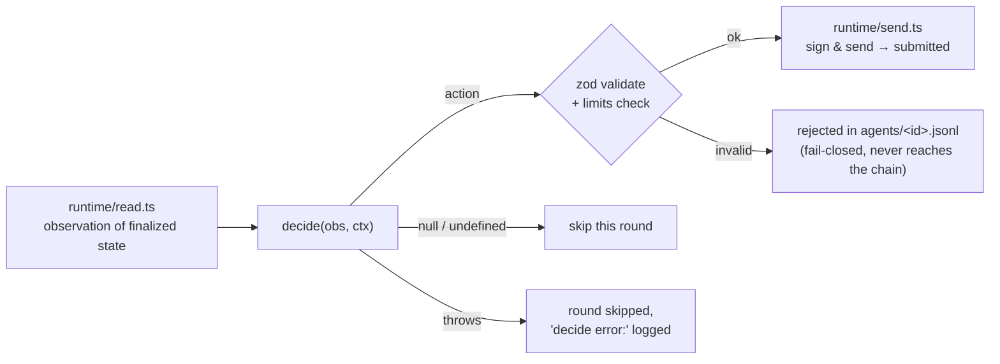

[← README](../../README.md)

# Writing a Strategy (agent authoring tutorial)

A new strategy runs by creating **one directory at `example/agents/<id>/`** and adding the id to a roster
(ADR 0015; `runtime/bot.ts` does all the spawning, observation, signing, sending, and validation). This document
is a single straight line: "minimal agent → read observations → return an action → keep a log → run in backtest → submit."

There are 3 types (details in [Architecture](architecture.md)). This page follows the most basic one, the rule strategy
(`decide()`):

| Type | What you place | Suited for |
|---|---|---|
| rule strategy | `agent.ts` (`decide(obs, ctx)`) | most strategies; observe → decide each block |
| self-driven | `agent.ts` (`run(ctx)`) | custom loops / event-driven (e.g. liquidator) |
| self-improving | `agent.ts` + `prompt.md` | trade at rule speed while an LLM rewrites the strategy in-run (see [Self-improving agents](llm-agents.md)) |

## Step 1: The minimal agent

```bash
mkdir example/agents/my-strategy
```

```ts
// example/agents/my-strategy/agent.ts
import type { AgentAction, AgentObservation } from "@eris/sdk";
import type { AgentContext } from "@eris/sdk/agent.js";

export function decide(
  obs: AgentObservation,
  ctx: AgentContext,
): AgentAction | Record<string, unknown> | null {
  return { type: "noop", reason: "doing nothing yet" };
}

// If omitted, it is called "once per new block". To change the interval:
// export const config = { intervalMs: 5000 };
```

That is the entire contract:

- If the return value is an action, the runtime **validates it before** signing and sending (invalid actions never
  reach the chain, and a `rejected` entry is left in `agents/<id>.jsonl` = fail-closed)
- Returning `null` / `undefined` means skipping. **noop is a perfectly good choice** (not trading in a market with no
  opportunity is the right answer)
- Throwing does not crash the run (that round is skipped and `decide error:` is left in the log)



## Step 2: Read the observation (AgentObservation)

`obs` is a "snapshot of confirmed state" that the runtime reconstructs each block. You don't need to hit RPC directly
(you can, but reading from the observation what is already in it is faster and safer). A sample from a real run (excerpt):

```jsonc
{
  "round": 610,
  "blockNumber": "610",
  "fairPriceUsdcPerWeth": 2993.27,          // fair price distributed by the environment (1 block late = by design)
  "fairPricesUsd": { "WETH": 2993.27, "WBTC": 60065.96 },  // per-base fair when multi-asset
  "balances": { "ethWei": "…", "wethWei": "0", "usdcUnits": "25000000000",
                "stables": { "USDC": { "token": "0x…", "decimals": 6,  "balance": "25000000000",
                                       "priceUsdc": 1,     "marketQuoted": false },
                             "DAI":  { "token": "0x…", "decimals": 18, "balance": "0",
                                       "priceUsdc": 0.991, "marketQuoted": true } } },
  "inventory": { "valueUsdc": 339290.8, "weth": 0, "usdc": 25000, "eth": 105.0 },
  "history": [ { "round": 608, "poolPriceUsdcPerWeth": 3000.0, "fairPriceUsdcPerWeth": 3000 }, … ],
  "limits": { "defaultPriorityFeePerGasWei": "100000000", "maxPriorityFeePerGasWei": "…", "defaultSlippageBps": 50 },
  "protocols": { "uniswap": { "pool": { "priceUsdcPerWeth": 3000.0, "fee": 3000, "liquidity": "54772255750516611", … } },
                 "balancer": { "priceUsdcPerWeth": 2991.0 }, "curve": { … }, "aave": { … } },
  "competition": { "maxCompetitorPriorityFeeWei": "0", "recentRevertRate": 0, … }
}
```

Things to watch when reading:

- **Token amounts are decimal strings** (`wethWei` is 18-decimal wei, `usdcUnits` is 6-decimal). Handle them with
  `BigInt(...)`. `inventory` is a human-readable numeric conversion (approximate)
- **`usdcUnits` is native USDC alone, and it is a budget rather than a valuation** (issue #27). It used to be every
  stable summed together, which could not be spent anywhere: USDT is not accepted in a USDC pool. What the wallet is
  worth is `inventory.valueUsdc`; what a USDC leg can be sized against is this
- **`balances.stables` is where a stable stops being a dollar.** Each entry carries the balance *and* `priceUsdc`, the
  two-sided executable mid of that stable's own market. A registry stable is scored at that price, in your wallet and
  in an LP leg alike — so holding a depegged one is a real loss, and buying one below par is a real position with a
  real downside. `marketQuoted: false` means `priceUsdc: 1` is par by assumption (no market, or the pool would not
  quote): **do not read a `1` there as "the peg is holding"**. Trade the pair with `stableSwap`
- **There is no per-order size cap** (`maxUsdcInUnits`/`maxWethInWei` were removed from `limits`). The only bounds on
  a trade are your wallet balance and the venue depth you are willing to move — **size yourself**. Oversizing is bounded
  by your balance and by slippage, not by a validator size cap
- `history` is the pool/fair series for the last ~20 blocks (for gauging momentum and the persistence of a gap)
- **`blocksRemaining` is how many blocks are left**, counted from the first block you observed (absent when the run has no block limit). An exit that takes longer than that cannot complete inside the run — which is what makes the LST withdrawal queue a decision rather than a formality. Approximate by a block or two
- `limits` holds only the default/max **fees** and default slippage (no size caps). **Fee-cap your action here** (actions over the fee limit
  are rejected by validation)
- The shape of `protocols.<venue>` differs per venue. **It's safest not to read it directly, but to normalize it with a
  shared helper** (Step 4). Reading `obs.pool` directly has repeatedly caused a TypeError → noop for every round
- **`protocols.uniswap.pool.liquidity` is in-range depth, and it moves during a run.** The `crash` regime withdraws a
  large fraction of it while the price is gapping (issue #52), so a size that was fine in `calm` can cost far more
  slippage exactly when the opportunity looks biggest. Sizing against depth read at block 0 is the mistake this field
  exists to let you avoid. It is a `uint128` decimal string (`BigInt(...)`), and **it is absent, not `"0"`, when the
  read failed** — treat a missing value as "unknown", never as an empty book. Non-WETH markets carry their own under
  `protocols.uniswap.markets["WBTC/USDC"].liquidity`. Balancer and Curve expose depth as `reserves` instead, and today
  they keep their block-0 depth for the whole run

## Step 3: Return an action

Actions are JSON (the zod schema `sdk/src/actionSchema.ts` is authoritative). The full list is in
[Protocols and Actions](protocols-and-actions.md). A minimal swap:

```ts
// buy WETH with USDC if the pool is 50bps or more below fair
const pool = obs.protocols.uniswap?.pool?.priceUsdcPerWeth;
if (!pool) return null;
const gapBps = (obs.fairPriceUsdcPerWeth / pool - 1) * 10000;
if (gapBps > 50) {
  return {
    type: "swap",                 // uniswap WETH/USDC swap
    tokenIn: "USDC",
    amountIn: "500000000",        // 500 USDC (6-decimal units, as a decimal string)
    slippageBps: 75,
    maxPriorityFeePerGasWei: obs.limits.defaultPriorityFeePerGasWei,
  };
}
return null;
// put the reasoning in ctx.log, not in the action (Step 4; only noop carries a reason field)
```

To put multiple legs in a single tx, use `type: "bundle"` (`actions: [...]`; GMX is async so it cannot be bundled).

## Step 4: Add a decision log from the start

**Skipping this makes post-run debugging dramatically harder** (investigating losses in a strategy with no decision log
means descending all the way to on-chain receipt reconciliation). Use `ctx.log` to leave each round's reasoning in
`runs/<run_id>/agents/<id>.jsonl`:

```ts
export function decide(obs: AgentObservation, ctx: AgentContext) {
  const signals = { fair: obs.fairPriceUsdcPerWeth, pool, gapBps };
  const action = pickAction(obs);   // your decision logic
  ctx.log({ round: obs.round, action: action ?? { type: "noop" }, signals,
            reason: action ? "gap over threshold" : "no edge" });
  return action;
}
```

Mempool activity (submitted / rejected / submit_failed) is left automatically by the runtime in the same file.
For how to read it, see [Run Output and Analysis](run-output.md).

## Step 5: Register in a roster and run in backtest

```yaml
# my-roster.yaml (together with sparring partners)
agents:
  - id: noop
    wallet: AGENT1_PRIVATE_KEY
    baseline: true
  - id: my-strategy          # ← the directory name is the id directly
    wallet: AGENT2_PRIVATE_KEY
  - id: multi-arb            # a bundled rival strategy
    wallet: AGENT3_PRIVATE_KEY
```

```bash
npm run backtest -- --regime calm --seed 101 --agents my-roster.yaml
npm run backtest -- --scenarios config/scenarios/public.yaml --agents my-roster.yaml  # every regime x seed
```

- `netPnlUsdc` is the default ranking metric but includes price drift (β); `alphaUsdc` removes β from spot inventory. Both are printed, and `matrix.json` also stores the two risk-adjusted candidates (`excessLogGrowth` / `score`), so a finished set can be re-ranked with `npm run metrics`. **Which metric the competition uses is still open** — read them together rather than tuning to one ([Scoring](scoring.md))
- Judge by the distribution across seeds, not by one run (tx ordering varies even within a scenario). `--repeat N` shows that spread for a single scenario; `--scenarios` covers the seed axis (see [Backtest](backtest.md))
- Verify across regimes: not overfiring in calm and capturing opportunity in crash — doing both is skill

## Shared helpers (example/agents/lib/)

Cross-venue strategies use `marketViews(obs)` from `lib/markets.ts`. It normalizes the observation into
"per-base `{ fair, venues: [{protocol, price, feeBps, swapType}] }`"
(absorbing the differences in per-venue observation shapes and applying the fee-inclusive mid correction to estimates):

```ts
import { marketViews } from "../lib/markets.js";

for (const view of marketViews(obs)) {
  // view.base ("WETH" | "WBTC" | …), view.fair, view.venues (prices normalized to mid-equivalent)
}
```

## Pitfalls (confirmed in real runs)

1. **Arbitrage that ignores fees structurally loses**. Because fee-aware informed flow keeps gaps within the fee band
   (~30bps), only fire when "gap > that venue's fee + safety margin" holds. A bundled strategy that fired every block at
   a 10bps threshold was measured bleeding −1,650 USDC over 60 blocks
2. **The fair price is 1 block late** (a property of on-chain distribution; everyone is delayed equally). In windows
   where fair moves a lot each block, execution based on a stale fair steps the wrong way. It's safer to confirm the
   "persistence" of the gap with `history` before moving
3. **Initial funding is USDC-only by default** (`funding.wethWei: "0"`). A strategy that starts by selling WETH has no
   inventory in the first round. Decide direction after checking `obs.balances`
4. **Use `obs.limits` for the fee/slippage defaults; size the trade yourself** (there is no size cap in `limits`). Fee overruns are rejected by validation, wasting that round

## Deploying your own contracts

Permitted (issue #40). Deployment is a `rawTx` with **no `to`**, whose `data` is the creation
bytecode, so it goes through the runtime like every other transaction — sharing the nonce manager,
the per-block transaction cap and the gas budget. Signing your own deploys instead puts a second
sender on your key, and two senders on one key race on the nonce.

```ts
import { deployAction, currentNonce, findDeployedContracts } from "../lib/deployContract.js";

const nonce = await currentNonce(ctx.publicClient, ctx.address);
ctx.submit(deployAction("MyContract", [constructorArg]));
// the runtime owns the nonce, so find the address afterwards rather than predicting it
const found = await findDeployedContracts(ctx.publicClient, ctx.address, {
  fromNonce: nonce,
  toNonce: nonce + 2,
});
```

Three things follow from the rules rather than from the code:

- **What you deploy is `unknown` to everybody else.** The environment publishes it to the
  `MarketRegistry` and makes no claim about it. Under the round-trip rule (rules §4.1) **value left
  inside a contract the environment cannot value is worth zero at the epoch's final block** — your
  own contract included. Profit taken *through* it counts in full.
- **Gas is capped** at 30,000,000 per transaction and 90,000,000 per agent per block (rules §2.6).
  The gateway refuses an over-cap transaction up front; exceeding it is a §8 offence, because a
  contract that eats the block starves the environment's price update as well as your rivals.
- **The bundle carries the artifacts.** `bundle:agent` scans your `.ts` for the contract names you
  hand to `deployAction` / `readForgeArtifact` and ships `out/<Name>.sol/<Name>.json` for each. Run
  `npm run build:contracts` first, and check the bundler's output — it prints what it shipped.

  A scan cannot see through an alias, a variable or a template. If you build the name at runtime,
  declare it instead: **`artifacts.json` in your agent directory**, a JSON array of contract names,
  always wins over the scan.

  ```json
  ["MyOracle", "MyToken"]
  ```

  Getting this wrong is not a build error. It is a deployment that throws on the operator's machine
  at the first block it is attempted, and nobody is there to fix it.

## Submission

```bash
npm run build:contracts       # only if your agent deploys its own contracts
npm run check:strategy        # static cheatcode check (entry gate)
npm run bundle:agent my-strategy   # submission zip (runtime + sdk + lib + target agent + artifacts)
```

The bundled strategies in `example/agents/` (noop = minimal form / arb-bot = a model with a decision log / multi-arb =
multi-asset cross-venue / liquidator = self-driven) are all usable as readable working examples.
